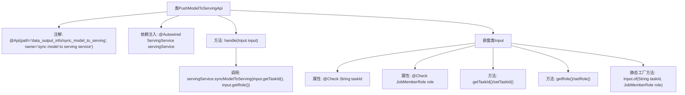

# 基础信息

|      |      |
|------|------|
| 名称 | PushModelToServingApi |
| 编码语言 | .java |
| 代码路径 | WeFe/board/board-service/src/main/java/com/welab/wefe/board/service/api/data_output_info/PushModelToServingApi.java |
| 包名 | com.welab.wefe.board.service.api.data_output_info |
| 依赖项 | ['com.welab.wefe.board.service.service.ServingService', 'com.welab.wefe.common.fieldvalidate.annotation.Check', 'com.welab.wefe.common.web.api.base.AbstractApi', 'com.welab.wefe.common.web.api.base.Api', 'com.welab.wefe.common.web.dto.AbstractApiInput', 'com.welab.wefe.common.web.dto.ApiResult', 'com.welab.wefe.common.wefe.enums.JobMemberRole', 'org.springframework.beans.factory.annotation.Autowired'] |
| 概述说明 | 该API用于将模型同步至服务端，接收任务ID和角色参数，调用ServingService完成同步操作。 |

# 说明

这是一个名为PushModelToServingApi的API类，用于将模型同步到服务端。API路径为"data_output_info/sync_model_to_serving"。该类继承自AbstractApi，接收Input类型参数并返回Object类型结果。Input类包含两个必填字段：taskId（任务ID）和role（模型角色）。处理逻辑通过调用servingService的syncModelToServing方法实现，传入taskId和role参数。Input类提供了getter/setter方法和静态工厂方法of用于创建实例。

# 类列表 Class Summary

| 名称   | 类型  | 说明 |
|-------|------|-------------|
| PushModelToServingApi | class | API类PushModelToServingApi，路径为data_output_info/sync_model_to_serving，用于同步模型至服务。输入参数为taskId和role，调用ServingService的syncModelToServing方法处理。 |


## 类 PushModelToServingApi

|      |      |
|------|------|
| 访问范围 | @Api(path = "data_output_info/sync_model_to_serving", name = "sync model to serving service");public |
| 类型 | class |
| 名称 | PushModelToServingApi |
| 说明 | API类PushModelToServingApi，路径为data_output_info/sync_model_to_serving，用于同步模型至服务。输入参数为taskId和role，调用ServingService的syncModelToServing方法处理。 |


### UML类图

```mermaid
classDiagram
    class PushModelToServingApi {
        -ServingService servingService
        +handle(Input input) ApiResult~Object~
    }
    <<Interface>> AbstractApi~Input, Object~
    PushModelToServingApi --|> AbstractApi~Input, Object~ : 继承
    PushModelToServingApi --> ServingService : 依赖

    class Input {
        -String taskId
        -JobMemberRole role
        +getTaskId() String
        +setTaskId(String taskId)
        +getRole() JobMemberRole
        +setRole(JobMemberRole role)
        +of(String taskId, JobMemberRole role) Input
    }
    <<Interface>> AbstractApiInput
    Input --|> AbstractApiInput : 继承
```

这段类图展示了PushModelToServingApi及其内部类Input的结构关系。PushModelToServingApi继承自泛型抽象类AbstractApi，依赖ServingService完成模型同步功能。Input作为内部输入参数类，继承自AbstractApiInput，包含taskId和role两个核心字段，并提供标准的getter/setter方法及工厂方法of()。整体设计体现了清晰的层级结构和职责分离，Input类专门处理参数验证和封装，主类专注于业务逻辑处理。


### 内部方法调用关系图



这段代码描述了一个用于同步模型到服务系统的API类PushModelToServingApi，其核心是通过handle方法调用ServingService的同步功能。嵌套类Input封装了任务ID和角色参数，包含参数校验注解和标准的getter/setter方法，并提供了静态工厂方法of来简化对象创建。流程图清晰展示了类结构、依赖关系和方法调用链，特别是标注了关键注解和参数校验逻辑。

### 字段列表 Field List

| 名称  | 类型  | 说明 |
|-------|-------|------|
| servingService | ServingService | 使用@Autowired自动注入ServingService服务实例。 |

### 方法列表

| 名称  | 类型  | 说明 |
|-------|-------|------|
| handle | ApiResult<Object> | Java方法重写，调用服务同步模型到Serving，返回成功结果。 |


