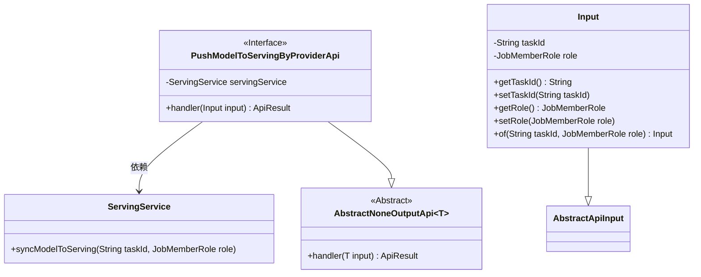

# 基础信息

|      |      |
|------|------|
| 名称 | PushModelToServingByProviderApi |
| 编码语言 | .java |
| 代码路径 | WeFe/board/board-service/src/main/java/com/welab/wefe/board/service/api/data_output_info/PushModelToServingByProviderApi.java |
| 包名 | com.welab.wefe.board.service.api.data_output_info |
| 依赖项 | ['com.welab.wefe.board.service.service.ServingService', 'com.welab.wefe.common.exception.StatusCodeWithException', 'com.welab.wefe.common.fieldvalidate.annotation.Check', 'com.welab.wefe.common.web.api.base.AbstractNoneOutputApi', 'com.welab.wefe.common.web.api.base.Api', 'com.welab.wefe.common.web.dto.AbstractApiInput', 'com.welab.wefe.common.web.dto.ApiResult', 'com.welab.wefe.common.wefe.enums.JobMemberRole', 'org.springframework.beans.factory.annotation.Autowired'] |
| 概述说明 | API类PushModelToServingByProviderApi，路径为data_output_info/provider/push_model_to_serving，允许签名访问，功能是将模型同步至服务，需输入taskId和模型角色。 |

# 说明

该代码定义了一个名为PushModelToServingByProviderApi的API类，用于将模型推送到服务系统。API路径为data_output_info/provider/push_model_to_serving，允许签名访问。类继承自AbstractNoneOutputApi，使用ServingService处理同步模型到服务的逻辑。输入参数Input包含必填字段taskId和role，提供getter/setter方法和静态工厂方法of。handler方法调用servingService.syncModelToServing完成任务同步并返回成功结果。

# 类列表 Class Summary

| 名称   | 类型  | 说明 |
|-------|------|-------------|
| PushModelToServingByProviderApi | class | 该API用于将模型推送至服务系统，需提供任务ID和角色参数，支持签名访问，调用ServingService同步模型。 |

## 类 PushModelToServingByProviderApi

|      |      |
|------|------|
| 访问范围 | @Api(;        path = "data_output_info/provider/push_model_to_serving",;        name = "push model to serving service",;        allowAccessWithSign = true;);public |
| 类型 | class |
| 名称 | PushModelToServingByProviderApi |
| 说明 | 该API用于将模型推送至服务系统，需提供任务ID和角色参数，支持签名访问，调用ServingService同步模型。 |

### UML类图

这段代码描述了一个推送模型到服务系统的API实现。PushModelToServingByProviderApi继承自AbstractNoneOutputApi，处理包含任务ID和角色信息的输入参数，通过ServingService将模型同步到服务系统。Input类作为内部类封装了必要的任务ID和角色参数，并提供了便捷的静态工厂方法。整个设计体现了清晰的职责划分，通过依赖注入方式使用ServingService完成核心业务逻辑。

### 内部方法调用关系图

```mermaid
graph TD
    A["类PushModelToServingByProviderApi"]
    B["注解: @Api"]
    C["继承: AbstractNoneOutputApi<Input>"]
    D["依赖注入: ServingService servingService"]
    E["重写方法: handler(Input input)"]
    F["内部类: Input"]
    G["属性: String taskId"]
    H["属性: JobMemberRole role"]
    I["方法: getTaskId/setTaskId"]
    J["方法: getRole/setRole"]
    K["静态工厂方法: of(String, JobMemberRole)"]
    L["调用: servingService.syncModelToServing"]
    M["返回: ApiResult.success()"]

    A --> B
    A --> C
    A --> D
    A --> E
    A --> F
    F --> G
    F --> H
    F --> I
    F --> J
    F --> K
    E --> L
    E --> M
```

该流程图展示了PushModelToServingByProviderApi类的完整结构，包含API注解、父类继承、服务依赖注入和核心handler方法实现。重点描述了内部类Input的字段结构、访问方法以及工厂方法，同时明确了handler方法中调用servingService同步模型到服务端并返回成功结果的处理流程。类关系清晰呈现了从API入口到业务逻辑处理的完整调用链。

### 字段列表 Field List

| 名称  | 类型  | 说明 |
|-------|-------|------|
| servingService | ServingService | 使用@Autowired自动注入ServingService实例。 |

### 方法列表

| 名称  | 类型  | 说明 |
|-------|-------|------|
| handler | ApiResult | 该方法重写父类逻辑，调用服务将模型同步至Serving，输入含任务ID和角色，成功返回结果。 |

