# 基础信息

|      |      |
|------|------|
| 名称 | PushRsaKeyToServingApi |
| 编码语言 | .java |
| 代码路径 | WeFe/board/board-service/src/main/java/com/welab/wefe/board/service/api/data_output_info/PushRsaKeyToServingApi.java |
| 包名 | com.welab.wefe.board.service.api.data_output_info |
| 依赖项 | ['com.welab.wefe.board.service.service.ServingService', 'com.welab.wefe.common.exception.StatusCodeWithException', 'com.welab.wefe.common.web.api.base.AbstractNoneOutputApi', 'com.welab.wefe.common.web.api.base.Api', 'com.welab.wefe.common.web.dto.AbstractApiInput', 'com.welab.wefe.common.web.dto.ApiResult', 'org.springframework.beans.factory.annotation.Autowired'] |
| 概述说明 | 推送RSA密钥至服务端的API类，继承AbstractNoneOutputApi，通过ServingService执行推送操作，输入类为空。 |

# 说明

该代码定义了一个名为PushRsaKeyToServingApi的API类，用于将RSA密钥推送到服务端。该类继承自AbstractNoneOutputApi，并指定输入类型为内部类Input。通过Autowired注入ServingService，在handler方法中调用pushRsaKeyToServing方法完成密钥推送操作，成功后返回ApiResult。Input类继承自AbstractApiInput，当前未包含具体字段。API路径为data_output_info/push_rsa_key_to_serving。

# 类列表 Class Summary

| 名称   | 类型  | 说明 |
|-------|------|-------------|
| PushRsaKeyToServingApi | class | 推送RSA密钥到服务端的API接口，调用ServingService的pushRsaKeyToServing方法，无输出参数，继承AbstractNoneOutputApi类。 |


## 类 PushRsaKeyToServingApi

|      |      |
|------|------|
| 访问范围 | @Api(path = "data_output_info/push_rsa_key_to_serving", name = "push_rsa_key_to_serving");public |
| 类型 | class |
| 名称 | PushRsaKeyToServingApi |
| 说明 | 推送RSA密钥到服务端的API接口，调用ServingService的pushRsaKeyToServing方法，无输出参数，继承AbstractNoneOutputApi类。 |


### UML类图

```mermaid
classDiagram
    class PushRsaKeyToServingApi {
        +ServingService servingService
        +ApiResult handler(Input input) StatusCodeWithException
    }
    <<Interface>> AbstractNoneOutputApi~Input~
    PushRsaKeyToServingApi --|> AbstractNoneOutputApi~Input~ : 继承
    PushRsaKeyToServingApi --> ServingService : 依赖

    class AbstractApiInput {
    }
    class Input {
    }
    Input --|> AbstractApiInput : 继承
```

这段代码展示了一个用于推送RSA密钥到服务端的API实现。PushRsaKeyToServingApi继承自泛型类AbstractNoneOutputApi<Input>，并重写了handler方法。它依赖ServingService来完成核心业务逻辑。Input作为内部静态类继承自AbstractApiInput，目前未定义具体字段。该设计体现了清晰的层级关系，通过继承抽象基类和依赖注入服务来实现功能解耦。


### 内部方法调用关系图

```mermaid
graph TD
    A["类PushRsaKeyToServingApi"]
    B["注解: @Api(path='data_output_info/push_rsa_key_to_serving', name='push_rsa_key_to_serving')"]
    C["继承: AbstractNoneOutputApi<Input>"]
    D["依赖注入: @Autowired ServingService servingService"]
    E["重写方法: handler(Input input)"]
    F["调用: servingService.pushRsaKeyToServing()"]
    G["返回: success()"]
    H["静态内部类: Input"]
    I["继承: AbstractApiInput"]

    A --> B
    A --> C
    A --> D
    A --> E
    E --> F
    E --> G
    A -.-> H
    H --> I
```



该流程图展示了PushRsaKeyToServingApi类的核心结构，包括类注解、继承关系、服务注入和关键方法调用链。类通过handler方法处理输入参数，调用ServingService的pushRsaKeyToServing()方法后返回成功结果。静态内部类Input作为输入参数载体继承自AbstractApiInput，整体体现了API接口的请求处理流程和分层设计模式。

### 字段列表 Field List

| 名称  | 类型  | 说明 |
|-------|-------|------|
| servingService | ServingService | 自动注入ServingService服务实例。 |

### 方法列表

| 名称  | 类型  | 说明 |
|-------|-------|------|
| handler | ApiResult | Java方法重写，调用servingService推送RSA密钥并返回成功结果。 |


