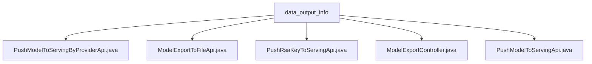

# 基础信息

|      |      |
|------|------|
| 名称 | data_output_info |
| 编码语言 | .java |
| 代码路径 | WeFe/board/board-service/src/main/java/com/welab/wefe/board/service/api/data_output_info |
| 包名 | docs.board.board-service.src.main.java.com.welab.wefe.board.service.api.data_output_info |
| 概述说明 | PushModelToServingByProviderApi推送模型到服务系统。ModelExportToFileApi导出模型文件并加密。PushRsaKeyToServingApi推送RSA密钥。ModelExportController处理模型导出请求。PushModelToServingApi同步模型到服务端。 |

# 说明

## 概述  
该模块核心职责是处理模型输出相关的服务化操作，包括模型推送至服务系统、文件导出及密钥管理。接口规范统一采用RESTful风格，路径前缀为`data_output_info`，支持签名访问和多种加密方式。关键数据结构包含`Input`类，必填字段为`taskId`和`role`，例如`PushModelToServingApi`的输入。外部依赖包括ServingService、文件操作工具及AES/RSA/SM2加密组件。实现案例丰富，例如`ModelExportToFileApi`通过混合加密生成模型文件。

## 主要业务场景  
模块主要支持三类场景：模型服务化同步（类似事件总线模式）、安全文件导出及密钥推送。业务流程均以`taskId`和`role`为触发条件，例如`PushModelToServingByProviderApi`调用`syncModelToServing`完成同步。交互模式包含API调用（如`PushRsaKeyToServingApi`）和文件下载（如`ModelExportController`设置响应头）。典型应用如联合学习场景下，通过`ModelExportToFileApi`导出加密模型供参与方下载，同时用`PushRsaKeyToServingApi`同步密钥。

### 包内部结构视图

该流程图展示了data_output_info目录下的五个Java文件层级关系。所有文件均直接隶属于data_output_info节点，无嵌套子目录结构。文件包括模型推送、RSA密钥推送、模型导出等不同功能模块的API实现类，反映了数据输出信息相关服务的接口组织结构。

# 文件列表

| 名称   | 类型  | 说明 |
|-------|------|-------------|
| [PushModelToServingByProviderApi.java](PushModelToServingByProviderApi.md) | file | API类PushModelToServingByProviderApi，路径为data_output_info/provider/push_model_to_serving，允许签名访问，功能是将模型同步至服务，需输入taskId和模型角色。 |
| [ModelExportToFileApi.java](ModelExportToFileApi.md) | file | 该API将模型参数导出到文件，使用AES加密数据并用RSA/SM2加密密钥，最终返回加密文件。输入需任务ID和角色。 |
| [PushRsaKeyToServingApi.java](PushRsaKeyToServingApi.md) | file | 推送RSA密钥至服务端的API类，继承AbstractNoneOutputApi，通过ServingService执行推送操作，输入类为空。 |
| [ModelExportController.java](ModelExportController.md) | file | ModelExportController处理模型导出请求，验证参数后调用ModelExportService导出数据，返回JSON结果或错误信息。 |
| [PushModelToServingApi.java](PushModelToServingApi.md) | file | 该API用于将模型同步至服务端，接收任务ID和角色参数，调用ServingService完成同步操作。 |

