# 基础信息

|      |      |
|------|------|
| 名称 | DataResourceQueryApi |
| 编码语言 | .java |
| 代码路径 | WeFe/board/board-service/src/main/java/com/welab/wefe/board/service/api/data_resource/DataResourceQueryApi.java |
| 包名 | com.welab.wefe.board.service.api.data_resource |
| 依赖项 | ['com.welab.wefe.board.service.dto.base.PagingInput', 'com.welab.wefe.board.service.dto.base.PagingOutput', 'com.welab.wefe.board.service.service.data_resource.DataResourceService', 'com.welab.wefe.common.exception.StatusCodeWithException', 'com.welab.wefe.common.fieldvalidate.annotation.Check', 'com.welab.wefe.common.web.api.base.AbstractApi', 'com.welab.wefe.common.web.api.base.Api', 'com.welab.wefe.common.web.dto.ApiResult', 'com.welab.wefe.common.wefe.enums.DataResourceType', 'com.welab.wefe.common.wefe.enums.DeepLearningJobType', 'org.springframework.beans.factory.annotation.Autowired', 'java.util.List'] |
| 概述说明 | DataResourceQueryApi用于查询各类数据资源，包含分页输入参数如资源ID、名称、标签、上传者、资源类型等，返回分页结果。 |

# 说明

该代码定义了一个名为DataResourceQueryApi的API类，用于查询各类数据资源。API路径为"data_resource/query"，继承自AbstractApi，输入类型为内部类Input，输出为分页结果PagingOutput。Input类包含多个查询参数：资源ID、名称、标签、上传者、资源类型列表，以及特定数据集相关的参数如是否包含Y值和任务类型。类中提供了各参数的getter和setter方法。API处理逻辑通过调用DataResourceService的query方法实现，并返回分页查询结果。

# 类列表 Class Summary

| 名称   | 类型  | 说明 |
|-------|------|-------------|
| DataResourceQueryApi | class | DataResourceQueryApi用于查询各类数据资源，支持分页和多种过滤条件，如ID、名称、标签、上传者、资源类型等，返回分页结果。 |


## 类 DataResourceQueryApi

|      |      |
|------|------|
| 访问范围 | @Api(path = "data_resource/query", name = "query all kinds of data resource");public |
| 类型 | class |
| 名称 | DataResourceQueryApi |
| 说明 | DataResourceQueryApi用于查询各类数据资源，支持分页和多种过滤条件，如ID、名称、标签、上传者、资源类型等，返回分页结果。 |


### UML类图

```mermaid
classDiagram
    class DataResourceQueryApi {
        -DataResourceService dataResourceService
        +handle(Input input) ApiResult~PagingOutput~?~~
    }
    
    class AbstractApi~T, R~ {
        <<Interface>>
    }
    
    class PagingInput {
        <<Interface>>
    }
    
    class DataResourceQueryApi$Input {
        -String id
        -String name
        -String tag
        -String creator
        -List~DataResourceType~ dataResourceType
        -Boolean containsY
        -DeepLearningJobType forJobType
        +String getId()
        +void setId(String id)
        +String getName()
        +void setName(String name)
        +String getTag()
        +void setTag(String tag)
        +String getCreator()
        +void setCreator(String creator)
        +List~DataResourceType~ getDataResourceType()
        +void setDataResourceType(List~DataResourceType~ dataResourceType)
        +Boolean getContainsY()
        +void setContainsY(Boolean containsY)
        +DeepLearningJobType getForJobType()
        +void setForJobType(DeepLearningJobType forJobType)
    }
    
    class PagingOutput~T~ {
        <<Interface>>
    }
    
    class DataResourceService {
        <<Interface>>
        +query(Input input) PagingOutput~?~
    }
    
    DataResourceQueryApi --> AbstractApi~Input, PagingOutput~?~~ : 继承
    DataResourceQueryApi --> DataResourceService : 依赖
    DataResourceQueryApi$Input --> PagingInput : 继承
    DataResourceService ..> PagingOutput~?~ : 返回
    DataResourceService ..> DataResourceQueryApi$Input : 参数
```

这段类图展示了数据资源查询API的结构。DataResourceQueryApi继承自泛型抽象类AbstractApi，包含一个内部类Input用于封装查询参数，Input继承自PagingInput接口。API通过依赖注入的DataResourceService服务进行实际查询操作，返回分页结果PagingOutput。图中清晰地展示了类之间的继承、依赖和关联关系，包括泛型参数的具体化过程。


### 内部方法调用关系图

```mermaid
graph TD
    A["类DataResourceQueryApi"]
    B["继承: AbstractApi<Input, PagingOutput<?>>"]
    C["依赖: DataResourceService dataResourceService"]
    D["重写方法: handle(Input input)"]
    E["嵌套类: Input"]
    F["属性: String id"]
    G["属性: String name"]
    H["属性: String tag"]
    I["属性: String creator"]
    J["属性: List<DataResourceType> dataResourceType"]
    K["属性: Boolean containsY"]
    L["属性: DeepLearningJobType forJobType"]
    M["方法: getter/setter"]

    A --> B
    A --> C
    A --> D
    A --> E
    E --> F
    E --> G
    E --> H
    E --> I
    E --> J
    E --> K
    E --> L
    E --> M
    D --> C["调用dataResourceService.query"]
    D --> N["返回ApiResult.success"]
```



该流程图展示了DataResourceQueryApi类的结构及其关键组件。该类继承自AbstractApi，包含一个自动注入的DataResourceService依赖，并重写了handle方法处理输入参数。嵌套类Input定义了多个带校验注解的属性和对应的getter/setter方法。handle方法通过调用dataResourceService.query获取分页结果，最终返回封装成功的ApiResult。整体结构体现了API层对数据资源查询请求的处理流程。

### 字段列表 Field List

| 名称  | 类型  | 说明 |
|-------|-------|------|
| dataResourceService | DataResourceService | 自动注入DataResourceService实例。 |

### 方法列表

| 名称  | 类型  | 说明 |
|-------|-------|------|
| handle | ApiResult<PagingOutput<?>> | 重写方法处理输入，调用服务查询数据并返回分页结果。 |


