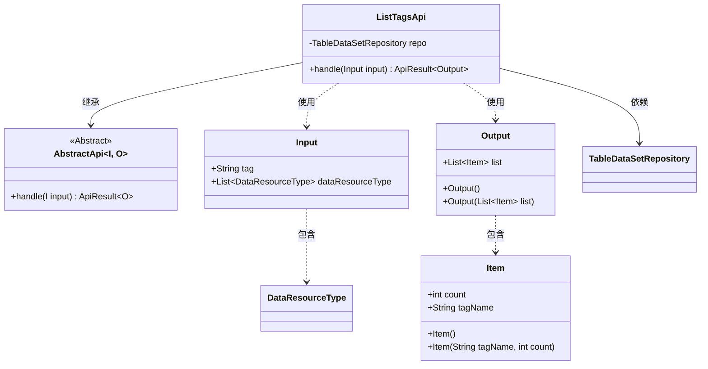
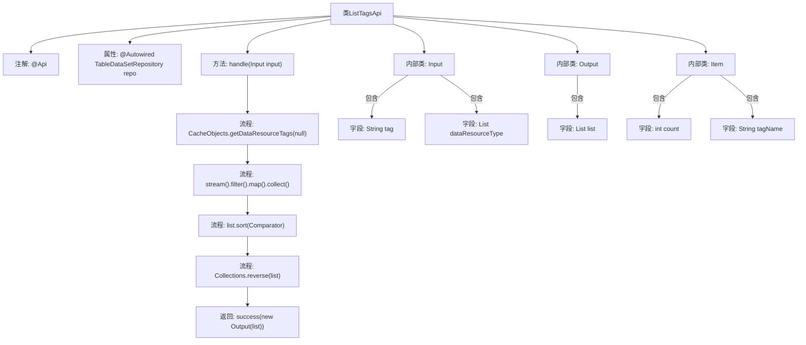

# 基础信息

|      |      |
|------|------|
| 名称 | ListTagsApi |
| 编码语言 | .java |
| 代码路径 | WeFe/board/board-service/src/main/java/com/welab/wefe/board/service/api/data_resource/ListTagsApi.java |
| 包名 | com.welab.wefe.board.service.api.data_resource |
| 依赖项 | ['com.welab.wefe.board.service.database.repository.data_resource.TableDataSetRepository', 'com.welab.wefe.board.service.service.CacheObjects', 'com.welab.wefe.common.exception.StatusCodeWithException', 'com.welab.wefe.common.fieldvalidate.annotation.Check', 'com.welab.wefe.common.util.StringUtil', 'com.welab.wefe.common.web.api.base.AbstractApi', 'com.welab.wefe.common.web.api.base.Api', 'com.welab.wefe.common.web.dto.AbstractApiInput', 'com.welab.wefe.common.web.dto.ApiResult', 'com.welab.wefe.common.wefe.enums.DataResourceType', 'org.springframework.beans.factory.annotation.Autowired', 'java.util.Collections', 'java.util.Comparator', 'java.util.List', 'java.util.stream.Collectors'] |
| 概述说明 | ListTagsApi接口用于获取数据集标签列表，支持按标签关键字模糊搜索和资源类型过滤，返回按标签数量排序的结果。 |

# 说明

该代码定义了一个名为ListTagsApi的API类，用于处理数据集标签的查询请求。API路径为"data_resource/tags"，接收包含tag关键字和资源类型的输入参数，通过缓存获取标签数据并进行过滤和排序。输出包含标签名称及其计数的列表，按计数降序排列。输入参数支持模糊搜索和资源类型筛选，输出结果为排序后的标签列表。

# 类列表 Class Summary

| 名称   | 类型  | 说明 |
|-------|------|-------------|
| ListTagsApi | class | ListTagsApi类处理数据集标签查询，支持按关键字模糊筛选并返回按计数排序的标签列表。输入含tag关键字和资源类型，输出为标签名和计数的列表。 |

## 类 ListTagsApi

|      |      |
|------|------|
| 访问范围 | @Api(path = "data_resource/tags", name = "all of the table data set tags");public |
| 类型 | class |
| 名称 | ListTagsApi |
| 说明 | ListTagsApi类处理数据集标签查询，支持按关键字模糊筛选并返回按计数排序的标签列表。输入含tag关键字和资源类型，输出为标签名和计数的列表。 |

### UML类图

这段代码展示了一个用于处理数据集标签列表的API类结构。ListTagsApi继承自泛型抽象类AbstractApi，接收Input参数并返回包含Item列表的Output结果。核心功能是通过缓存获取标签数据，支持按关键字过滤和按计数排序，体现了清晰的输入输出分离和数据处理逻辑。类图中包含了5个主要类和1个接口，清晰地展示了继承、依赖和包含关系。

### 内部方法调用关系图

这段代码实现了一个带标签过滤和排序功能的API，主要流程为：通过CacheObjects获取数据资源标签，根据输入参数进行流式过滤和映射，对结果列表按计数排序后返回。Input类定义了标签关键字和资源类型参数，Output和Item类分别封装了返回结果及其条目结构。整个流程体现了数据获取、过滤、排序和响应的完整处理链。

### 字段列表 Field List

| 名称  | 类型  | 说明 |
|-------|-------|------|
| repo | TableDataSetRepository | 使用@Autowired自动注入TableDataSetRepository实例repo。 |

### 方法列表

| 名称  | 类型  | 说明 |
|-------|-------|------|
| handle | ApiResult<Output> | 方法处理输入参数，从缓存获取数据并按标签过滤后排序，返回结果列表。 |

