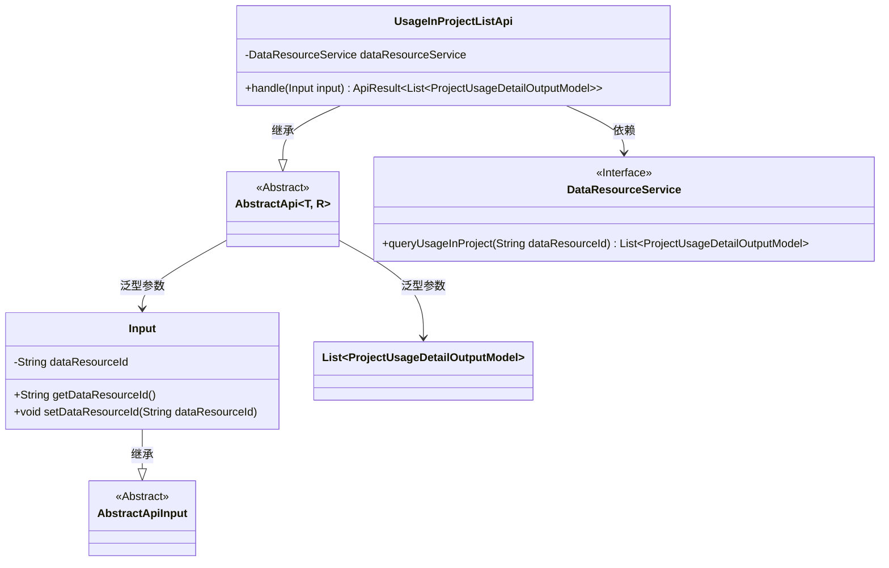

# 基础信息

|      |      |
|------|------|
| 名称 | UsageInProjectListApi |
| 编码语言 | .java |
| 代码路径 | WeFe/board/board-service/src/main/java/com/welab/wefe/board/service/api/data_resource/UsageInProjectListApi.java |
| 包名 | com.welab.wefe.board.service.api.data_resource |
| 依赖项 | ['com.welab.wefe.board.service.dto.entity.project.ProjectUsageDetailOutputModel', 'com.welab.wefe.board.service.service.data_resource.DataResourceService', 'com.welab.wefe.common.exception.StatusCodeWithException', 'com.welab.wefe.common.fieldvalidate.annotation.Check', 'com.welab.wefe.common.web.api.base.AbstractApi', 'com.welab.wefe.common.web.api.base.Api', 'com.welab.wefe.common.web.dto.AbstractApiInput', 'com.welab.wefe.common.web.dto.ApiResult', 'org.springframework.beans.factory.annotation.Autowired', 'java.io.IOException', 'java.util.List'] |
| 概述说明 | 该API用于查询数据资源在各项目中的使用情况，接收资源ID参数，返回项目使用详情列表。 |

# 说明

该代码定义了一个名为UsageInProjectListApi的API类，用于查询数据资源在项目中的使用情况。API路径为data_resource/usage_in_project_list，功能是按数据资源使用情况列出项目。该类继承自AbstractApi，输入类型为内部类Input，输出为ProjectUsageDetailOutputModel列表。输入参数dataResourceId是必填项，通过DataResourceService的queryUsageInProject方法获取结果。处理逻辑封装在handle方法中，成功时返回查询结果。

# 类列表 Class Summary

| 名称   | 类型  | 说明 |
|-------|------|-------------|
| UsageInProjectListApi | class | 该API用于查询数据资源在项目中的使用情况，接收资源ID参数，返回项目使用详情列表。核心逻辑调用DataResourceService处理查询请求。 |

## 类 UsageInProjectListApi

|      |      |
|------|------|
| 访问范围 | @Api(path = "data_resource/usage_in_project_list", name = "list project by data resource usage");public |
| 类型 | class |
| 名称 | UsageInProjectListApi |
| 说明 | 该API用于查询数据资源在项目中的使用情况，接收资源ID参数，返回项目使用详情列表。核心逻辑调用DataResourceService处理查询请求。 |

### UML类图

这段代码展示了一个基于抽象API框架的REST端点实现，主要用于查询数据资源在项目中的使用情况。核心类UsageInProjectListApi继承自泛型抽象类AbstractApi，指定了输入类型Input和返回类型List<ProjectUsageDetailOutputModel>。通过依赖注入的DataResourceService接口实现业务逻辑，Input类作为参数封装了必要的数据资源ID字段。整体设计体现了清晰的层次结构和职责分离，输入验证通过注解实现，异常处理由父类统一管理。

### 内部方法调用关系图

```mermaid
graph TD
    A["类UsageInProjectListApi"]
    B["注解: @Api"]
    C["继承: AbstractApi<Input, List<ProjectUsageDetailOutputModel>>"]
    D["依赖注入: @Autowired DataResourceService"]
    E["重写方法: handle(Input input)"]
    F["内部类: Input"]
    G["属性: String dataResourceId"]
    H["校验注解: @Check"]
    I["getter/setter方法"]
    J["方法调用: dataResourceService.queryUsageInProject"]

    A --> B
    A --> C
    A --> D
    A --> E
    A --> F
    F --> G
    F --> H
    F --> I
    E --> J
```

这段代码定义了一个名为UsageInProjectListApi的API类，继承自AbstractApi基类，用于查询数据资源在项目中的使用情况。类中包含一个内部Input类用于接收请求参数，通过@Autowired注入DataResourceService服务，并重写handle方法调用queryUsageInProject查询服务。Input类中的dataResourceId字段通过@Check注解进行参数校验，确保资源ID必填。整体流程清晰展示了从API入口到服务调用的完整链路。

### 字段列表 Field List

| 名称  | 类型  | 说明 |
|-------|-------|------|
| dataResourceService | DataResourceService | 使用@Autowired自动注入DataResourceService实例。 |

### 方法列表

| 名称  | 类型  | 说明 |
|-------|-------|------|
| handle | ApiResult<List<ProjectUsageDetailOutputModel>> | 重写方法处理项目资源使用查询，返回查询结果或异常。 |

