# 基础信息

|      |      |
|------|------|
| 名称 | data_resource |
| 编码语言 | .java |
| 代码路径 | WeFe/board/board-service/src/main/java/com/welab/wefe/board/service/api/data_resource |
| 包名 | docs.board.board-service.src.main.java.com.welab.wefe.board.service.api.data_resource |
| 概述说明 | 管理数据集生命周期，包括增删改查、预览及元数据操作。支持文件上传、结构化存储和样本查看。提供布隆过滤器管理、图像数据集维护及标签查询功能。接口遵循RESTful规范，统一继承AbstractApi，路径前缀明确。关键数据结构包含输入输出模型，依赖服务层处理业务逻辑。 |

# 说明

## 概述  
该模块核心职责是统一管理多模态数据资源（表格/图像/布隆过滤器）的全生命周期，提供标准CRUD操作、元数据维护及跨项目使用追踪，类似数据中台架构。接口规范继承AbstractApi基类，路径按资源类型分层（如`table_data_set/add`），输入输出均采用Model类封装，例如DataResourceAddOutputModel跨模块复用。关键数据结构包含三类模型：输入校验类（如TableDataSetUpdateInputModel）、分页包装类（PagingOutput）和业务实体类（如ImageDataSet实体）。外部依赖包括各资源专属Service（如BloomFilterService）、通用存储库（Repository）及缓存组件。例如ListTagsApi通过缓存优化标签查询性能。

## 主要业务场景  
典型流程形成数据治理闭环：1）资源接入（通过AddApi/文件上传API导入CSV/Excel等）；2）元数据管理（DetailApi维护描述信息，ListTagsApi处理标签）；3）应用分析（StatisticsApi生成热力图，UsageInProjectListApi追踪使用场景）。交互模式混合精确查询（如ID检索详情）和批量操作（如分页筛选），类似数据库管理系统。API类型覆盖：基础CRUD（如DeleteApi）、扩展功能（PreviewApi解析文件）、统计类（标签计数排序）和集成类（DataResourceQueryApi支持多条件联合查询）。例如图像数据集场景需串联UpdateApi修改标注、DownloadApi导出文件、StatisticsApi可视化分布。

### 包内部结构视图

```mermaid
graph TD
    data_resource --> table_data_set
    data_resource --> upload_task
    data_resource --> bloom_filter
    data_resource --> image_data_set
    data_resource --> UsageInProjectListApi
    data_resource --> ListTagsApi
    data_resource --> DataResourceQueryApi

    table_data_set --> column
    table_data_set --> ListServerLocalFilesApi
    table_data_set --> UpdateApi
    table_data_set --> AddApi
    table_data_set --> TableDataSetDeleteApi
    table_data_set --> DetailApi
    table_data_set --> PreviewApi

    column --> ListApi

    upload_task --> DataResourceUploadTaskDetailApi
    upload_task --> DataResourceUploadTaskQueryApi

    bloom_filter --> BloomFilterPreviewApi
    bloom_filter --> BloomFilterDeleteApi
    bloom_filter --> BloomFilterDataResourceListApi
    bloom_filter --> BloomFilterDetailApi
    bloom_filter --> BloomFilterAddApi
    bloom_filter --> BloomFilterUpdateApi

    image_data_set --> sample
    image_data_set --> ImageDataSetUpdateApi
    image_data_set --> ImageDataSetAddApi
    image_data_set --> ImageDataSetDetailApi
    image_data_set --> ImageDataSetDownloadApi
    image_data_set --> ImageDataSetDeleteApi

    sample --> ImageDataSetSampleDeleteApi
    sample --> ImageDataSetSampleQueryApi
    sample --> ImageDataSetSampleDownloadApi
    sample --> ImageDataSetSampleUpdateApi
    sample --> ImageDataSetSampleStatisticsApi
```

该流程图展示了数据资源模块的完整API结构，包含四大子模块（表格数据集、上传任务、布隆过滤器和图像数据集）及其对应的API接口。每个子模块下又细分为具体功能接口，如表格数据集包含列操作接口，图像数据集包含样本管理接口等。顶层还包含三个独立的数据资源查询API。整个结构清晰展现了模块间的层级关系。

# 文件列表

| 名称   | 类型  | 说明 |
|-------|------|-------------|
| [UsageInProjectListApi.java](UsageInProjectListApi.md) | file | 该API用于查询数据资源在各项目中的使用情况，接收资源ID参数，返回项目使用详情列表。 |
| [ListTagsApi.java](ListTagsApi.md) | file | ListTagsApi接口用于获取数据集标签列表，支持按标签关键字模糊搜索和资源类型过滤，返回按标签数量排序的结果。 |
| [DataResourceQueryApi.java](DataResourceQueryApi.md) | file | DataResourceQueryApi用于查询各类数据资源，包含分页输入参数如资源ID、名称、标签、上传者、资源类型等，返回分页结果。 |
| [image_data_set](image_data_set/_module.md) | package | 该模块提供图像数据集的CRUD管理功能，包括增删改查、下载及标签统计。API基于RESTful风格，路径统一以image_data_set为前缀。核心功能涵盖数据操作和统计分析，依赖服务层和数据库实现业务逻辑。 |
| [bloom_filter](bloom_filter/_module.md) | package | BloomFilterPreviewApi预览布隆过滤器数据，支持数据库和文件读取。BloomFilterDeleteApi删除布隆过滤器。BloomFilterDataResourceListApi查询数据资源。BloomFilterDetailApi获取布隆过滤器详情。BloomFilterAddApi添加布隆过滤器。BloomFilterUpdateApi更新布隆过滤器信息。 |
| [upload_task](upload_task/_module.md) | package | DataResourceUploadTaskDetailApi类用于获取数据集上传任务详情，继承AbstractApi，通过dataResourceId查询。DataResourceUploadTaskQueryApi类用于分页查询任务列表，继承AbstractApi，使用PagingInput参数返回分页结果。两者均通过DataResourceUploadTaskService处理查询。 |
| [table_data_set](table_data_set/_module.md) | package | ListApi类用于获取数据集字段列表，路径为table_data_set/column/list。ListServerLocalFilesApi类查询服务器文件，仅显示xls、xlsx和csv文件。UpdateApi类更新数据集信息，路径为table_data_set/update。AddApi类添加数据集，路径为table_data_set/add。DeleteApi类删除数据集，路径为table_data_set/delete。DetailApi类获取数据集详情，路径为table_data_set/detail。PreviewApi类预览数据集行，支持数据库和文件数据源。 |

