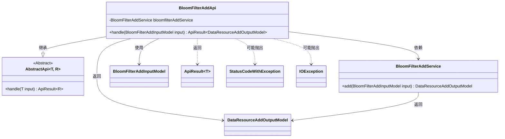
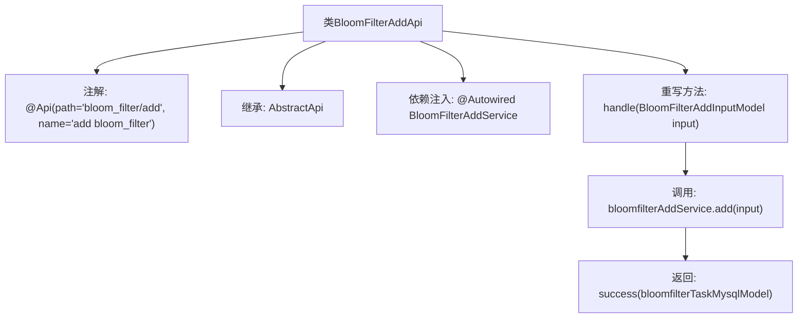

# 基础信息

|      |      |
|------|------|
| 名称 | BloomFilterAddApi |
| 编码语言 | .java |
| 代码路径 | WeFe/board/board-service/src/main/java/com/welab/wefe/board/service/api/data_resource/bloom_filter/BloomFilterAddApi.java |
| 包名 | com.welab.wefe.board.service.api.data_resource.bloom_filter |
| 依赖项 | ['com.welab.wefe.board.service.dto.vo.data_resource.BloomFilterAddInputModel', 'com.welab.wefe.board.service.dto.vo.data_resource.DataResourceAddOutputModel', 'com.welab.wefe.board.service.service.data_resource.add.BloomFilterAddService', 'com.welab.wefe.common.exception.StatusCodeWithException', 'com.welab.wefe.common.web.api.base.AbstractApi', 'com.welab.wefe.common.web.api.base.Api', 'com.welab.wefe.common.web.dto.ApiResult', 'org.springframework.beans.factory.annotation.Autowired', 'java.io.IOException'] |
| 概述说明 | 这是一个布隆过滤器添加API类，继承自AbstractApi，使用BloomFilterAddService处理添加请求，返回DataResourceAddOutputModel结果。 |

# 说明

这段代码描述了一个名为BloomFilterAddApi的Java类，它是一个基于Spring框架的API接口，用于处理布隆过滤器的添加操作。该类继承自AbstractApi，泛型参数指定了输入模型BloomFilterAddInputModel和输出模型DataResourceAddOutputModel。通过@Autowired注解注入了BloomFilterAddService服务类。handle方法重写了父类方法，调用bloomfilterAddService.add处理输入参数，并返回封装成功的ApiResult结果。整个类通过@Api注解定义了API路径为"bloom_filter/add"和名称为"add bloom_filter"。

# 类列表 Class Summary

| 名称   | 类型  | 说明 |
|-------|------|-------------|
| BloomFilterAddApi | class | 这是一个布隆过滤器添加API类，继承自AbstractApi，使用BloomFilterAddService处理添加请求，返回DataResourceAddOutputModel结果。 |

## 类 BloomFilterAddApi

|      |      |
|------|------|
| 访问范围 | @Api(path = "bloom_filter/add", name = "add bloom_filter");public |
| 类型 | class |
| 名称 | BloomFilterAddApi |
| 说明 | 这是一个布隆过滤器添加API类，继承自AbstractApi，使用BloomFilterAddService处理添加请求，返回DataResourceAddOutputModel结果。 |

### UML类图

类图描述：该图展示了BloomFilterAddApi类继承自泛型抽象类AbstractApi，并依赖BloomFilterAddService进行业务处理。BloomFilterAddApi接收BloomFilterAddInputModel作为输入，返回包含DataResourceAddOutputModel的ApiResult结果，同时可能抛出StatusCodeWithException和IOException异常。服务层BloomFilterAddService负责核心添加逻辑，体现了清晰的层级调用关系。

### 内部方法调用关系图

这段代码展示了一个基于Spring框架的API类BloomFilterAddApi，用于处理布隆过滤器添加操作。该类继承自AbstractApi抽象类，通过@Autowired注入BloomFilterAddService服务，并重写handle方法实现核心逻辑：调用服务的add方法处理输入模型，最后返回封装成功的ApiResult结果。流程图清晰呈现了类结构、依赖关系和主要方法调用链。

### 字段列表 Field List

| 名称  | 类型  | 说明 |
|-------|-------|------|
| bloomfilterAddService | BloomFilterAddService | 使用@Autowired自动注入BloomFilterAddService实例。 |

### 方法列表

| 名称  | 类型  | 说明 |
|-------|-------|------|
| handle | ApiResult<DataResourceAddOutputModel> | 重写方法处理布隆过滤器添加请求，调用服务添加数据并返回结果。 |

