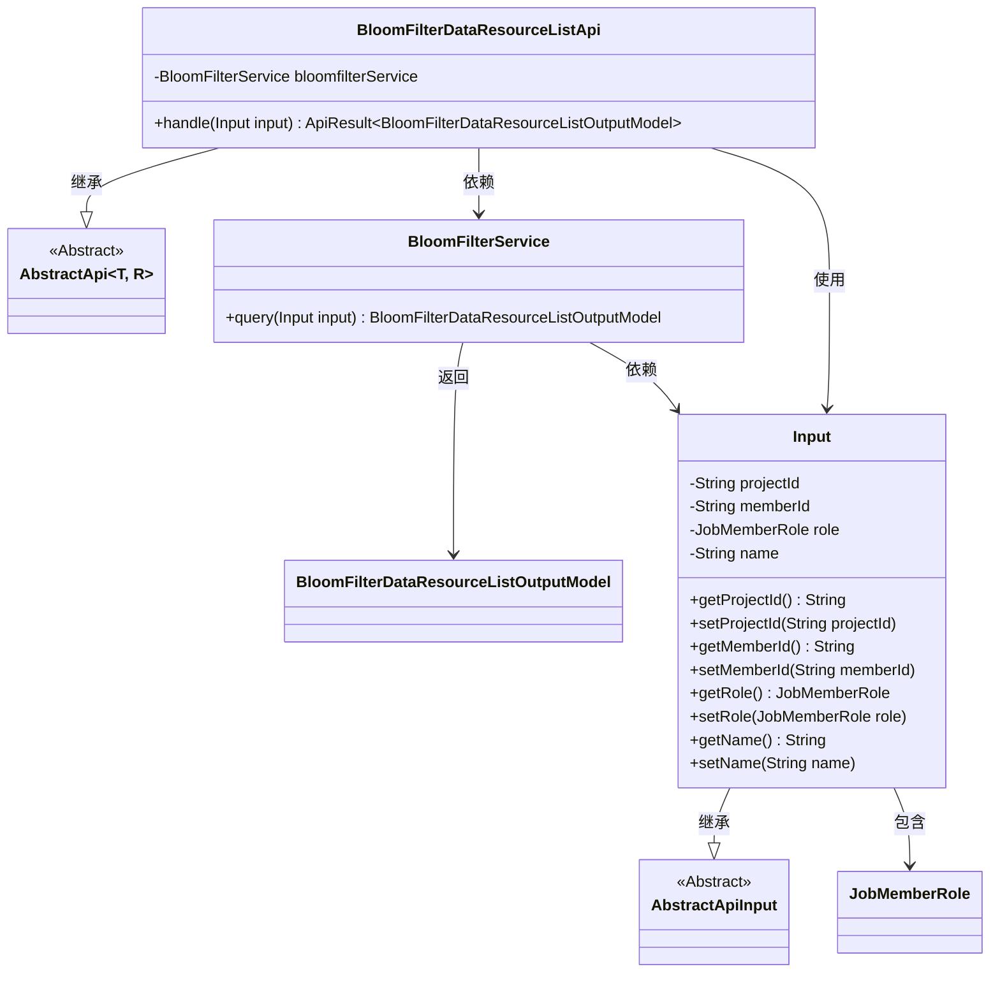
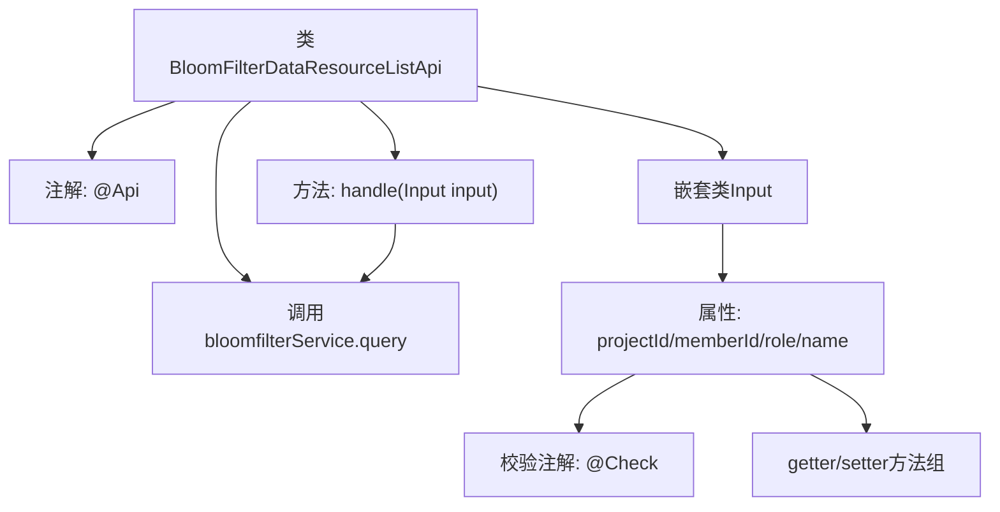

# 基础信息

|      |      |
|------|------|
| 名称 | BloomFilterDataResourceListApi |
| 编码语言 | .java |
| 代码路径 | WeFe/board/board-service/src/main/java/com/welab/wefe/board/service/api/data_resource/bloom_filter/BloomFilterDataResourceListApi.java |
| 包名 | com.welab.wefe.board.service.api.data_resource.bloom_filter |
| 依赖项 | ['com.welab.wefe.board.service.dto.entity.BloomFilterDataResourceListOutputModel', 'com.welab.wefe.board.service.service.data_resource.bloom_filter.BloomFilterService', 'com.welab.wefe.common.exception.StatusCodeWithException', 'com.welab.wefe.common.fieldvalidate.annotation.Check', 'com.welab.wefe.common.web.api.base.AbstractApi', 'com.welab.wefe.common.web.api.base.Api', 'com.welab.wefe.common.web.dto.AbstractApiInput', 'com.welab.wefe.common.web.dto.ApiResult', 'com.welab.wefe.common.wefe.enums.JobMemberRole', 'org.springframework.beans.factory.annotation.Autowired', 'java.io.IOException'] |
| 概述说明 | BloomFilterDataResourceListApi类用于查询数据资源，需提供工程Id、成员Id、成员类型，可选数据资源名称，调用bloomfilterService.query处理请求。 |

# 说明

该代码定义了一个名为BloomFilterDataResourceListApi的API类，用于查询数据资源。API路径为data_resource/member/query，继承自AbstractApi类，处理输入类型Input和输出类型BloomFilterDataResourceListOutputModel。输入参数包括必填的工程Id、成员Id、成员类型以及可选的数据资源名称。通过BloomFilterService的query方法处理请求并返回结果。输入参数通过getter和setter方法进行访问和修改。

# 类列表 Class Summary

| 名称   | 类型  | 说明 |
|-------|------|-------------|
| BloomFilterDataResourceListApi | class | BloomFilterDataResourceListApi类用于查询数据资源，需提供工程Id、成员Id、成员类型，可选数据资源名称，调用BloomFilterService处理请求并返回结果。 |

## 类 BloomFilterDataResourceListApi

|      |      |
|------|------|
| 访问范围 | @Api(path = "data_resource/member/query", name = "query data_resource");public |
| 类型 | class |
| 名称 | BloomFilterDataResourceListApi |
| 说明 | BloomFilterDataResourceListApi类用于查询数据资源，需提供工程Id、成员Id、成员类型，可选数据资源名称，调用BloomFilterService处理请求并返回结果。 |

### UML类图

这段代码描述了一个基于布隆过滤器的数据资源查询API。BloomFilterDataResourceListApi继承自泛型抽象类AbstractApi，处理包含工程ID、成员ID、成员类型等参数的输入类Input，通过BloomFilterService进行查询并返回BloomFilterDataResourceListOutputModel结果。Input类继承自AbstractApiInput，包含多个带校验注解的字段及其getter/setter方法。整体结构展示了典型的API层、服务层和数据模型层的分层架构。

### 内部方法调用关系图

该流程图展示了BloomFilterDataResourceListApi类的核心结构，包含API注解标记、服务依赖注入、请求处理方法及嵌套输入参数类的组成。输入类Input包含四个带校验注解的属性和对应的getter/setter方法，handle方法通过bloomfilterService处理输入参数并返回结果。整体呈现了从API入口到业务处理的完整调用链路。

### 字段列表 Field List

| 名称  | 类型  | 说明 |
|-------|-------|------|
| bloomfilterService | BloomFilterService | 使用@Autowired自动注入BloomFilterService实例。 |

### 方法列表

| 名称  | 类型  | 说明 |
|-------|-------|------|
| handle | ApiResult<BloomFilterDataResourceListOutputModel> | 该方法重写父类逻辑，调用bloomfilterService查询输入参数并返回结果，可能抛出异常。 |

