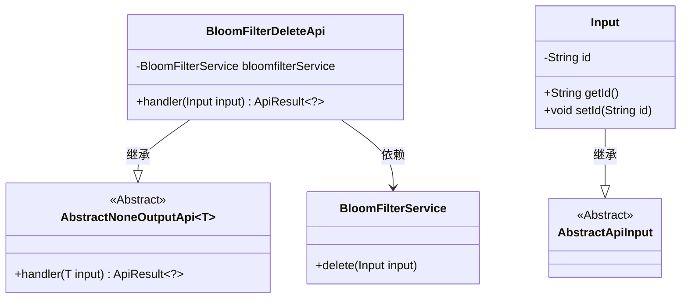

# 基础信息

|      |      |
|------|------|
| 名称 | BloomFilterDeleteApi |
| 编码语言 | .java |
| 代码路径 | WeFe/board/board-service/src/main/java/com/welab/wefe/board/service/api/data_resource/bloom_filter/BloomFilterDeleteApi.java |
| 包名 | com.welab.wefe.board.service.api.data_resource.bloom_filter |
| 依赖项 | ['com.welab.wefe.board.service.service.data_resource.bloom_filter.BloomFilterService', 'com.welab.wefe.common.fieldvalidate.annotation.Check', 'com.welab.wefe.common.web.api.base.AbstractNoneOutputApi', 'com.welab.wefe.common.web.api.base.Api', 'com.welab.wefe.common.web.dto.AbstractApiInput', 'com.welab.wefe.common.web.dto.ApiResult', 'org.springframework.beans.factory.annotation.Autowired'] |
| 概述说明 | BloomFilterDeleteApi类用于删除布隆过滤器，接收数据集Id作为必填参数，调用bloomfilterService.delete方法处理。 |

# 说明

该代码定义了一个名为BloomFilterDeleteApi的API类，用于删除布隆过滤器。它继承自AbstractNoneOutputApi，输入参数为内部类Input。Input包含一个必填字段id，表示数据集ID。API通过BloomFilterService的delete方法处理删除请求，成功时返回空结果。整个类标注了API路径和名称，并使用了Spring的依赖注入。

# 类列表 Class Summary

| 名称   | 类型  | 说明 |
|-------|------|-------------|
| BloomFilterDeleteApi | class | 这是一个删除布隆过滤器的API类，接收数据集ID作为输入，调用服务层进行删除操作，无返回值。 |

## 类 BloomFilterDeleteApi

|      |      |
|------|------|
| 访问范围 | @Api(path = "bloom_filter/delete", name = "delete bloom_filter");public |
| 类型 | class |
| 名称 | BloomFilterDeleteApi |
| 说明 | 这是一个删除布隆过滤器的API类，接收数据集ID作为输入，调用服务层进行删除操作，无返回值。 |

### UML类图

类图描述：该图展示了BloomFilterDeleteApi及其相关类的结构关系。BloomFilterDeleteApi继承自泛型类AbstractNoneOutputApi<Input>，并依赖BloomFilterService进行删除操作。Input类继承自AbstractApiInput，包含id属性和对应的getter/setter方法。整体结构体现了Spring风格的API控制器与服务的分层设计。

### 内部方法调用关系图

```mermaid
graph TD
    A["类BloomFilterDeleteApi"]
    B["继承: AbstractNoneOutputApi<Input>"]
    C["注解: @Api(path='bloom_filter/delete', name='delete bloom_filter')"]
    D["依赖注入: @Autowired BloomFilterService"]
    E["重写方法: handler(Input input)"]
    F["内部类: Input"]
    G["继承: AbstractApiInput"]
    H["属性: String id"]
    I["校验注解: @Check(name='数据集 Id', require=true)"]
    J["getter/setter方法"]

    A --> B
    A --> C
    A --> D
    A --> E
    E --> D
    E --> F
    F --> G
    F --> H
    H --> I
    H --> J
```

这段代码描述了一个布隆过滤器删除API的实现，主要包含BloomFilterDeleteApi类及其内部输入参数类Input。流程图展示了类继承关系、依赖注入、方法重写和参数校验等关键结构。外部API类通过handler方法调用BloomFilterService服务，内部Input类封装了必须校验的数据集ID字段，整体采用分层设计模式，符合API接口的典型实现方式。

### 字段列表 Field List

| 名称  | 类型  | 说明 |
|-------|-------|------|
| bloomfilterService | BloomFilterService | 使用@Autowired自动注入BloomFilterService实例。 |

### 方法列表

| 名称  | 类型  | 说明 |
|-------|-------|------|
| handler | ApiResult<?> | 该方法重写父类handler，接收Input参数，调用bloomfilterService的delete方法处理输入，成功后返回ApiResult。异常时抛出Exception。 |

