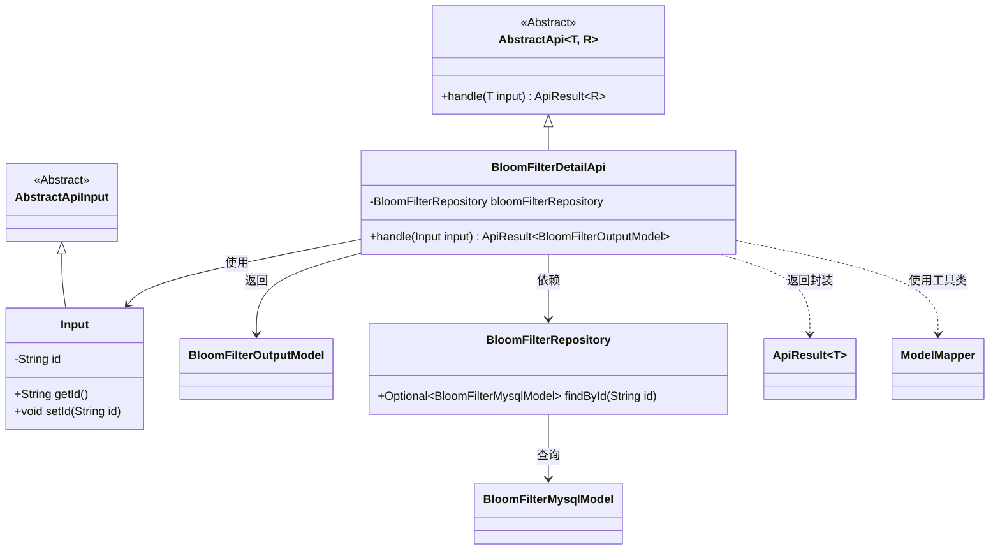

# 基础信息

|      |      |
|------|------|
| 名称 | BloomFilterDetailApi |
| 编码语言 | .java |
| 代码路径 | WeFe/board/board-service/src/main/java/com/welab/wefe/board/service/api/data_resource/bloom_filter/BloomFilterDetailApi.java |
| 包名 | com.welab.wefe.board.service.api.data_resource.bloom_filter |
| 依赖项 | ['com.welab.wefe.board.service.database.entity.data_resource.BloomFilterMysqlModel', 'com.welab.wefe.board.service.database.repository.data_resource.BloomFilterRepository', 'com.welab.wefe.board.service.dto.entity.data_resource.output.BloomFilterOutputModel', 'com.welab.wefe.common.exception.StatusCodeWithException', 'com.welab.wefe.common.web.api.base.AbstractApi', 'com.welab.wefe.common.web.api.base.Api', 'com.welab.wefe.common.web.dto.AbstractApiInput', 'com.welab.wefe.common.web.dto.ApiResult', 'com.welab.wefe.common.web.util.ModelMapper', 'org.springframework.beans.factory.annotation.Autowired'] |
| 概述说明 | BloomFilterDetailApi类通过id查询布隆过滤器详情，返回BloomFilterOutputModel结果。若未找到数据返回空。 |

# 说明

该代码定义了一个名为BloomFilterDetailApi的API类，用于获取布隆过滤器的详细信息。类注解指定了API路径和名称。它继承自AbstractApi，输入类型为内部类Input，输出类型为BloomFilterOutputModel。通过Autowired注入BloomFilterRepository来访问数据库。handle方法根据输入ID查询数据库，若存在则映射为输出模型返回，不存在返回空成功结果。Input内部类包含id字段及其getter/setter方法。整个流程实现了按ID查询布隆过滤器详情的功能。

# 类列表 Class Summary

| 名称   | 类型  | 说明 |
|-------|------|-------------|
| BloomFilterDetailApi | class | BloomFilterDetailApi类通过id查询布隆过滤器详情，返回BloomFilterOutputModel。使用BloomFilterRepository获取数据，若不存在返回空。输入参数为id。 |

## 类 BloomFilterDetailApi

|      |      |
|------|------|
| 访问范围 | @Api(path = "bloom_filter/detail", name = "get BloomFilter detail");public |
| 类型 | class |
| 名称 | BloomFilterDetailApi |
| 说明 | BloomFilterDetailApi类通过id查询布隆过滤器详情，返回BloomFilterOutputModel。使用BloomFilterRepository获取数据，若不存在返回空。输入参数为id。 |

### UML类图

类图描述：该图展示了一个基于Spring框架的BloomFilter查询API实现。BloomFilterDetailApi继承自泛型抽象类AbstractApi，处理输入Input类并返回ApiResult封装的BloomFilterOutputModel。通过依赖BloomFilterRepository进行数据库查询，使用ModelMapper工具进行模型转换。Input作为内部类继承AbstractApiInput，包含id字段及访问器。整体结构体现了清晰的层级关系和依赖方向，符合Spring的依赖注入模式。

### 内部方法调用关系图

```mermaid
graph TD
    A["类BloomFilterDetailApi"]
    B["注解: @Api(path='bloom_filter/detail', name='get BloomFilter detail')"]
    C["继承: AbstractApi<Input, BloomFilterOutputModel>"]
    D["依赖注入: @Autowired BloomFilterRepository"]
    E["重写方法: handle(Input input)"]
    F["内部类: Input extends AbstractApiInput"]
    G["属性: String id"]
    H["方法: getId()/setId()"]
    I["流程: bloomFilterRepository.findById"]
    J["条件判断: model == null"]
    K["流程: ModelMapper.map"]
    L["返回: success(output)"]

    A --> B
    A --> C
    A --> D
    A --> E
    A --> F
    F --> G
    F --> H
    E --> I
    E --> J
    J -->|否| K
    K --> L
    J -->|是| M["返回: success()"]
```

该流程图描述了BloomFilterDetailApi类的结构和核心处理逻辑。类通过注解定义API路径，继承抽象模板类并注入仓储服务。主要处理流程包括：通过ID查询数据模型，空值检查，模型转换后返回成功结果。内部类Input封装了请求参数id及其访问方法。整体展现了从请求处理到结果返回的完整链路。

### 字段列表 Field List

| 名称  | 类型  | 说明 |
|-------|-------|------|
| bloomFilterRepository | BloomFilterRepository | 代码片段使用@Autowired自动注入BloomFilterRepository实例。 |

### 方法列表

| 名称  | 类型  | 说明 |
|-------|-------|------|
| handle | ApiResult<BloomFilterOutputModel> | 方法处理输入，查询指定ID的布隆过滤器模型。若不存在返回空成功，存在则映射为输出模型并返回成功结果。 |

