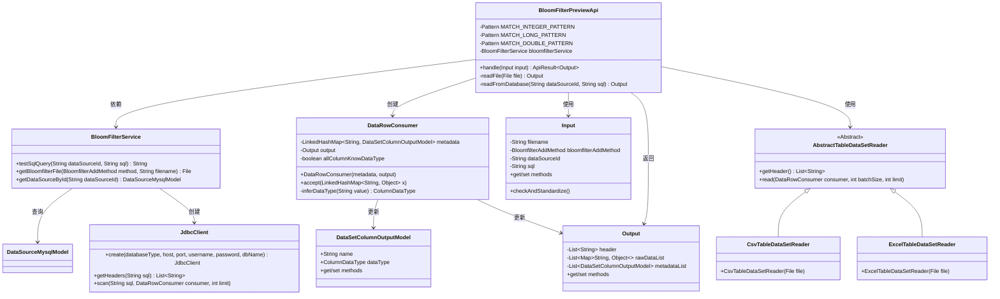
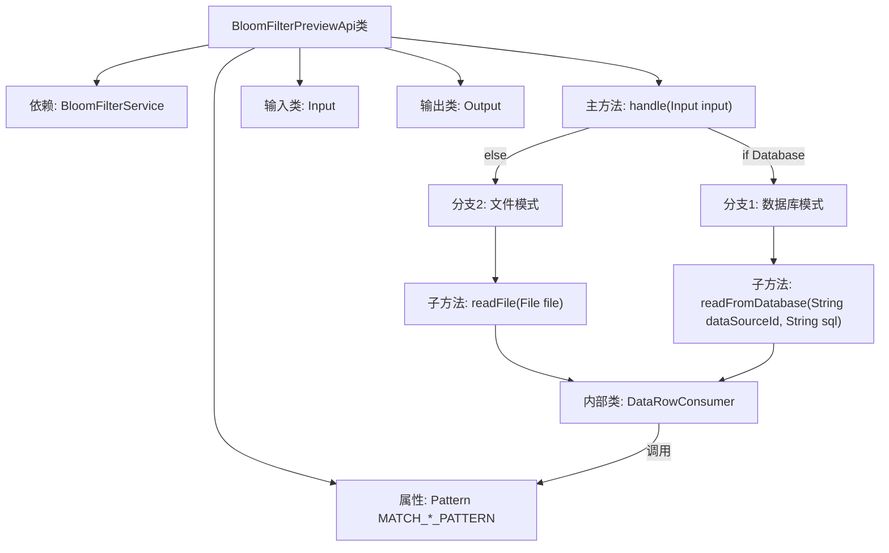
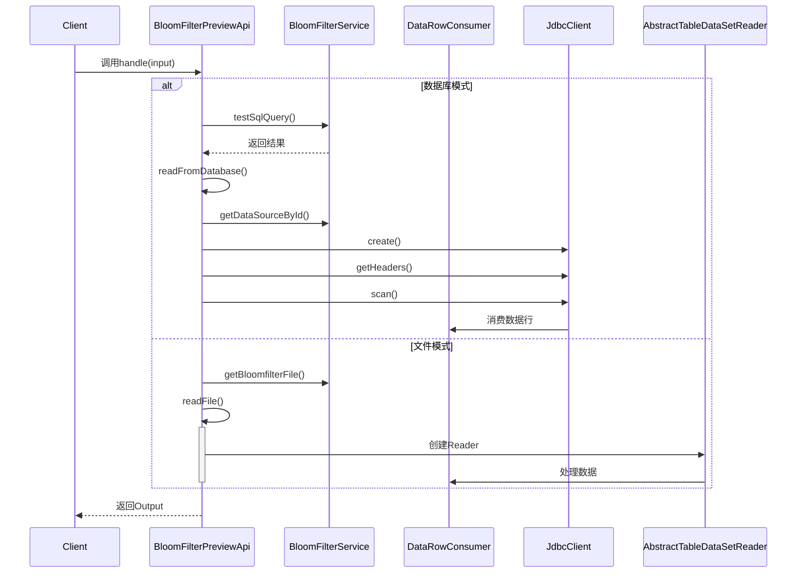

# 基础信息

|      |      |
|------|------|
| 名称 | BloomFilterPreviewApi |
| 编码语言 | .java |
| 代码路径 | WeFe/board/board-service/src/main/java/com/welab/wefe/board/service/api/data_resource/bloom_filter/BloomFilterPreviewApi.java |
| 包名 | com.welab.wefe.board.service.api.data_resource.bloom_filter |
| 依赖项 | ['com.welab.wefe.board.service.constant.BloomfilterAddMethod', 'com.welab.wefe.board.service.constant.DataSetAddMethod', 'com.welab.wefe.board.service.database.entity.DataSourceMysqlModel', 'com.welab.wefe.board.service.dto.entity.data_set.DataSetColumnOutputModel', 'com.welab.wefe.board.service.service.data_resource.bloom_filter.BloomFilterService', 'com.welab.wefe.board.service.util.AbstractTableDataSetReader', 'com.welab.wefe.board.service.util.CsvTableDataSetReader', 'com.welab.wefe.board.service.util.ExcelTableDataSetReader', 'com.welab.wefe.common.StatusCode', 'com.welab.wefe.common.exception.StatusCodeWithException', 'com.welab.wefe.common.fieldvalidate.annotation.Check', 'com.welab.wefe.common.jdbc.JdbcClient', 'com.welab.wefe.common.util.ListUtil', 'com.welab.wefe.common.web.api.base.AbstractApi', 'com.welab.wefe.common.web.api.base.Api', 'com.welab.wefe.common.web.dto.AbstractApiInput', 'com.welab.wefe.common.web.dto.ApiResult', 'com.welab.wefe.common.wefe.ColumnDataTypeInferrer', 'com.welab.wefe.common.wefe.enums.ColumnDataType', 'org.apache.commons.lang3.StringUtils', 'org.springframework.beans.factory.annotation.Autowired', 'java.io.File', 'java.io.IOException', 'java.util.ArrayList', 'java.util.LinkedHashMap', 'java.util.List', 'java.util.Map', 'java.util.function.Consumer', 'java.util.regex.Pattern', 'java.util.stream.Collectors'] |
| 概述说明 | BloomFilterPreviewApi类用于预览布隆过滤器数据，支持从数据库或文件读取数据，推断数据类型并返回元信息和预览数据。 |

# 说明

BloomFilterPreviewApi是一个用于预览布隆过滤器数据的API类，继承自AbstractApi。它支持从数据库或文件读取数据，并进行数据类型推断。主要功能包括：处理输入参数验证，通过BloomFilterService读取数据，测试数据库连接，解析CSV或Excel文件，推断数据类型（整数、长整型、双精度、字符串），并生成包含表头、原始数据和元数据的输出。输入类Input包含文件名、数据源ID、SQL等字段，输出类Output包含表头、原始数据和元数据列表。

# 类列表 Class Summary

| 名称   | 类型  | 说明 |
|-------|------|-------------|
| BloomFilterPreviewApi | class | BloomFilter预览API，支持从数据库或文件读取数据，解析数据类型并生成预览结果，包含字段列表、原始数据和元数据信息。 |

## 类 BloomFilterPreviewApi

|      |      |
|------|------|
| 访问范围 | @Api(path = "bloom_filter/preview", name = "preview bloom_filter rows");public |
| 类型 | class |
| 名称 | BloomFilterPreviewApi |
| 说明 | BloomFilter预览API，支持从数据库或文件读取数据，解析数据类型并生成预览结果，包含字段列表、原始数据和元数据信息。 |

### UML类图

这段代码实现了一个布隆过滤器预览API，主要功能是从数据库或文件读取数据并推断数据类型。BloomFilterPreviewApi继承自AbstractApi，通过handle方法处理输入参数，根据数据来源调用readFromDatabase或readFile方法。DataRowConsumer类负责处理数据行并推断数据类型，使用正则表达式匹配整数、长整型和浮点数。BloomFilterService提供数据库连接和文件操作服务，JdbcClient执行SQL查询，AbstractTableDataSetReader及其子类负责读取CSV和Excel文件。整体设计采用分层架构，职责明确，支持多种数据源和文件格式。

### 内部方法调用关系图

该流程图展示了BloomFilterPreviewApi的核心处理逻辑，包含两种数据获取路径：数据库查询和文件读取。数据库路径涉及JDBC连接和SQL执行，文件路径根据扩展名选择CSV或Excel解析器。时序图详细描述了客户端请求到数据处理的完整调用链，包括异常处理和数据转换过程。DataRowConsumer作为核心数据处理单元，负责数据类型推断和结果收集，支持最大10行的数据预览限制。

### 字段列表 Field List

| 名称  | 类型  | 说明 |
|-------|-------|------|
| MATCH_DOUBLE_PATTERN = Pattern.compile("^-?\\d+\\.\\d+$") | Pattern | 定义静态常量MATCH_DOUBLE_PATTERN，用于匹配带可选负号的浮点数格式。 |
| bloomfilterService | BloomFilterService | 自动注入布隆过滤器服务实例。 |
| MATCH_INTEGER_PATTERN = Pattern.compile("^-?\\d{1,9}$") | Pattern | 定义静态常量整数匹配正则模式，检查1到9位可选负号整数。 |
| MATCH_LONG_PATTERN = Pattern.compile("^-?\\d{10,}$") | Pattern | 定义静态常量MATCH_LONG_PATTERN，使用正则表达式匹配10位及以上数字，支持负号开头。 |

### 方法列表

| 名称  | 类型  | 说明 |
|-------|-------|------|
| handle | ApiResult<Output> | 方法根据输入选择数据源：若为数据库则测试SQL连接并读取数据，失败抛异常；若为文件则读取文件内容，出错记录日志并抛系统错误。最后返回处理结果。 |
| readFile | Output | 方法`readFile`读取文件数据，处理首行为列头，剩余为数据行，支持CSV和Excel格式，返回包含元数据和内容的`Output`对象。 |
| readFromDatabase | Output | 从数据库读取数据的方法：根据dataSourceId获取数据源配置，建立JDBC连接执行SQL查询。检查数据列名是否重复，转换Y为y，若有y列则移至第二列。构建输出对象包含列名和元数据，通过消费者处理数据行后返回结果。 |

