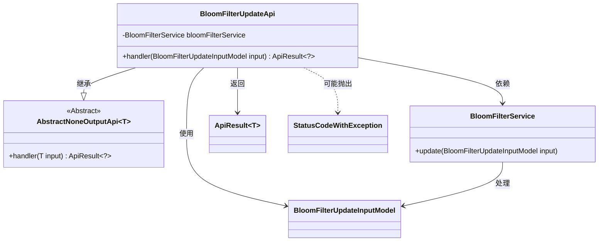
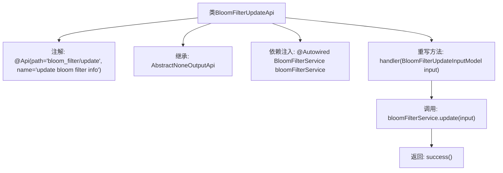

# 基础信息

|      |      |
|------|------|
| 名称 | BloomFilterUpdateApi |
| 编码语言 | .java |
| 代码路径 | WeFe/board/board-service/src/main/java/com/welab/wefe/board/service/api/data_resource/bloom_filter/BloomFilterUpdateApi.java |
| 包名 | com.welab.wefe.board.service.api.data_resource.bloom_filter |
| 依赖项 | ['com.welab.wefe.board.service.dto.vo.data_resource.BloomFilterUpdateInputModel', 'com.welab.wefe.board.service.service.data_resource.bloom_filter.BloomFilterService', 'com.welab.wefe.common.exception.StatusCodeWithException', 'com.welab.wefe.common.web.api.base.AbstractNoneOutputApi', 'com.welab.wefe.common.web.api.base.Api', 'com.welab.wefe.common.web.dto.ApiResult', 'org.springframework.beans.factory.annotation.Autowired'] |
| 概述说明 | 这是一个用于更新布隆过滤器信息的API类，通过BloomFilterService处理输入模型并返回成功结果。 |

# 说明

这是一个名为BloomFilterUpdateApi的Java类，用于更新布隆过滤器信息。它继承自AbstractNoneOutputApi类，泛型参数为BloomFilterUpdateInputModel。类上标注了Api注解，指定路径为"bloom_filter/update"，名称为"update bloom filter info"。类中通过Autowired注入了BloomFilterService服务。重写了handler方法，接收BloomFilterUpdateInputModel输入参数，调用bloomFilterService.update方法进行更新操作，最后返回成功的ApiResult。整个类实现了无输出的API接口功能。

# 类列表 Class Summary

| 名称   | 类型  | 说明 |
|-------|------|-------------|
| BloomFilterUpdateApi | class | BloomFilterUpdateApi类用于更新布隆过滤器信息，继承AbstractNoneOutputApi，调用BloomFilterService的update方法处理输入模型BloomFilterUpdateInputModel。 |

## 类 BloomFilterUpdateApi

|      |      |
|------|------|
| 访问范围 | @Api(path = "bloom_filter/update", name = "update bloom filter info");public |
| 类型 | class |
| 名称 | BloomFilterUpdateApi |
| 说明 | BloomFilterUpdateApi类用于更新布隆过滤器信息，继承AbstractNoneOutputApi，调用BloomFilterService的update方法处理输入模型BloomFilterUpdateInputModel。 |

### UML类图

这段代码展示了一个基于Spring框架的API类BloomFilterUpdateApi，它继承自泛型抽象类AbstractNoneOutputApi，专门用于处理布隆过滤器的更新操作。类图清晰地呈现了该API与BloomFilterService服务层的依赖关系，以及输入模型BloomFilterUpdateInputModel的数据流转路径。通过Autowired注入的服务类完成核心业务逻辑，最终返回统一封装的ApiResult结果。异常处理通过StatusCodeWithException实现，体现了清晰的层次结构和职责划分。

### 内部方法调用关系图

该流程图展示了BloomFilterUpdateApi类的结构和工作流程。该类通过@Api注解定义API路径和名称，继承自AbstractNoneOutputApi基类，并注入BloomFilterService服务。核心handler方法接收输入模型后调用服务层的update方法进行布隆过滤器更新，最后返回成功结果。整个流程清晰地呈现了从API入口到业务处理的调用链关系。

### 字段列表 Field List

| 名称  | 类型  | 说明 |
|-------|-------|------|
| bloomFilterService | BloomFilterService | 使用@Autowired自动注入BloomFilterService实例。 |

### 方法列表

| 名称  | 类型  | 说明 |
|-------|-------|------|
| handler | ApiResult<?> | 方法重写处理布隆过滤器更新输入，调用服务更新后返回成功结果。 |

