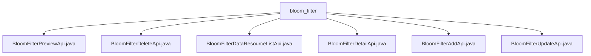

# 基础信息

|      |      |
|------|------|
| 名称 | bloom_filter |
| 编码语言 | .java |
| 代码路径 | WeFe/board/board-service/src/main/java/com/welab/wefe/board/service/api/data_resource/bloom_filter |
| 包名 | docs.board.board-service.src.main.java.com.welab.wefe.board.service.api.data_resource.bloom_filter |
| 概述说明 | BloomFilterPreviewApi预览布隆过滤器数据，支持数据库和文件读取。BloomFilterDeleteApi删除布隆过滤器。BloomFilterDataResourceListApi查询数据资源。BloomFilterDetailApi获取布隆过滤器详情。BloomFilterAddApi添加布隆过滤器。BloomFilterUpdateApi更新布隆过滤器信息。 |

# 说明

## 概述  
该模块核心职责是提供布隆过滤器数据的全生命周期管理，包括预览、增删改查等操作，类似CRUD服务模式。接口规范统一继承AbstractApi基类，输入输出均采用特定Model类封装，例如BloomFilterAddInputModel和DataResourceAddOutputModel。关键数据结构包含Input类（含ID/文件名等字段）、Output类（含表头/元数据等）及各类Model。外部依赖包括Spring框架、BloomFilterService和BloomFilterRepository。例如通过BloomFilterService处理删除请求，或使用Repository查询详情。

## 主要业务场景  
业务流程涵盖数据预览（支持CSV/Excel解析）、资源列表查询、详情获取及增删改操作，形成完整闭环。交互模式均通过REST API实现，例如预览API处理参数验证后调用服务层读取数据。典型应用包括：成员查询数据资源（需工程ID/成员ID）、按ID更新过滤器配置等。API类型包含标准CRUD（如AddApi/DeleteApi）和特殊功能（如PreviewApi），集成案例例如通过DetailApi获取元数据列表。

### 包内部结构视图

该流程图展示了bloom_filter目录下的6个API文件结构关系。所有Java文件均直接隶属于bloom_filter节点，呈现扁平化层级。这些API文件涉及布隆过滤器的预览、删除、列表查询、详情查看、新增和更新等操作功能，属于数据资源管理模块的接口实现文件。

# 文件列表

| 名称   | 类型  | 说明 |
|-------|------|-------------|
| [BloomFilterPreviewApi.java](BloomFilterPreviewApi.md) | file | BloomFilterPreviewApi类用于预览布隆过滤器数据，支持从数据库或文件读取数据，推断数据类型并返回元信息和预览数据。 |
| [BloomFilterDeleteApi.java](BloomFilterDeleteApi.md) | file | BloomFilterDeleteApi类用于删除布隆过滤器，接收数据集Id作为必填参数，调用bloomfilterService.delete方法处理。 |
| [BloomFilterDataResourceListApi.java](BloomFilterDataResourceListApi.md) | file | BloomFilterDataResourceListApi类用于查询数据资源，需提供工程Id、成员Id、成员类型，可选数据资源名称，调用bloomfilterService.query处理请求。 |
| [BloomFilterDetailApi.java](BloomFilterDetailApi.md) | file | BloomFilterDetailApi类通过id查询布隆过滤器详情，返回BloomFilterOutputModel结果。若未找到数据返回空。 |
| [BloomFilterAddApi.java](BloomFilterAddApi.md) | file | 这是一个布隆过滤器添加API类，继承自AbstractApi，使用BloomFilterAddService处理添加请求，返回DataResourceAddOutputModel结果。 |
| [BloomFilterUpdateApi.java](BloomFilterUpdateApi.md) | file | 这是一个用于更新布隆过滤器信息的API类，通过BloomFilterService处理输入模型并返回成功结果。 |

