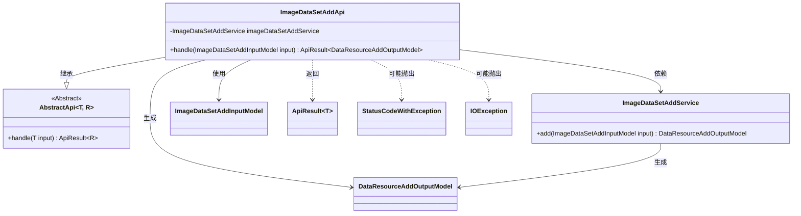
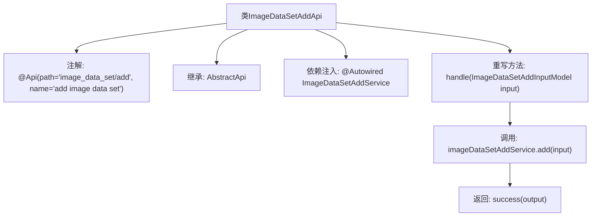

# 基础信息

|      |      |
|------|------|
| 名称 | ImageDataSetAddApi |
| 编码语言 | .java |
| 代码路径 | WeFe/board/board-service/src/main/java/com/welab/wefe/board/service/api/data_resource/image_data_set/ImageDataSetAddApi.java |
| 包名 | com.welab.wefe.board.service.api.data_resource.image_data_set |
| 依赖项 | ['com.welab.wefe.board.service.dto.vo.data_resource.DataResourceAddOutputModel', 'com.welab.wefe.board.service.dto.vo.data_resource.ImageDataSetAddInputModel', 'com.welab.wefe.board.service.service.data_resource.add.ImageDataSetAddService', 'com.welab.wefe.common.exception.StatusCodeWithException', 'com.welab.wefe.common.web.api.base.AbstractApi', 'com.welab.wefe.common.web.api.base.Api', 'com.welab.wefe.common.web.dto.ApiResult', 'org.springframework.beans.factory.annotation.Autowired', 'java.io.IOException'] |
| 概述说明 | 这是一个用于添加图像数据集的API类，继承自AbstractApi，使用ImageDataSetAddInputModel作为输入，DataResourceAddOutputModel作为输出。通过ImageDataSetAddService处理添加操作，并返回成功结果。 |

# 说明

这是一个名为ImageDataSetAddApi的Java类，用于添加图像数据集。它继承自AbstractApi基类，泛型参数指定了输入模型ImageDataSetAddInputModel和输出模型DataResourceAddOutputModel。类上标注了@Api注解，定义了API路径为"image_data_set/add"和名称为"add image data set"。通过@Autowired自动注入了ImageDataSetAddService服务。核心方法是handle，接收输入模型，调用服务层的add方法处理业务逻辑，并返回封装成功的ApiResult结果。该方法可能抛出StatusCodeWithException和IOException异常。

# 类列表 Class Summary

| 名称   | 类型  | 说明 |
|-------|------|-------------|
| ImageDataSetAddApi | class | 这是一个名为ImageDataSetAddApi的API类，用于添加图像数据集。它继承自AbstractApi，处理ImageDataSetAddInputModel输入并返回DataResourceAddOutputModel输出。通过调用imageDataSetAddService的add方法实现功能。 |

## 类 ImageDataSetAddApi

|      |      |
|------|------|
| 访问范围 | @Api(path = "image_data_set/add", name = "add image data set");public |
| 类型 | class |
| 名称 | ImageDataSetAddApi |
| 说明 | 这是一个名为ImageDataSetAddApi的API类，用于添加图像数据集。它继承自AbstractApi，处理ImageDataSetAddInputModel输入并返回DataResourceAddOutputModel输出。通过调用imageDataSetAddService的add方法实现功能。 |

### UML类图

这段代码展示了一个图像数据集添加API的实现类`ImageDataSetAddApi`，它继承自泛型抽象类`AbstractApi`，并依赖`ImageDataSetAddService`来完成核心业务逻辑。该API接收`ImageDataSetAddInputModel`作为输入，返回包含`DataResourceAddOutputModel`的`ApiResult`，并可能抛出`StatusCodeWithException`和`IOException`异常。类图清晰地展示了各组件间的继承、依赖和使用关系，体现了Spring框架中典型的控制器层实现模式。

### 内部方法调用关系图

这段代码展示了一个基于Spring框架的API类，用于添加图像数据集。流程图描述了类结构的关键元素：类继承关系、服务注入、核心处理方法调用链。该类通过`@Api`注解定义接口路径，继承抽象模板类处理特定输入输出模型，并依赖`ImageDataSetAddService`实现业务逻辑，最终返回封装好的成功结果。

### 字段列表 Field List

| 名称  | 类型  | 说明 |
|-------|-------|------|
| imageDataSetAddService | ImageDataSetAddService | 使用@Autowired自动注入ImageDataSetAddService实例。 |

### 方法列表

| 名称  | 类型  | 说明 |
|-------|-------|------|
| handle | ApiResult<DataResourceAddOutputModel> | 处理图像数据集添加请求，调用服务生成输出并返回成功结果。 |

