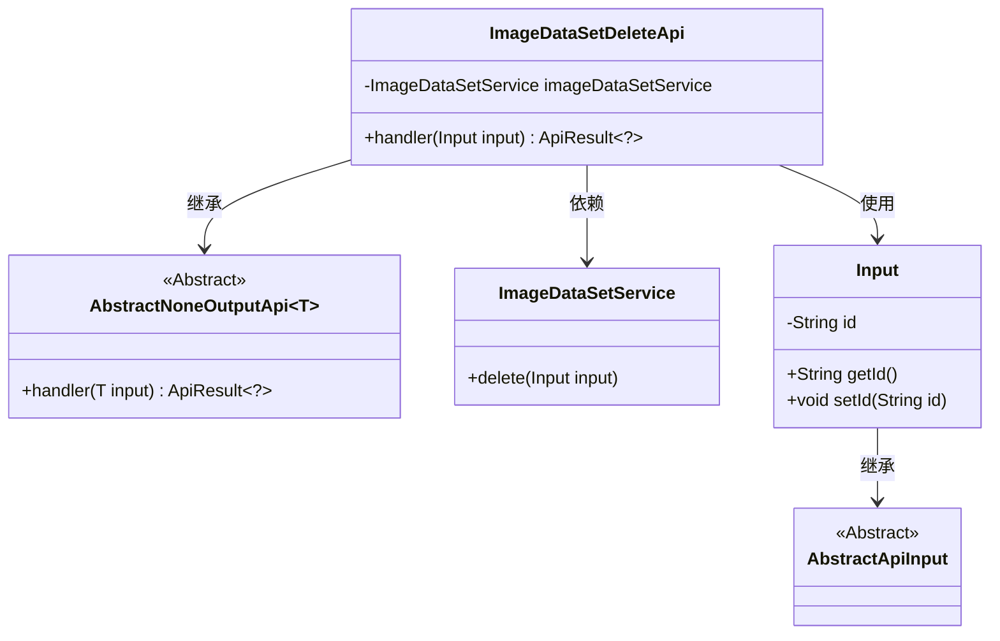

# 基础信息

|      |      |
|------|------|
| 名称 | ImageDataSetDeleteApi |
| 编码语言 | .java |
| 代码路径 | WeFe/board/board-service/src/main/java/com/welab/wefe/board/service/api/data_resource/image_data_set/ImageDataSetDeleteApi.java |
| 包名 | com.welab.wefe.board.service.api.data_resource.image_data_set |
| 依赖项 | ['com.welab.wefe.board.service.service.data_resource.image_data_set.ImageDataSetService', 'com.welab.wefe.common.exception.StatusCodeWithException', 'com.welab.wefe.common.fieldvalidate.annotation.Check', 'com.welab.wefe.common.web.api.base.AbstractNoneOutputApi', 'com.welab.wefe.common.web.api.base.Api', 'com.welab.wefe.common.web.dto.AbstractApiInput', 'com.welab.wefe.common.web.dto.ApiResult', 'org.springframework.beans.factory.annotation.Autowired'] |
| 概述说明 | 这是一个删除数据集的API类，接收数据集ID作为必填参数，调用服务层删除数据并返回成功结果。 |

# 说明

该代码定义了一个名为ImageDataSetDeleteApi的API类，用于删除图像数据集。API路径为image_data_set/delete，通过POST请求处理输入参数。输入类Input包含一个必填字段id，表示要删除的数据集ID。该API调用ImageDataSetService的delete方法执行删除操作，成功后返回空结果。整个流程通过继承抽象类实现，包含输入验证和异常处理机制。

# 类列表 Class Summary

| 名称   | 类型  | 说明 |
|-------|------|-------------|
| ImageDataSetDeleteApi | class | 删除数据集的API类，接收数据集ID作为输入，调用服务层删除操作，返回成功结果。 |

## 类 ImageDataSetDeleteApi

|      |      |
|------|------|
| 访问范围 | @Api(path = "image_data_set/delete", name = "delete data set");public |
| 类型 | class |
| 名称 | ImageDataSetDeleteApi |
| 说明 | 删除数据集的API类，接收数据集ID作为输入，调用服务层删除操作，返回成功结果。 |

### UML类图

这段代码展示了一个图像数据集删除API的实现结构。ImageDataSetDeleteApi继承自AbstractNoneOutputApi泛型类，使用Input作为输入参数类型，并依赖ImageDataSetService执行删除操作。Input类继承自AbstractApiInput，包含数据集ID字段及其访问方法。整体设计遵循了分层架构，通过继承抽象类和依赖服务类来实现业务逻辑。

### 内部方法调用关系图

```mermaid
graph TD
    A["类ImageDataSetDeleteApi"]
    B["注解: @Api(path='image_data_set/delete', name='delete data set')"]
    C["继承: AbstractNoneOutputApi<Input>"]
    D["依赖注入: @Autowired ImageDataSetService"]
    E["重写方法: handler(Input input)"]
    F["调用: imageDataSetService.delete(input)"]
    G["返回: success()"]
    H["嵌套类Input"]
    I["继承: AbstractApiInput"]
    J["字段: @Check String id"]
    K["getter/setter方法"]

    A --> B
    A --> C
    A --> D
    A --> E
    E --> F
    E --> G
    A --> H
    H --> I
    H --> J
    H --> K
```

该流程图展示了ImageDataSetDeleteApi类的结构及其关键组件。类通过@Api注解定义API路径，继承AbstractNoneOutputApi并实现handler方法处理删除请求。内部类Input继承AbstractApiInput，包含带校验注解的id字段及对应访问方法。handler方法调用imageDataSetService执行删除操作后返回成功结果，整体构成一个完整的API处理流程。

### 字段列表 Field List

| 名称  | 类型  | 说明 |
|-------|-------|------|
| imageDataSetService | ImageDataSetService | 自动注入ImageDataSetService实例。 |

### 方法列表

| 名称  | 类型  | 说明 |
|-------|-------|------|
| handler | ApiResult<?> | 删除图像数据集服务中的指定输入项，操作成功返回结果。 |

