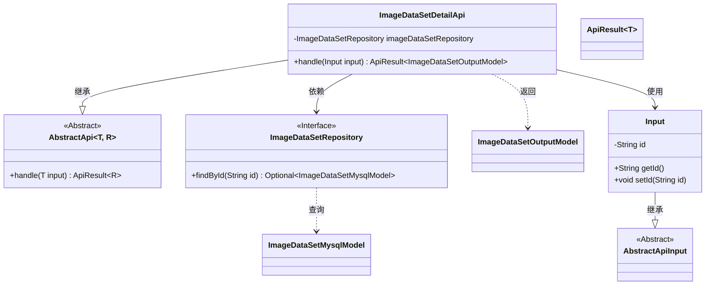

# 基础信息

|      |      |
|------|------|
| 名称 | ImageDataSetDetailApi |
| 编码语言 | .java |
| 代码路径 | WeFe/board/board-service/src/main/java/com/welab/wefe/board/service/api/data_resource/image_data_set/ImageDataSetDetailApi.java |
| 包名 | com.welab.wefe.board.service.api.data_resource.image_data_set |
| 依赖项 | ['com.welab.wefe.board.service.database.entity.data_resource.ImageDataSetMysqlModel', 'com.welab.wefe.board.service.database.repository.data_resource.ImageDataSetRepository', 'com.welab.wefe.board.service.dto.entity.data_resource.output.ImageDataSetOutputModel', 'com.welab.wefe.common.exception.StatusCodeWithException', 'com.welab.wefe.common.web.api.base.AbstractApi', 'com.welab.wefe.common.web.api.base.Api', 'com.welab.wefe.common.web.dto.AbstractApiInput', 'com.welab.wefe.common.web.dto.ApiResult', 'com.welab.wefe.common.web.util.ModelMapper', 'org.springframework.beans.factory.annotation.Autowired'] |
| 概述说明 | 该代码定义了一个获取图像数据集详情的API接口，通过ID查询数据库并返回映射后的输出模型。若未找到数据则返回空结果。输入参数为ID字符串。 |

# 说明

该代码定义了一个名为ImageDataSetDetailApi的API类，用于获取图像数据集的详细信息。该类继承自AbstractApi，接受Input类型的输入参数并返回ImageDataSetOutputModel类型的结果。通过Autowired注入ImageDataSetRepository来访问数据库。处理逻辑包括根据输入ID查询数据库，若不存在则返回空，存在则映射为输出模型并返回。Input内部类包含id字段及其getter和setter方法。API路径为"image_data_set/detail"，名称为"get a image data set detail"。

# 类列表 Class Summary

| 名称   | 类型  | 说明 |
|-------|------|-------------|
| ImageDataSetDetailApi | class | 这是一个获取图像数据集详情的API类，通过ID查询数据库并返回映射后的输出模型。若未找到数据则返回空结果。 |

## 类 ImageDataSetDetailApi

|      |      |
|------|------|
| 访问范围 | @Api(path = "image_data_set/detail", name = "get a image data set detail");public |
| 类型 | class |
| 名称 | ImageDataSetDetailApi |
| 说明 | 这是一个获取图像数据集详情的API类，通过ID查询数据库并返回映射后的输出模型。若未找到数据则返回空结果。 |

### UML类图

类图描述：该图展示了ImageDataSetDetailApi类继承自泛型抽象类AbstractApi，并依赖ImageDataSetRepository接口进行数据查询。Input作为内部类继承AbstractApiInput，用于封装输入参数。ApiResult作为泛型类包装返回结果，ImageDataSetOutputModel和ImageDataSetMysqlModel分别表示输出和数据库模型。整体结构体现了Spring风格的API层实现，包含依赖注入和模型转换逻辑。

### 内部方法调用关系图

```mermaid
graph TD
    A["类ImageDataSetDetailApi"]
    B["注解: @Api(path='image_data_set/detail', name='get a image data set detail')"]
    C["继承: AbstractApi<Input, ImageDataSetOutputModel>"]
    D["依赖注入: @Autowired ImageDataSetRepository"]
    E["重写方法: handle(Input input)"]
    F["内部类: Input extends AbstractApiInput"]
    G["属性: String id"]
    H["方法: getId()/setId()"]
    I["操作: imageDataSetRepository.findById(input.id)"]
    J["条件判断: model == null"]
    K["操作: ModelMapper.map(model, ImageDataSetOutputModel.class)"]
    L["返回: success(output)"]
    M["返回: success()"]

    A --> B
    A --> C
    A --> D
    A --> E
    A --> F
    F --> G
    F --> H
    E --> I
    I --> J
    J -- 是 --> M
    J -- 否 --> K
    K --> L
```

这段代码定义了一个获取图像数据集详情的API类，继承自抽象API基类。主要流程包括：通过ID从仓库查询数据，若存在则映射为输出模型返回，否则返回空成功结果。内部类Input封装了请求参数ID及其访问方法。流程图清晰地展示了类结构、依赖关系和核心处理逻辑的分支流程。

### 字段列表 Field List

| 名称  | 类型  | 说明 |
|-------|-------|------|
| imageDataSetRepository | ImageDataSetRepository | 自动注入ImageDataSetRepository实例。 |

### 方法列表

| 名称  | 类型  | 说明 |
|-------|-------|------|
| handle | ApiResult<ImageDataSetOutputModel> | 重写方法，根据输入ID查询图像数据集，若不存在返回空成功，存在则映射为输出模型并返回。 |

