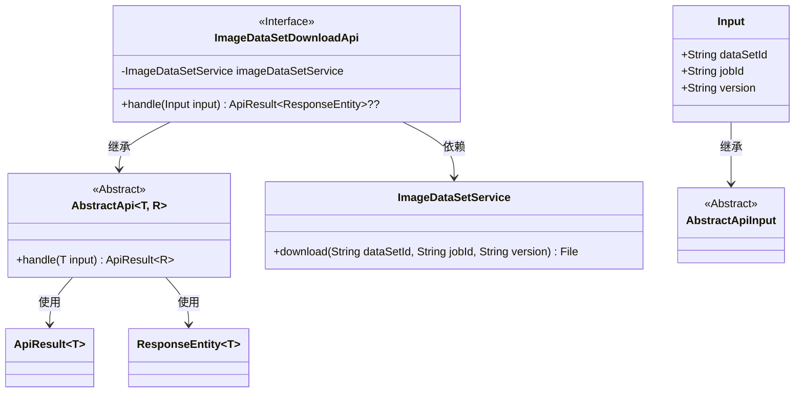
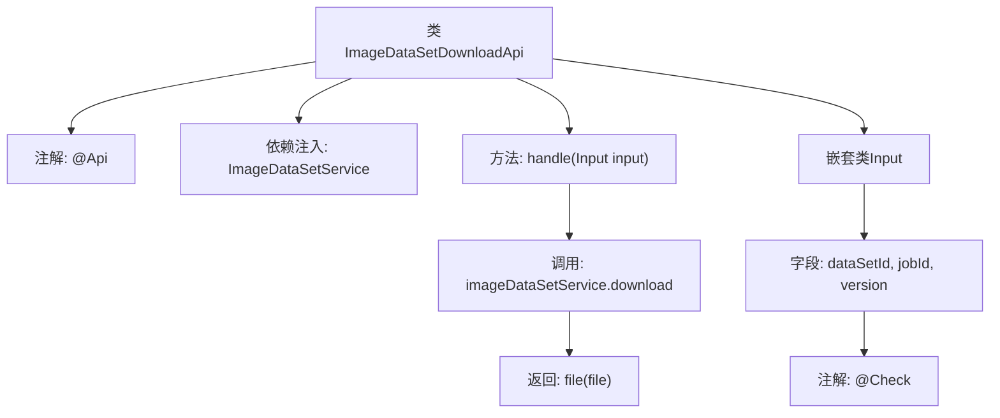
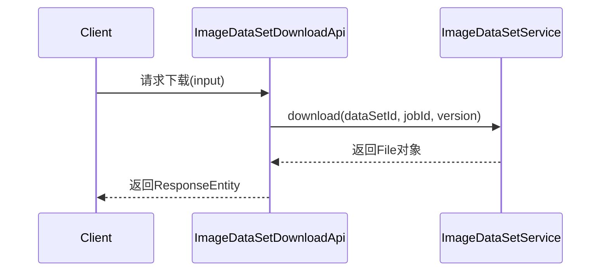

# 基础信息

|      |      |
|------|------|
| 名称 | ImageDataSetDownloadApi |
| 编码语言 | .java |
| 代码路径 | WeFe/board/board-service/src/main/java/com/welab/wefe/board/service/api/data_resource/image_data_set/ImageDataSetDownloadApi.java |
| 包名 | com.welab.wefe.board.service.api.data_resource.image_data_set |
| 依赖项 | ['com.welab.wefe.board.service.service.data_resource.image_data_set.ImageDataSetService', 'com.welab.wefe.common.exception.StatusCodeWithException', 'com.welab.wefe.common.fieldvalidate.annotation.Check', 'com.welab.wefe.common.web.api.base.AbstractApi', 'com.welab.wefe.common.web.api.base.Api', 'com.welab.wefe.common.web.dto.AbstractApiInput', 'com.welab.wefe.common.web.dto.ApiResult', 'org.springframework.beans.factory.annotation.Autowired', 'org.springframework.http.ResponseEntity', 'java.io.File'] |
| 概述说明 | 这是一个用于下载图像数据集的API类，路径为"image_data_set/download"，允许签名访问。通过输入数据集ID、任务ID和版本号，调用服务层下载文件并返回结果。 |

# 说明

该代码定义了一个名为ImageDataSetDownloadApi的API类，用于下载图像数据集文件。API路径为"image_data_set/download"，允许签名访问。类继承自AbstractApi，输入类型为内部类Input，返回ResponseEntity。Input包含三个字段：必填的数据集ID(dataSetId)、任务ID(jobId)和版本号(version)。处理逻辑通过imageDataSetService下载指定文件，并返回文件对象。整个API封装了数据集下载功能，包含参数校验和异常处理机制。

# 类列表 Class Summary

| 名称   | 类型  | 说明 |
|-------|------|-------------|
| ImageDataSetDownloadApi | class | 这是一个图片数据集下载API类，允许签名访问，通过数据集ID、任务ID和版本号下载文件，返回文件响应。 |

## 类 ImageDataSetDownloadApi

|      |      |
|------|------|
| 访问范围 | @Api(path = "image_data_set/download", name = "download image data set file", allowAccessWithSign = true);public |
| 类型 | class |
| 名称 | ImageDataSetDownloadApi |
| 说明 | 这是一个图片数据集下载API类，允许签名访问，通过数据集ID、任务ID和版本号下载文件，返回文件响应。 |

### UML类图

这段代码展示了一个图片数据集下载API的实现结构。ImageDataSetDownloadApi继承自泛型抽象类AbstractApi，处理包含数据集ID、任务ID和版本号的输入参数，通过ImageDataSetService完成文件下载功能。类图中清晰地呈现了继承关系(ImageDataSetDownloadApi→AbstractApi、Input→AbstractApiInput)、依赖关系(ImageDataSetDownloadApi→ImageDataSetService)以及泛型类的使用(AbstractApi~T,R~、ApiResult~T~)。输入参数类Input包含三个字符串字段，其中dataSetId是必填项。整个设计符合Spring框架的API开发模式，通过分层结构实现业务逻辑与基础框架的解耦。

### 内部方法调用关系图

这段代码定义了一个用于下载图像数据集的API类，通过继承抽象API模板并注入服务层实现文件下载功能。流程图展示了类结构、依赖关系和方法调用链，时序图描述了从客户端请求到返回文件响应的完整交互过程。嵌套类Input封装了必需的请求参数，并通过注解进行参数校验。

### 字段列表 Field List

| 名称  | 类型  | 说明 |
|-------|-------|------|
| imageDataSetService | ImageDataSetService | 自动注入ImageDataSetService实例。 |

### 方法列表

| 名称  | 类型  | 说明 |
|-------|-------|------|
| handle | ApiResult<ResponseEntity<?>> | 该方法处理输入数据，调用服务下载指定数据集文件，并返回文件结果。 |

