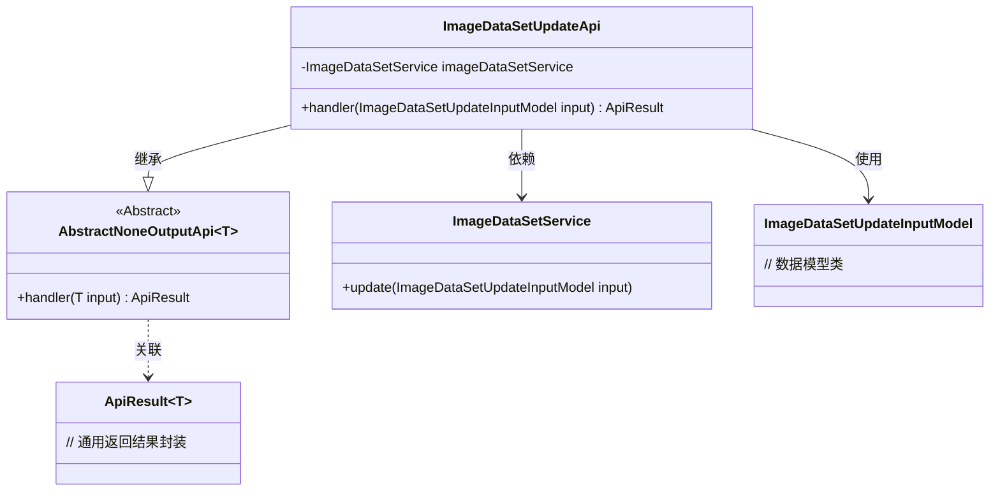
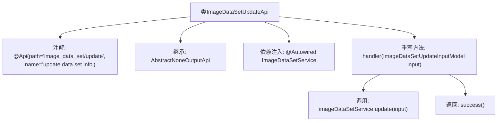

# 基础信息

|      |      |
|------|------|
| 名称 | ImageDataSetUpdateApi |
| 编码语言 | .java |
| 代码路径 | WeFe/board/board-service/src/main/java/com/welab/wefe/board/service/api/data_resource/image_data_set/ImageDataSetUpdateApi.java |
| 包名 | com.welab.wefe.board.service.api.data_resource.image_data_set |
| 依赖项 | ['com.welab.wefe.board.service.dto.vo.data_resource.ImageDataSetUpdateInputModel', 'com.welab.wefe.board.service.service.data_resource.image_data_set.ImageDataSetService', 'com.welab.wefe.common.exception.StatusCodeWithException', 'com.welab.wefe.common.web.api.base.AbstractNoneOutputApi', 'com.welab.wefe.common.web.api.base.Api', 'com.welab.wefe.common.web.dto.ApiResult', 'org.springframework.beans.factory.annotation.Autowired'] |
| 概述说明 | 这是一个用于更新图像数据集信息的API类，调用ImageDataSetService的update方法处理输入并返回成功结果。 |

# 说明

这是一个用于更新图像数据集信息的API类，路径为"image_data_set/update"。它继承自AbstractNoneOutputApi基类，泛型参数指定了输入模型为ImageDataSetUpdateInputModel。类中通过自动注入方式获取ImageDataSetService服务实例。核心处理逻辑在handler方法中实现，该方法接收输入参数后调用服务层的update方法完成数据更新操作，最后返回成功的API结果。整个API不产生输出数据，仅执行更新操作。

# 类列表 Class Summary

| 名称   | 类型  | 说明 |
|-------|------|-------------|
| ImageDataSetUpdateApi | class | 这是一个用于更新图像数据集信息的API类，调用ImageDataSetService的update方法处理输入参数，成功后返回空结果。 |

## 类 ImageDataSetUpdateApi

|      |      |
|------|------|
| 访问范围 | @Api(path = "image_data_set/update", name = "update data set info");public |
| 类型 | class |
| 名称 | ImageDataSetUpdateApi |
| 说明 | 这是一个用于更新图像数据集信息的API类，调用ImageDataSetService的update方法处理输入参数，成功后返回空结果。 |

### UML类图

该类图展示了ImageDataSetUpdateApi继承自泛型抽象类AbstractNoneOutputApi，并依赖ImageDataSetService进行数据更新操作。作为REST API实现类，它通过handler方法处理ImageDataSetUpdateInputModel类型输入参数，返回ApiResult封装结果。各组件间通过清晰的关系连接，体现了Spring依赖注入和模板方法模式的应用。

### 内部方法调用关系图

该流程图展示了ImageDataSetUpdateApi类的结构和执行流程。该类通过@Api注解定义API路径和名称，继承AbstractNoneOutputApi基类并指定输入模型类型。核心逻辑在handler方法中实现：首先通过自动注入的ImageDataSetService执行update操作，然后返回成功结果。整个流程清晰地反映了从API入口到业务处理的调用链关系。

### 字段列表 Field List

| 名称  | 类型  | 说明 |
|-------|-------|------|
| imageDataSetService | ImageDataSetService | 自动注入ImageDataSetService实例。 |

### 方法列表

| 名称  | 类型  | 说明 |
|-------|-------|------|
| handler | ApiResult<?> | 覆盖方法处理图像数据集更新，调用服务更新输入数据并返回成功结果。 |

