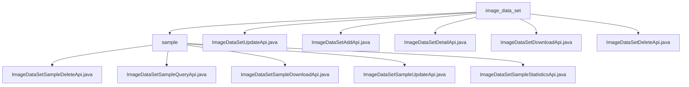

# 基础信息

|      |      |
|------|------|
| 名称 | image_data_set |
| 编码语言 | .java |
| 代码路径 | WeFe/board/board-service/src/main/java/com/welab/wefe/board/service/api/data_resource/image_data_set |
| 包名 | docs.board.board-service.src.main.java.com.welab.wefe.board.service.api.data_resource.image_data_set |
| 概述说明 | 该模块提供图像数据集的CRUD管理功能，包括增删改查、下载及标签统计。API基于RESTful风格，路径统一以image_data_set为前缀。核心功能涵盖数据操作和统计分析，依赖服务层和数据库实现业务逻辑。 |

# 说明

## 概述  
该模块实现图像数据集的完整生命周期管理，核心功能包括数据增删改查、文件下载及元信息统计。所有API遵循RESTful规范，路径统一采用`image_data_set`前缀，例如UpdateApi处理标注更新，DownloadApi实现文件流传输。关键数据结构涵盖Input基类（含ID校验）、分页参数和标签统计模型，依赖项集中于ImageDataSetService和数据库仓库。例如DeleteApi强制校验ID有效性，DetailApi通过Repository映射数据实体。  

## 主要业务场景  
典型流程包含数据集维护（如AddApi创建资源）和深度分析（如StatisticsApi生成标签热力图）。交互模式类似资源池管理，支持精确检索（DetailApi）和批量操作（DeleteApi）。例如用户可上传数据集后触发标签统计，或通过分页查询筛选样本。API类型覆盖CRUD操作和扩展功能，集成案例包括前端调用DetailApi展示元信息，或系统通过定时任务调用DownloadApi备份数据。所有接口均内置参数校验，例如AddApi验证输入模型完整性。

### 包内部结构视图

该流程图展示了图像数据集API的层级结构，顶层为image_data_set目录，包含直接处理数据集的API文件和sample子目录。sample子目录下则包含处理数据集样本的各类API文件，如删除、查询、下载、更新和统计等功能。整体结构清晰反映了API的功能分类和组织方式。

# 文件列表

| 名称   | 类型  | 说明 |
|-------|------|-------------|
| [ImageDataSetUpdateApi.java](ImageDataSetUpdateApi.md) | file | 这是一个用于更新图像数据集信息的API类，调用ImageDataSetService的update方法处理输入并返回成功结果。 |
| [ImageDataSetAddApi.java](ImageDataSetAddApi.md) | file | 这是一个用于添加图像数据集的API类，继承自AbstractApi，使用ImageDataSetAddInputModel作为输入，DataResourceAddOutputModel作为输出。通过ImageDataSetAddService处理添加操作，并返回成功结果。 |
| [ImageDataSetDetailApi.java](ImageDataSetDetailApi.md) | file | 该代码定义了一个获取图像数据集详情的API接口，通过ID查询数据库并返回映射后的输出模型。若未找到数据则返回空结果。输入参数为ID字符串。 |
| [ImageDataSetDownloadApi.java](ImageDataSetDownloadApi.md) | file | 这是一个用于下载图像数据集的API类，路径为"image_data_set/download"，允许签名访问。通过输入数据集ID、任务ID和版本号，调用服务层下载文件并返回结果。 |
| [ImageDataSetDeleteApi.java](ImageDataSetDeleteApi.md) | file | 这是一个删除数据集的API类，接收数据集ID作为必填参数，调用服务层删除数据并返回成功结果。 |
| [sample](sample/_module.md) | package | ImageDataSetSampleDeleteApi：删除图像样本，需ID，返回空。ImageDataSetSampleQueryApi：查询样本，支持分页和条件筛选。ImageDataSetSampleDownloadApi：下载样本，需ID，返回文件。ImageDataSetSampleUpdateApi：更新样本标注信息，需ID和labelInfo。ImageDataSetSampleStatisticsApi：统计样本标签分布，返回两种计数方式。 |

