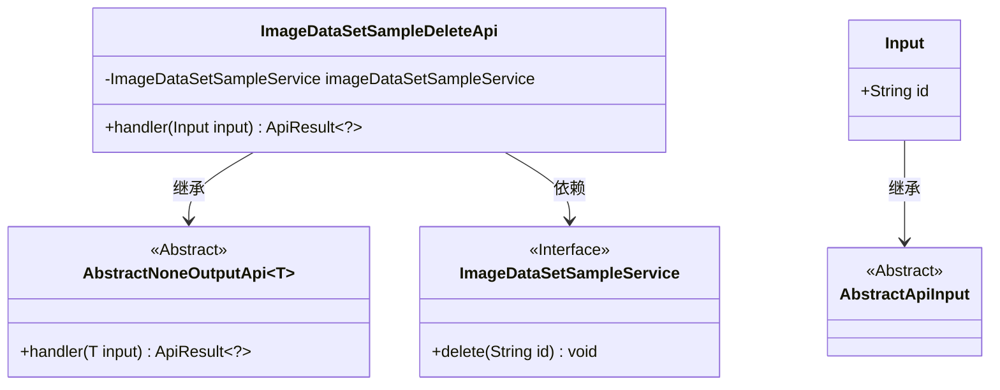

# 基础信息

|      |      |
|------|------|
| 名称 | ImageDataSetSampleDeleteApi |
| 编码语言 | .java |
| 代码路径 | WeFe/board/board-service/src/main/java/com/welab/wefe/board/service/api/data_resource/image_data_set/sample/ImageDataSetSampleDeleteApi.java |
| 包名 | com.welab.wefe.board.service.api.data_resource.image_data_set.sample |
| 依赖项 | ['com.welab.wefe.board.service.service.data_resource.image_data_set.ImageDataSetSampleService', 'com.welab.wefe.common.exception.StatusCodeWithException', 'com.welab.wefe.common.fieldvalidate.annotation.Check', 'com.welab.wefe.common.web.api.base.AbstractNoneOutputApi', 'com.welab.wefe.common.web.api.base.Api', 'com.welab.wefe.common.web.dto.AbstractApiInput', 'com.welab.wefe.common.web.dto.ApiResult', 'org.springframework.beans.factory.annotation.Autowired'] |
| 概述说明 | 这是一个删除图像数据集样本的API类，通过调用ImageDataSetSampleService的delete方法实现删除功能，输入参数为必须的id字段。 |

# 说明

这是一个名为ImageDataSetSampleDeleteApi的API类，用于删除图像数据集样本。它继承自AbstractNoneOutputApi，输入类型为内部定义的Input类。该API路径为image_data_set_sample/delete，通过注入的ImageDataSetSampleService调用delete方法完成删除操作。Input类包含一个必填的字符串类型id字段，用于指定要删除的样本。处理成功后返回空结果。整个API设计简洁，专注于删除功能。

# 类列表 Class Summary

| 名称   | 类型  | 说明 |
|-------|------|-------------|
| ImageDataSetSampleDeleteApi | class | 这是一个删除图像数据集样本的API类，通过调用服务层方法根据输入ID删除对应样本，成功时返回空结果。输入参数为必须的ID字符串。 |

## 类 ImageDataSetSampleDeleteApi

|      |      |
|------|------|
| 访问范围 | @Api(path = "image_data_set_sample/delete", name = "delete image data set sample");public |
| 类型 | class |
| 名称 | ImageDataSetSampleDeleteApi |
| 说明 | 这是一个删除图像数据集样本的API类，通过调用服务层方法根据输入ID删除对应样本，成功时返回空结果。输入参数为必须的ID字符串。 |

### UML类图

这段代码展示了一个图像数据集样本删除API的实现结构。ImageDataSetSampleDeleteApi继承自泛型类AbstractNoneOutputApi，指定Input作为输入类型，并依赖ImageDataSetSampleService接口执行删除操作。Input类继承自AbstractApiInput，包含一个必填的id字段。整体设计遵循了依赖注入和模板方法模式，通过抽象基类规范API行为，具体实现委托给服务接口完成核心业务逻辑。

### 内部方法调用关系图

```mermaid
graph TD
    A["类ImageDataSetSampleDeleteApi"]
    B["注解: @Api"]
    C["继承: AbstractNoneOutputApi<Input>"]
    D["依赖注入: @Autowired ImageDataSetSampleService"]
    E["重写方法: handler(Input input)"]
    F["调用: imageDataSetSampleService.delete(input.id)"]
    G["返回: success()"]
    H["嵌套类Input"]
    I["继承: AbstractApiInput"]
    J["字段: @Check String id"]

    A --> B
    A --> C
    A --> D
    A --> E
    E --> F
    E --> G
    A --> H
    H --> I
    H --> J
```

该流程图展示了ImageDataSetSampleDeleteApi类的结构和工作流程。类通过@Api注解定义API路径，继承AbstractNoneOutputApi并实现handler方法处理输入。handler方法调用服务层删除操作后返回成功结果。嵌套类Input继承AbstractApiInput并包含必填字段id。整个流程清晰展现了从API接收到业务处理的完整调用链，体现了Spring Boot项目中典型的控制器层结构。

### 字段列表 Field List

| 名称  | 类型  | 说明 |
|-------|-------|------|
| imageDataSetSampleService | ImageDataSetSampleService | 使用@Autowired自动注入ImageDataSetSampleService服务实例。 |

### 方法列表

| 名称  | 类型  | 说明 |
|-------|-------|------|
| handler | ApiResult<?> | 该方法处理删除请求，调用服务删除指定ID的图片数据集样本，成功后返回空结果。 |

