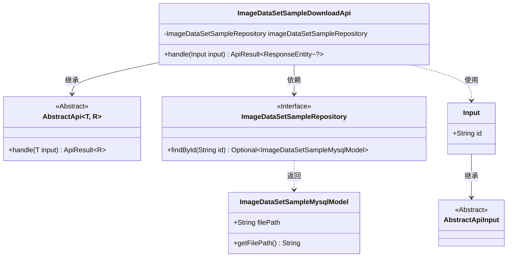

# 基础信息

|      |      |
|------|------|
| 名称 | ImageDataSetSampleDownloadApi |
| 编码语言 | .java |
| 代码路径 | WeFe/board/board-service/src/main/java/com/welab/wefe/board/service/api/data_resource/image_data_set/sample/ImageDataSetSampleDownloadApi.java |
| 包名 | com.welab.wefe.board.service.api.data_resource.image_data_set.sample |
| 依赖项 | ['com.welab.wefe.board.service.database.entity.data_set.ImageDataSetSampleMysqlModel', 'com.welab.wefe.board.service.database.repository.ImageDataSetSampleRepository', 'com.welab.wefe.common.exception.StatusCodeWithException', 'com.welab.wefe.common.fieldvalidate.annotation.Check', 'com.welab.wefe.common.web.api.base.AbstractApi', 'com.welab.wefe.common.web.api.base.Api', 'com.welab.wefe.common.web.dto.AbstractApiInput', 'com.welab.wefe.common.web.dto.ApiResult', 'org.springframework.beans.factory.annotation.Autowired', 'org.springframework.http.ResponseEntity', 'java.io.File', 'java.io.IOException'] |
| 概述说明 | 这是一个用于下载图像数据集样本的API类，通过ID查找样本文件并返回文件内容。输入参数为必须的ID字段。 |

# 说明

这是一个用于下载图像数据集样本的API类，路径为"image_data_set_sample/download"。该类继承自抽象API基类，接收包含必需ID字段的输入参数。通过自动注入的仓库类查询数据库获取样本文件路径，最终返回文件内容。处理过程中可能抛出状态码异常或IO异常。输入参数类继承自抽象API输入基类，并对ID字段进行了非空校验。

# 类列表 Class Summary

| 名称   | 类型  | 说明 |
|-------|------|-------------|
| ImageDataSetSampleDownloadApi | class | 这是一个用于下载图像数据集样本的API类，通过ID查找样本文件并返回文件内容。输入参数为必须的ID字段。 |

## 类 ImageDataSetSampleDownloadApi

|      |      |
|------|------|
| 访问范围 | @Api(path = "image_data_set_sample/download", name = "download image data set sample");public |
| 类型 | class |
| 名称 | ImageDataSetSampleDownloadApi |
| 说明 | 这是一个用于下载图像数据集样本的API类，通过ID查找样本文件并返回文件内容。输入参数为必须的ID字段。 |

### UML类图

该代码实现了一个图片数据集样本下载API，核心类`ImageDataSetSampleDownloadApi`继承自泛型抽象类`AbstractApi`，通过`ImageDataSetSampleRepository`接口查询数据库获取文件路径。输入参数`Input`继承自`AbstractApiInput`并包含必填的id字段。类图清晰展示了继承、依赖和接口实现关系，体现了Spring依赖注入和模板方法模式的应用。

### 内部方法调用关系图

```mermaid
graph TD
    A["类ImageDataSetSampleDownloadApi"]
    B["注解: @Api"]
    C["继承: AbstractApi<Input, ResponseEntity<?>>"]
    D["依赖注入: @Autowired ImageDataSetSampleRepository"]
    E["重写方法: handle(Input input)"]
    F["内部类: Input extends AbstractApiInput"]
    G["字段校验: @Check String id"]
    H["流程: imageDataSetSampleRepository.findById"]
    I["流程: new File(sample.getFilePath())"]
    J["返回: file(file)"]

    A --> B
    A --> C
    A --> D
    A --> E
    E --> H
    H --> I
    I --> J
    A --> F
    F --> G
```

该流程图展示了ImageDataSetSampleDownloadApi类的核心结构和处理流程。类通过继承AbstractApi实现API基础功能，使用@Autowired注入数据仓库，并通过重写handle方法处理文件下载请求。内部类Input定义了必需的ID参数校验。主流程包含查询样本数据、构建文件对象和返回文件响应三个关键步骤，形成完整的文件下载处理链。

### 字段列表 Field List

| 名称  | 类型  | 说明 |
|-------|-------|------|
| imageDataSetSampleRepository | ImageDataSetSampleRepository | 使用@Autowired自动注入ImageDataSetSampleRepository实例。 |

### 方法列表

| 名称  | 类型  | 说明 |
|-------|-------|------|
| handle | ApiResult<ResponseEntity<?>> | 该方法根据输入ID查询数据库获取样本，读取文件路径并返回文件内容。处理中可能抛出异常或IO错误。 |

