# 基础信息

|      |      |
|------|------|
| 名称 | ImageDataSetSampleQueryApi |
| 编码语言 | .java |
| 代码路径 | WeFe/board/board-service/src/main/java/com/welab/wefe/board/service/api/data_resource/image_data_set/sample/ImageDataSetSampleQueryApi.java |
| 包名 | com.welab.wefe.board.service.api.data_resource.image_data_set.sample |
| 依赖项 | ['com.welab.wefe.board.service.dto.base.PagingInput', 'com.welab.wefe.board.service.dto.base.PagingOutput', 'com.welab.wefe.board.service.dto.entity.data_set.ImageDataSetSampleOutputModel', 'com.welab.wefe.board.service.service.data_resource.image_data_set.ImageDataSetSampleService', 'com.welab.wefe.common.exception.StatusCodeWithException', 'com.welab.wefe.common.fieldvalidate.annotation.Check', 'com.welab.wefe.common.web.api.base.AbstractApi', 'com.welab.wefe.common.web.api.base.Api', 'com.welab.wefe.common.web.dto.ApiResult', 'org.springframework.beans.factory.annotation.Autowired'] |
| 概述说明 | 图像数据集样本查询API，支持分页、数据集ID、标签名称模糊匹配及标注状态筛选，调用ImageDataSetSampleService处理查询请求。 |

# 说明

这是一个名为ImageDataSetSampleQueryApi的Java类，用于查询图像数据集样本。它继承自AbstractApi，处理输入类型为Input，输出为分页的ImageDataSetSampleOutputModel。类中注入了ImageDataSetSampleService服务，并通过handle方法调用服务的query方法处理查询请求。Input内部类继承自PagingInput，包含数据集ID、标签名称、是否使用模糊匹配标签以及是否已标注等查询条件，并提供了相应的getter和setter方法。

# 类列表 Class Summary

| 名称   | 类型  | 说明 |
|-------|------|-------------|
| ImageDataSetSampleQueryApi | class | 图像数据集查询API，支持分页、按数据集ID、标签名称模糊匹配及标注状态筛选，返回分页结果。 |


## 类 ImageDataSetSampleQueryApi

|      |      |
|------|------|
| 访问范围 | @Api(path = "image_data_set_sample/query", name = "query image data set samples");public |
| 类型 | class |
| 名称 | ImageDataSetSampleQueryApi |
| 说明 | 图像数据集查询API，支持分页、按数据集ID、标签名称模糊匹配及标注状态筛选，返回分页结果。 |


### UML类图

```mermaid
classDiagram
    class ImageDataSetSampleQueryApi {
        -ImageDataSetSampleService imageDataSetSampleService
        +handle(Input input) ApiResult~PagingOutput~ImageDataSetSampleOutputModel~~
    }

    class PagingInput {
        <<abstract>>
    }

    class Input {
        -String dataSetId
        -String label
        -boolean labelMatchWithContains
        -Boolean labeled
        +getDataSetId() String
        +setDataSetId(String dataSetId)
        +getLabel() String
        +setLabel(String label)
        +getLabeled() Boolean
        +setLabeled(Boolean labeled)
    }

    class ImageDataSetSampleService {
        <<Interface>>
        +query(Input input) PagingOutput~ImageDataSetSampleOutputModel~
    }

    class PagingOutput~T~ {
        +T data
    }

    class ImageDataSetSampleOutputModel {
        // 模型字段未完全展示
    }

    class ApiResult~T~ {
        +T data
    }

    ImageDataSetSampleQueryApi --> ImageDataSetSampleService : 依赖
    ImageDataSetSampleQueryApi --> Input : 使用
    Input --|> PagingInput : 继承
    ImageDataSetSampleService ..> PagingOutput~ImageDataSetSampleOutputModel~ : 返回
    ImageDataSetSampleService ..> Input : 参数
    PagingOutput~ImageDataSetSampleOutputModel~ --> ImageDataSetSampleOutputModel : 包含
    ImageDataSetSampleQueryApi ..> ApiResult~PagingOutput~ImageDataSetSampleOutputModel~~ : 返回
```

这段代码展示了一个图像数据集样本查询API的实现结构。ImageDataSetSampleQueryApi继承自AbstractApi，通过ImageDataSetSampleService处理查询请求，使用Input类封装分页查询参数，返回包含ImageDataSetSampleOutputModel的分页结果。Input类继承PagingInput并添加了数据集ID、标签等查询条件，通过服务层进行数据查询后返回PagingOutput包装的分页结果。整体设计体现了分层架构和泛型应用，适合处理分页查询场景。


### 内部方法调用关系图

```mermaid
graph TD
    A["类ImageDataSetSampleQueryApi"]
    B["继承: AbstractApi<Input, PagingOutput<ImageDataSetSampleOutputModel>>"]
    C["注解: @Api(path='image_data_set_sample/query', name='query image data set samples')"]
    D["依赖注入: @Autowired ImageDataSetSampleService"]
    E["重写方法: handle(Input input)"]
    F["内部类: Input"]
    G["继承: PagingInput"]
    H["属性: String dataSetId"]
    I["属性: String label"]
    J["属性: boolean labelMatchWithContains"]
    K["属性: Boolean labeled"]
    L["getter/setter方法"]

    A --> B
    A --> C
    A --> D
    A --> E
    A --> F
    F --> G
    F --> H
    F --> I
    F --> J
    F --> K
    F --> L
    E --> D
```



这段代码是一个用于查询图像数据集样本的API类，继承自AbstractApi基类。主要功能是通过ImageDataSetSampleService处理分页查询请求，包含输入参数验证和结果返回。内部类Input定义了查询参数结构，包括数据集ID、标签名称、模糊匹配标志和标注状态等字段，并提供了相应的getter/setter方法。流程图清晰展示了类继承关系、依赖注入、方法重写和内部类结构。

### 字段列表 Field List

| 名称  | 类型  | 说明 |
|-------|-------|------|
| imageDataSetSampleService | ImageDataSetSampleService | 使用@Autowired自动注入ImageDataSetSampleService实例。 |

### 方法列表

| 名称  | 类型  | 说明 |
|-------|-------|------|
| handle | ApiResult<PagingOutput<ImageDataSetSampleOutputModel>> | 重写方法处理输入，调用服务查询并返回分页结果。 |


