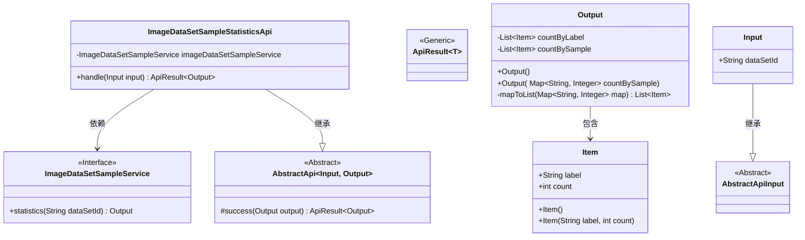
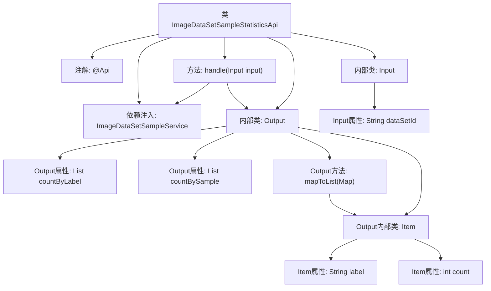
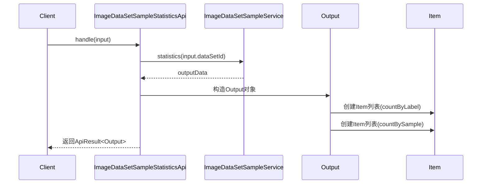

# 基础信息

|      |      |
|------|------|
| 名称 | ImageDataSetSampleStatisticsApi |
| 编码语言 | .java |
| 代码路径 | WeFe/board/board-service/src/main/java/com/welab/wefe/board/service/api/data_resource/image_data_set/sample/ImageDataSetSampleStatisticsApi.java |
| 包名 | com.welab.wefe.board.service.api.data_resource.image_data_set.sample |
| 依赖项 | ['com.welab.wefe.board.service.service.data_resource.image_data_set.ImageDataSetSampleService', 'com.welab.wefe.common.exception.StatusCodeWithException', 'com.welab.wefe.common.fieldvalidate.annotation.Check', 'com.welab.wefe.common.web.api.base.AbstractApi', 'com.welab.wefe.common.web.api.base.Api', 'com.welab.wefe.common.web.dto.AbstractApiInput', 'com.welab.wefe.common.web.dto.ApiResult', 'org.springframework.beans.factory.annotation.Autowired', 'java.io.IOException', 'java.util.List', 'java.util.Map', 'java.util.stream.Collectors'] |
| 概述说明 | ImageDataSetSampleStatisticsApi用于统计数据集标签分布，输入为数据集ID，输出包含按标签和样本统计的标签数量列表。 |

# 说明

该代码定义了一个名为ImageDataSetSampleStatisticsApi的API类，用于统计图像数据集的标签分布情况。API路径为image_data_set_sample/statistics，接收数据集ID作为输入参数。输出包含两种统计方式：按标签统计数量（一个样本中相同标签多次出现则多次计数）和按样本统计标签数量（一个样本中相同标签仅计数一次）。输出结果以Item列表形式返回，每个Item包含标签名称和对应计数。该API通过调用ImageDataSetSampleService的statistics方法实现功能，并返回处理结果。

# 类列表 Class Summary

| 名称   | 类型  | 说明 |
|-------|------|-------------|
| ImageDataSetSampleStatisticsApi | class | 图像数据集样本统计API，输入数据集ID，输出按标签和样本统计的标签数量。 |

## 类 ImageDataSetSampleStatisticsApi

|      |      |
|------|------|
| 访问范围 | @Api(path = "image_data_set_sample/statistics", name = "statistics the data set labels distribute");public |
| 类型 | class |
| 名称 | ImageDataSetSampleStatisticsApi |
| 说明 | 图像数据集样本统计API，输入数据集ID，输出按标签和样本统计的标签数量。 |

### UML类图

该代码实现了一个图像数据集样本统计API，核心功能是通过ImageDataSetSampleService统计数据集中标签的分布情况。类图展示了主要结构：ImageDataSetSampleStatisticsApi继承自泛型AbstractApi，依赖ImageDataSetSampleService接口，使用嵌套类Input作为输入参数，Output作为输出结果。Output包含两个统计维度（按标签计数和按样本计数），通过Item类存储具体标签及其数量。整个设计采用分层结构，符合Spring的依赖注入规范，同时通过泛型提高了代码复用性。

### 内部方法调用关系图

这段代码实现了一个图像数据集样本统计API，主要功能是通过数据集ID统计标签分布情况。流程图展示了类结构关系，包含主类、嵌套的Output/Input类及其属性和方法。时序图描述了API调用流程：客户端请求触发handle方法，调用服务层获取统计数据，构造包含两种统计方式（按标签计数和按样本计数）的Output对象，最终返回封装结果。Output类使用内部Item类存储标签和对应计数，通过mapToList方法实现Map到List的转换。

### 字段列表 Field List

| 名称  | 类型  | 说明 |
|-------|-------|------|
| imageDataSetSampleService | ImageDataSetSampleService | 使用@Autowired自动注入ImageDataSetSampleService实例。 |

### 方法列表

| 名称  | 类型  | 说明 |
|-------|-------|------|
| handle | ApiResult<Output> | Java方法：处理输入并调用服务统计数据集，返回成功结果或异常。 |

