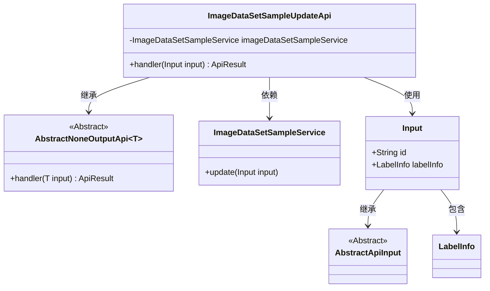

# 基础信息

|      |      |
|------|------|
| 名称 | ImageDataSetSampleUpdateApi |
| 编码语言 | .java |
| 代码路径 | WeFe/board/board-service/src/main/java/com/welab/wefe/board/service/api/data_resource/image_data_set/sample/ImageDataSetSampleUpdateApi.java |
| 包名 | com.welab.wefe.board.service.api.data_resource.image_data_set.sample |
| 依赖项 | ['com.welab.wefe.board.service.dto.vo.data_set.image_data_set.LabelInfo', 'com.welab.wefe.board.service.service.data_resource.image_data_set.ImageDataSetSampleService', 'com.welab.wefe.common.exception.StatusCodeWithException', 'com.welab.wefe.common.fieldvalidate.annotation.Check', 'com.welab.wefe.common.web.api.base.AbstractNoneOutputApi', 'com.welab.wefe.common.web.api.base.Api', 'com.welab.wefe.common.web.dto.AbstractApiInput', 'com.welab.wefe.common.web.dto.ApiResult', 'org.springframework.beans.factory.annotation.Autowired'] |
| 概述说明 | 这是一个用于更新图像数据集样本信息的API类，通过调用ImageDataSetSampleService的update方法处理输入参数id和labelInfo，成功后返回空结果。 |

# 说明

这是一个用于更新图像数据集样本信息的API类，路径为"image_data_set_sample/update"。它继承自AbstractNoneOutputApi，输入类型为内部类Input。通过自动注入的ImageDataSetSampleService调用update方法处理更新请求。Input类包含两个必填字段：id和标注信息labelInfo。处理成功后返回空结果。整个API实现了基本的参数校验和业务逻辑封装。

# 类列表 Class Summary

| 名称   | 类型  | 说明 |
|-------|------|-------------|
| ImageDataSetSampleUpdateApi | class | 这是一个用于更新图像数据集样本信息的API类，包含输入参数id和标注信息，调用服务层方法完成更新操作。 |

## 类 ImageDataSetSampleUpdateApi

|      |      |
|------|------|
| 访问范围 | @Api(path = "image_data_set_sample/update", name = "update image data set sample info");public |
| 类型 | class |
| 名称 | ImageDataSetSampleUpdateApi |
| 说明 | 这是一个用于更新图像数据集样本信息的API类，包含输入参数id和标注信息，调用服务层方法完成更新操作。 |

### UML类图

这段代码展示了一个图像数据集样本更新API的实现结构。ImageDataSetSampleUpdateApi继承自泛型抽象类AbstractNoneOutputApi，并实现了其handler方法，通过依赖注入的ImageDataSetSampleService来完成更新操作。Input作为内部静态类继承自AbstractApiInput，包含id和LabelInfo两个必填字段，用于接收API请求参数。整个设计体现了清晰的层次结构和职责分离，API类专注于请求处理，服务类负责业务逻辑，输入类负责数据验证。

### 内部方法调用关系图

```mermaid
graph TD
    A["类ImageDataSetSampleUpdateApi"]
    B["父类: AbstractNoneOutputApi<Input>"]
    C["依赖注入: ImageDataSetSampleService"]
    D["重写方法: handler(Input input)"]
    E["调用: imageDataSetSampleService.update(input)"]
    F["返回: success()"]
    G["嵌套类Input"]
    H["父类: AbstractApiInput"]
    I["字段: String id"]
    J["字段: LabelInfo labelInfo"]
    K["注解: @Check(require=true)"]
    L["注解: @Check(require=true, name='标注信息')"]

    A --> B
    A --> C
    A --> D
    D --> E
    D --> F
    A --> G
    G --> H
    G --> I
    G --> J
    I --> K
    J --> L
```

流程图描述了ImageDataSetSampleUpdateApi类的结构和工作流程。该类继承AbstractNoneOutputApi，通过重写handler方法处理输入参数，调用服务层更新数据样本，最终返回成功结果。嵌套类Input定义了必需的id和labelInfo字段，并带有参数校验注解。整个流程展示了从API入口到服务调用的完整处理链。

### 字段列表 Field List

| 名称  | 类型  | 说明 |
|-------|-------|------|
| imageDataSetSampleService | ImageDataSetSampleService | 自动注入ImageDataSetSampleService服务实例。 |

### 方法列表

| 名称  | 类型  | 说明 |
|-------|-------|------|
| handler | ApiResult | 代码重写handler方法，调用服务更新输入数据后返回成功结果。 |

