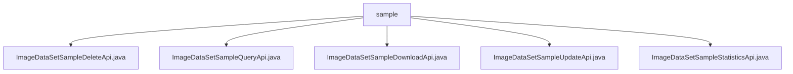

# 基础信息

|      |      |
|------|------|
| 名称 | sample |
| 编码语言 | .java |
| 代码路径 | WeFe/board/board-service/src/main/java/com/welab/wefe/board/service/api/data_resource/image_data_set/sample |
| 包名 | docs.board.board-service.src.main.java.com.welab.wefe.board.service.api.data_resource.image_data_set.sample |
| 概述说明 | ImageDataSetSampleDeleteApi：删除图像样本，需ID，返回空。ImageDataSetSampleQueryApi：查询样本，支持分页和条件筛选。ImageDataSetSampleDownloadApi：下载样本，需ID，返回文件。ImageDataSetSampleUpdateApi：更新样本标注信息，需ID和labelInfo。ImageDataSetSampleStatisticsApi：统计样本标签分布，返回两种计数方式。 |

# 说明

## 概述  
该模块提供图像数据集样本的CRUD管理功能，核心职责包括样本删除、查询、下载、更新及标签统计。所有API均基于RESTful风格，路径统一以`image_data_set_sample`为前缀。例如DeleteApi通过ID删除样本，QueryApi支持分页和条件筛选，StatisticsApi提供标签分布分析。  

关键数据结构包含Input基类（含ID字段）、分页查询参数和标签统计Item。外部依赖仅涉及ImageDataSetSampleService和数据库仓库类。例如UpdateApi需注入Service处理标注更新，DownloadApi依赖仓库获取文件路径。  

## 主要业务场景  
典型应用包括数据集维护（如通过UpdateApi修改标签）和数据分析（如StatisticsApi生成标签报表）。交互模式类似资源管理器，支持精确/模糊查询（QueryApi）和批量操作（DeleteApi）。例如用户可下载样本文件后更新标注，再统计标签分布。  

API类型覆盖数据操作（增删改查）和统计分析，集成案例包括前端调用QueryApi展示分页列表，或系统定时调用StatisticsApi生成数据集报告。所有接口均实现参数校验，例如DownloadApi强制校验ID非空，确保业务完整性。

### 包内部结构视图

该流程图展示了WeFe项目中图像数据集样本API的层级结构。根节点为sample文件夹，包含5个Java API文件，分别实现样本删除、查询、下载、更新和统计功能。所有API文件均位于同一目录下，属于平级关系，共同构成图像数据集样本管理的完整功能模块。

# 文件列表

| 名称   | 类型  | 说明 |
|-------|------|-------------|
| [ImageDataSetSampleDeleteApi.java](ImageDataSetSampleDeleteApi.md) | file | 这是一个删除图像数据集样本的API类，通过调用ImageDataSetSampleService的delete方法实现删除功能，输入参数为必须的id字段。 |
| [ImageDataSetSampleQueryApi.java](ImageDataSetSampleQueryApi.md) | file | 图像数据集样本查询API，支持分页、数据集ID、标签名称模糊匹配及标注状态筛选，调用ImageDataSetSampleService处理查询请求。 |
| [ImageDataSetSampleDownloadApi.java](ImageDataSetSampleDownloadApi.md) | file | 这是一个用于下载图像数据集样本的API类，通过ID查找样本文件并返回文件内容。输入参数为必须的ID字段。 |
| [ImageDataSetSampleUpdateApi.java](ImageDataSetSampleUpdateApi.md) | file | 这是一个用于更新图像数据集样本信息的API类，通过调用ImageDataSetSampleService的update方法处理输入参数id和labelInfo，成功后返回空结果。 |
| [ImageDataSetSampleStatisticsApi.java](ImageDataSetSampleStatisticsApi.md) | file | ImageDataSetSampleStatisticsApi用于统计数据集标签分布，输入为数据集ID，输出包含按标签和样本统计的标签数量列表。 |

