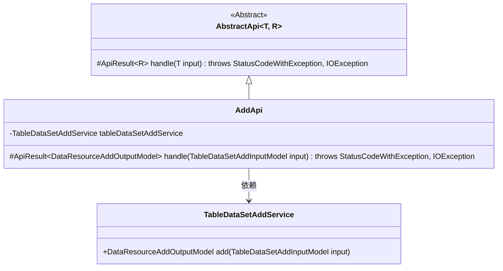
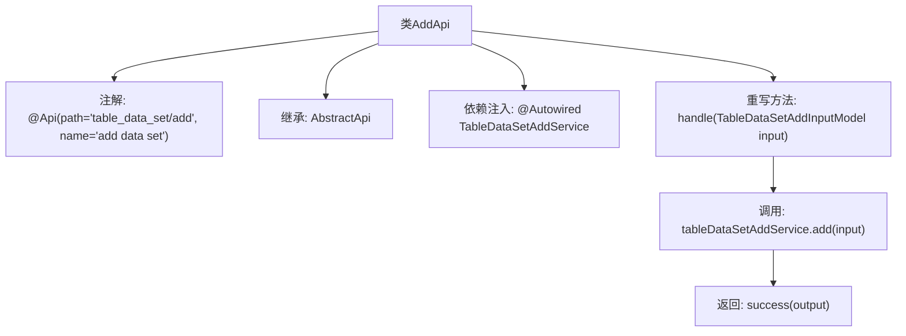

# 基础信息

|      |      |
|------|------|
| 名称 | AddApi |
| 编码语言 | .java |
| 代码路径 | WeFe/board/board-service/src/main/java/com/welab/wefe/board/service/api/data_resource/table_data_set/AddApi.java |
| 包名 | com.welab.wefe.board.service.api.data_resource.table_data_set |
| 依赖项 | ['com.welab.wefe.board.service.dto.vo.data_resource.DataResourceAddOutputModel', 'com.welab.wefe.board.service.dto.vo.data_resource.TableDataSetAddInputModel', 'com.welab.wefe.board.service.service.data_resource.add.TableDataSetAddService', 'com.welab.wefe.common.exception.StatusCodeWithException', 'com.welab.wefe.common.web.api.base.AbstractApi', 'com.welab.wefe.common.web.api.base.Api', 'com.welab.wefe.common.web.dto.ApiResult', 'org.springframework.beans.factory.annotation.Autowired', 'java.io.IOException'] |
| 概述说明 | 这是一个Java类，定义了一个名为AddApi的API接口，路径为"table_data_set/add"，用于添加数据集。它继承自AbstractApi，处理TableDataSetAddInputModel输入和DataResourceAddOutputModel输出。通过tableDataSetAddService的add方法实现功能，成功时返回包含输出的ApiResult。 |

# 说明

这是一个名为AddApi的Java类，用于实现添加数据集的API功能。该类继承自AbstractApi基类，泛型参数指定了输入模型TableDataSetAddInputModel和输出模型DataResourceAddOutputModel。通过@Api注解定义了API路径为"table_data_set/add"和名称为"add data set"。类中注入了TableDataSetAddService服务，并通过重写handle方法调用服务的add方法来处理请求，最终返回包含输出模型的成功结果。该方法可能抛出StatusCodeWithException和IOException异常。

# 类列表 Class Summary

| 名称   | 类型  | 说明 |
|-------|------|-------------|
| AddApi | class | Java类AddApi提供添加数据集的API，路径为"table_data_set/add"，使用TableDataSetAddService处理输入TableDataSetAddInputModel并返回DataResourceAddOutputModel。 |

## 类 AddApi

|      |      |
|------|------|
| 访问范围 | @Api(path = "table_data_set/add", name = "add data set");public |
| 类型 | class |
| 名称 | AddApi |
| 说明 | Java类AddApi提供添加数据集的API，路径为"table_data_set/add"，使用TableDataSetAddService处理输入TableDataSetAddInputModel并返回DataResourceAddOutputModel。 |

### UML类图

类图描述：该图展示了AddApi继承自泛型抽象类AbstractApi，并实现了其handle方法。AddApi通过依赖注入使用TableDataSetAddService来完成数据添加操作，其中TableDataSetAddInputModel作为输入参数，DataResourceAddOutputModel作为输出结果。整体结构体现了模板方法模式的应用，父类定义处理框架，子类实现具体业务逻辑。

### 内部方法调用关系图

该流程图展示了AddApi类的核心结构，它是一个带有RESTful注解的API实现类，继承自泛型抽象类AbstractApi。主要流程包括：通过@Autowired注入服务类TableDataSetAddService，重写handle方法处理输入模型，调用服务层add方法并返回封装后的成功结果。整个设计体现了Spring Boot的依赖注入和模板方法模式的应用。

### 字段列表 Field List

| 名称  | 类型  | 说明 |
|-------|-------|------|
| tableDataSetAddService | TableDataSetAddService | 代码片段使用@Autowired注解自动注入TableDataSetAddService实例。 |

### 方法列表

| 名称  | 类型  | 说明 |
|-------|-------|------|
| handle | ApiResult<DataResourceAddOutputModel> | 方法处理表数据集添加请求，调用服务生成输出模型并返回成功结果。 |

