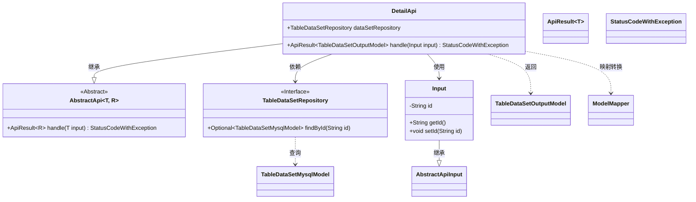
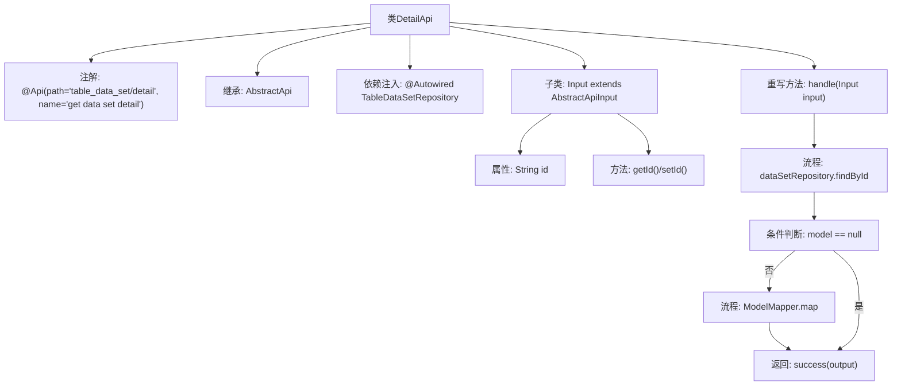

# 基础信息

|      |      |
|------|------|
| 名称 | DetailApi |
| 编码语言 | .java |
| 代码路径 | WeFe/board/board-service/src/main/java/com/welab/wefe/board/service/api/data_resource/table_data_set/DetailApi.java |
| 包名 | com.welab.wefe.board.service.api.data_resource.table_data_set |
| 依赖项 | ['com.welab.wefe.board.service.database.entity.data_resource.TableDataSetMysqlModel', 'com.welab.wefe.board.service.database.repository.data_resource.TableDataSetRepository', 'com.welab.wefe.board.service.dto.entity.data_resource.output.TableDataSetOutputModel', 'com.welab.wefe.common.exception.StatusCodeWithException', 'com.welab.wefe.common.web.api.base.AbstractApi', 'com.welab.wefe.common.web.api.base.Api', 'com.welab.wefe.common.web.dto.AbstractApiInput', 'com.welab.wefe.common.web.dto.ApiResult', 'com.welab.wefe.common.web.util.ModelMapper', 'org.springframework.beans.factory.annotation.Autowired'] |
| 概述说明 | DetailApi类通过id查询数据集详情，返回TableDataSetOutputModel。若数据不存在返回空结果。使用Autowired注入TableDataSetRepository进行数据库操作。 |

# 说明

该代码定义了一个名为DetailApi的API类，用于获取数据集详情。它继承自AbstractApi，接受Input参数并返回TableDataSetOutputModel。类中注入了TableDataSetRepository用于数据查询。handle方法通过ID查找数据，若不存在返回空结果，存在则映射为输出模型并返回。Input内部类包含id字段及其getter/setter方法。API路径为"table_data_set/detail"，名称为"get data set detail"。

# 类列表 Class Summary

| 名称   | 类型  | 说明 |
|-------|------|-------------|
| DetailApi | class | 这是一个获取数据集详情的API类，通过ID查询数据库并返回映射后的输出模型。若未找到数据则返回空结果。 |

## 类 DetailApi

|      |      |
|------|------|
| 访问范围 | @Api(path = "table_data_set/detail", name = "get data set detail");public |
| 类型 | class |
| 名称 | DetailApi |
| 说明 | 这是一个获取数据集详情的API类，通过ID查询数据库并返回映射后的输出模型。若未找到数据则返回空结果。 |

### UML类图

类图描述：该图展示了DetailApi类继承自泛型类AbstractApi<Input, TableDataSetOutputModel>，并依赖TableDataSetRepository接口进行数据访问。Input作为内部类继承AbstractApiInput，包含id属性和getter/setter方法。DetailApi通过ModelMapper将TableDataSetMysqlModel映射为TableDataSetOutputModel，最终返回ApiResult包装的结果。整体结构体现了典型的API层实现模式，包含输入参数处理、数据访问和输出模型转换等核心要素。

### 内部方法调用关系图

该流程图展示了DetailApi类的结构和核心处理逻辑。类通过继承AbstractApi实现接口功能，使用@Autowired注入Repository依赖。主要处理流程为：通过ID查询数据，若存在则映射为输出模型并返回成功结果，否则直接返回空成功。内部类Input封装了请求参数id及其访问方法。整体流程清晰体现了数据查询-转换-返回的业务链路。

### 字段列表 Field List

| 名称  | 类型  | 说明 |
|-------|-------|------|
| dataSetRepository | TableDataSetRepository | 自动注入TableDataSetRepository实例到dataSetRepository变量。 |

### 方法列表

| 名称  | 类型  | 说明 |
|-------|-------|------|
| handle | ApiResult<TableDataSetOutputModel> | 重写方法，根据输入ID查询数据，若存在则映射为输出模型返回成功，否则返回空成功。 |

