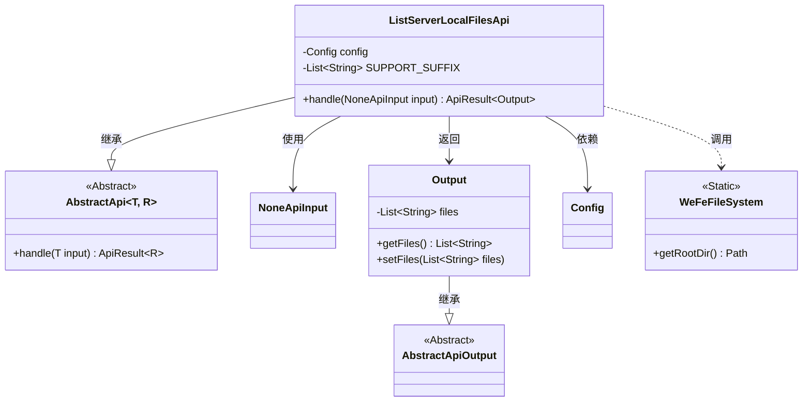
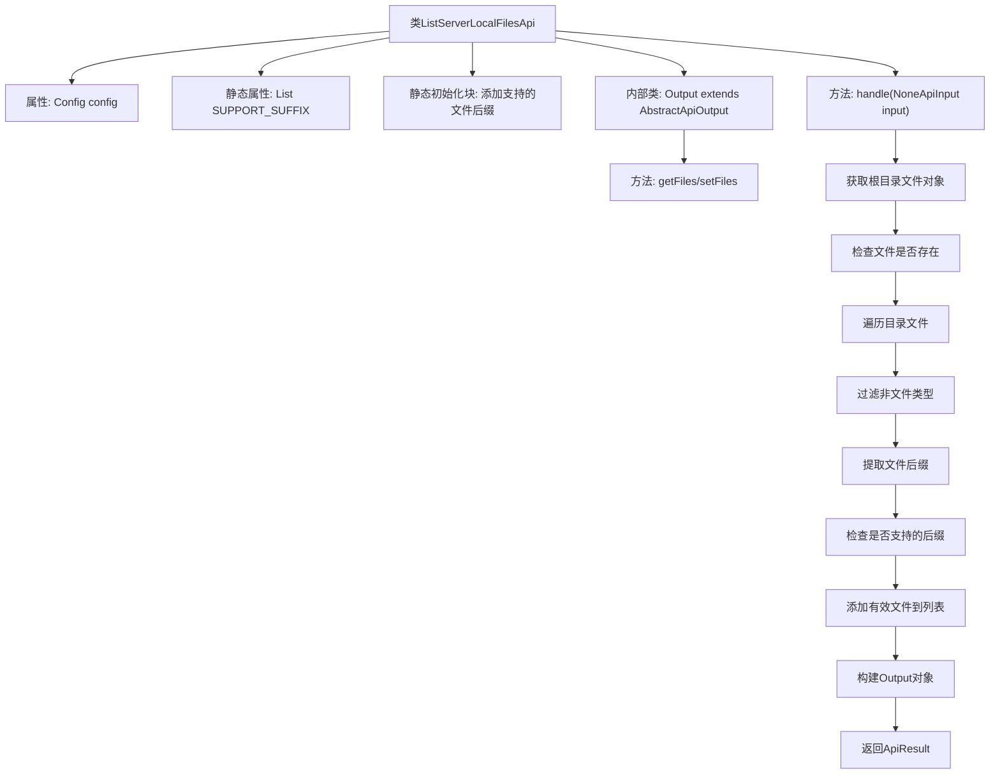

# 基础信息

|      |      |
|------|------|
| 名称 | ListServerLocalFilesApi |
| 编码语言 | .java |
| 代码路径 | WeFe/board/board-service/src/main/java/com/welab/wefe/board/service/api/data_resource/table_data_set/ListServerLocalFilesApi.java |
| 包名 | com.welab.wefe.board.service.api.data_resource.table_data_set |
| 依赖项 | ['com.welab.wefe.board.service.base.file_system.WeFeFileSystem', 'com.welab.wefe.board.service.constant.Config', 'com.welab.wefe.common.exception.StatusCodeWithException', 'com.welab.wefe.common.web.api.base.AbstractApi', 'com.welab.wefe.common.web.api.base.Api', 'com.welab.wefe.common.web.dto.AbstractApiOutput', 'com.welab.wefe.common.web.dto.ApiResult', 'com.welab.wefe.common.web.dto.NoneApiInput', 'org.springframework.beans.factory.annotation.Autowired', 'java.io.File', 'java.util.ArrayList', 'java.util.List'] |
| 概述说明 | 查询服务器指定目录下的文件，仅返回xls、xlsx和csv格式的文件列表。 |

# 说明

该代码定义了一个名为ListServerLocalFilesApi的API类，用于查询服务器指定目录下的文件。API路径为"data_set/list_local_data_set_files"，接受无输入参数，返回包含文件列表的输出。该API仅支持显示扩展名为xls、xlsx和csv的文件。处理逻辑包括获取根目录文件列表，过滤非目标文件类型，并将符合条件的文件名存入输出对象。输出类Output继承自AbstractApiOutput，包含一个文件列表属性及其getter和setter方法。

# 类列表 Class Summary

| 名称   | 类型  | 说明 |
|-------|------|-------------|
| ListServerLocalFilesApi | class | 该API用于查询服务器指定目录下的文件，仅返回xls、xlsx和csv格式的文件列表。 |

## 类 ListServerLocalFilesApi

|      |      |
|------|------|
| 访问范围 | @Api(path = "data_set/list_local_data_set_files", name = "query the files in the specified directory on the server");public |
| 类型 | class |
| 名称 | ListServerLocalFilesApi |
| 说明 | 该API用于查询服务器指定目录下的文件，仅返回xls、xlsx和csv格式的文件列表。 |

### UML类图

这段代码展示了一个用于查询服务器指定目录下文件的API实现。ListServerLocalFilesApi继承自AbstractApi，处理NoneApiInput输入并返回包含文件列表的Output对象。该类通过WeFeFileSystem获取根目录，筛选出xls/xlsx/csv格式的文件，使用Config进行配置管理。Output作为内部类继承AbstractApiOutput，封装文件列表数据。整个设计体现了清晰的层次结构和职责分离。

### 内部方法调用关系图

这段代码实现了一个查询服务器本地文件列表的API，主要功能是扫描指定目录并过滤出.xls/.xlsx/.csv格式的文件。流程图展示了从类结构到核心处理逻辑的完整流程，包括静态初始化、目录遍历、文件过滤和结果封装等关键步骤。内部类Output用于封装返回的文件列表数据，整个处理过程严格遵循后缀白名单机制。

### 字段列表 Field List

| 名称  | 类型  | 说明 |
|-------|-------|------|
| config | Config | 使用@Autowired自动注入Config配置类的私有实例。 |
| SUPPORT_SUFFIX = new ArrayList() | List<String> | 定义一个私有静态不可变列表SUPPORT_SUFFIX，初始化为空ArrayList，用于存储字符串类型元素。 |

### 方法列表

| 名称  | 类型  | 说明 |
|-------|-------|------|
| handle | ApiResult<Output> | 该方法处理输入NoneApiInput，获取根目录文件列表，筛选出XLS、xlsx和CSV格式的文件名，返回包含这些文件名的Output结果。 |

