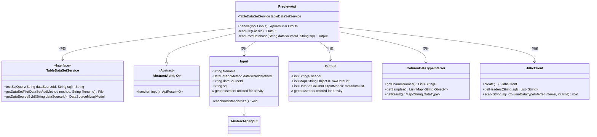
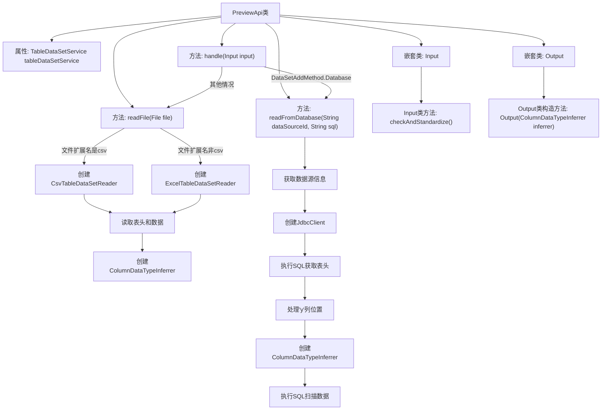

# 基础信息

|      |      |
|------|------|
| 名称 | PreviewApi |
| 编码语言 | .java |
| 代码路径 | WeFe/board/board-service/src/main/java/com/welab/wefe/board/service/api/data_resource/table_data_set/PreviewApi.java |
| 包名 | com.welab.wefe.board.service.api.data_resource.table_data_set |
| 依赖项 | ['com.welab.wefe.board.service.constant.DataSetAddMethod', 'com.welab.wefe.board.service.database.entity.DataSourceMysqlModel', 'com.welab.wefe.board.service.dto.entity.data_set.DataSetColumnOutputModel', 'com.welab.wefe.board.service.service.data_resource.table_data_set.TableDataSetService', 'com.welab.wefe.board.service.util.AbstractTableDataSetReader', 'com.welab.wefe.board.service.util.CsvTableDataSetReader', 'com.welab.wefe.board.service.util.ExcelTableDataSetReader', 'com.welab.wefe.common.StatusCode', 'com.welab.wefe.common.exception.StatusCodeWithException', 'com.welab.wefe.common.fieldvalidate.annotation.Check', 'com.welab.wefe.common.jdbc.JdbcClient', 'com.welab.wefe.common.util.ListUtil', 'com.welab.wefe.common.web.api.base.AbstractApi', 'com.welab.wefe.common.web.api.base.Api', 'com.welab.wefe.common.web.dto.AbstractApiInput', 'com.welab.wefe.common.web.dto.ApiResult', 'com.welab.wefe.common.wefe.ColumnDataTypeInferrer', 'org.apache.commons.lang3.StringUtils', 'org.springframework.beans.factory.annotation.Autowired', 'java.io.File', 'java.io.IOException', 'java.util.ArrayList', 'java.util.List', 'java.util.Map', 'java.util.stream.Collectors'] |
| 概述说明 | PreviewApi类用于预览数据集行，支持从数据库或文件读取数据。数据库方式验证SQL并获取数据，文件方式解析CSV或Excel文件。输出包含字段列表、原始数据和元数据信息。 |

# 说明

PreviewApi类是一个用于预览数据集行的API，继承自AbstractApi，处理输入Input和输出Output。根据输入的数据集添加方法，从数据库或文件读取数据。数据库方式会测试SQL查询并读取数据，文件方式支持CSV和Excel格式，解析文件内容并推断数据类型。输出包含字段列表、原始数据和元数据信息。输入类Input校验数据源ID和SQL语句，输出类Output包含数据集的结构和数据样本。

# 类列表 Class Summary

| 名称   | 类型  | 说明 |
|-------|------|-------------|
| PreviewApi | class | PreviewApi类用于预览数据集行，支持从数据库或文件读取数据。数据库方式需验证SQL查询，文件方式支持CSV和Excel格式。处理数据后返回字段列表、原始数据和元数据信息。 |

## 类 PreviewApi

|      |      |
|------|------|
| 访问范围 | @Api(path = "table_data_set/preview", name = "preview data set rows");public |
| 类型 | class |
| 名称 | PreviewApi |
| 说明 | PreviewApi类用于预览数据集行，支持从数据库或文件读取数据。数据库方式需验证SQL查询，文件方式支持CSV和Excel格式。处理数据后返回字段列表、原始数据和元数据信息。 |

### UML类图

这段代码实现了一个数据集预览API，主要功能是根据不同数据源(数据库或文件)读取数据并推断列数据类型。类图展示了核心类关系：PreviewApi继承自泛型AbstractApi，依赖TableDataSetService进行数据操作，使用Input作为输入参数，生成包含元数据的Output结果。处理流程分为数据库查询和文件读取两种路径，分别通过JdbcClient和ColumnDataTypeInferrer实现数据解析和类型推断，最终统一返回标准化数据结构。

### 内部方法调用关系图

这段代码是PreviewApi类的实现，主要用于预览数据集内容。它提供两种数据来源处理方式：数据库查询和文件读取。当数据来自数据库时，会验证SQL并获取结果；当数据来自文件时，会根据文件类型(CSV/Excel)创建相应读取器。核心处理流程包括数据源验证、数据读取、表头处理和数据类型推断，最终返回包含表头、原始数据和元数据的输出对象。Input类负责参数校验，Output类负责封装结果数据。

### 字段列表 Field List

| 名称  | 类型  | 说明 |
|-------|-------|------|
| tableDataSetService | TableDataSetService | 自动注入表格数据集服务实例。 |

### 方法列表

| 名称  | 类型  | 说明 |
|-------|-------|------|
| handle | ApiResult<Output> | 处理输入数据并返回输出结果。若数据来源为数据库，测试SQL查询有效性后读取数据；若为文件，则读取文件内容。异常时抛出错误，成功则返回输出。 |
| readFile | Output | 该方法读取CSV或Excel文件，获取表头并推断列数据类型，返回包含推断结果的Output对象。支持最多10万行数据，处理异常包括IO和状态码错误。 |
| readFromDatabase | Output | 从数据库读取数据，检查数据源是否存在，验证字段无重复，调整字段顺序（移动y列到第二列），推断列数据类型，返回结果。 |

