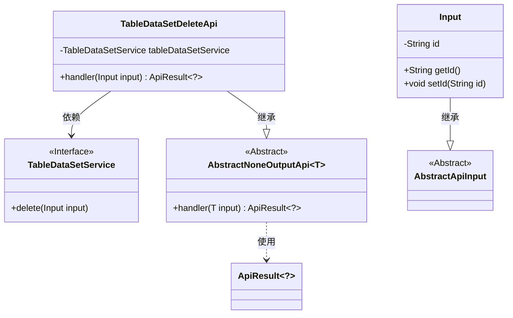

# 基础信息

|      |      |
|------|------|
| 名称 | TableDataSetDeleteApi |
| 编码语言 | .java |
| 代码路径 | WeFe/board/board-service/src/main/java/com/welab/wefe/board/service/api/data_resource/table_data_set/TableDataSetDeleteApi.java |
| 包名 | com.welab.wefe.board.service.api.data_resource.table_data_set |
| 依赖项 | ['com.welab.wefe.board.service.service.data_resource.table_data_set.TableDataSetService', 'com.welab.wefe.common.fieldvalidate.annotation.Check', 'com.welab.wefe.common.web.api.base.AbstractNoneOutputApi', 'com.welab.wefe.common.web.api.base.Api', 'com.welab.wefe.common.web.dto.AbstractApiInput', 'com.welab.wefe.common.web.dto.ApiResult', 'org.springframework.beans.factory.annotation.Autowired'] |
| 概述说明 | 这是一个删除数据集的API类，路径为"table_data_set/delete"，通过传入数据集ID调用服务删除数据。 |

# 说明

这是一个用于删除数据集的API类，路径为"table_data_set/delete"。它继承自AbstractNoneOutputApi，输入参数为内部类Input，包含必填字段"数据集Id"。通过注入的TableDataSetService执行删除操作，成功时返回空结果。输入类Input继承自AbstractApiInput，包含id字段及其getter/setter方法。

# 类列表 Class Summary

| 名称   | 类型  | 说明 |
|-------|------|-------------|
| TableDataSetDeleteApi | class | 删除数据集的API类，接收数据集ID作为必填参数，调用服务层删除数据并返回成功结果。 |

## 类 TableDataSetDeleteApi

|      |      |
|------|------|
| 访问范围 | @Api(path = "table_data_set/delete", name = "delete data set");public |
| 类型 | class |
| 名称 | TableDataSetDeleteApi |
| 说明 | 删除数据集的API类，接收数据集ID作为必填参数，调用服务层删除数据并返回成功结果。 |

### UML类图

这段代码展示了一个删除数据集的API实现结构。TableDataSetDeleteApi继承自AbstractNoneOutputApi，处理Input类型的参数，通过依赖注入的TableDataSetService执行删除操作。Input类包含数据集ID字段及其访问方法，继承自AbstractApiInput。整个设计采用分层架构，通过泛型和抽象类实现代码复用，体现了清晰的职责分离和依赖管理。

### 内部方法调用关系图

```mermaid
graph TD
    A["类TableDataSetDeleteApi"]
    B["继承: AbstractNoneOutputApi<Input>"]
    C["注解: @Api(path='table_data_set/delete', name='delete data set')"]
    D["依赖注入: @Autowired TableDataSetService"]
    E["重写方法: handler(Input input)"]
    F["调用: tableDataSetService.delete(input)"]
    G["返回: success()"]
    H["静态内部类Input"]
    I["继承: AbstractApiInput"]
    J["属性: String id"]
    K["校验注解: @Check(name='数据集 Id', require=true)"]
    L["getter/setter方法"]

    A --> B
    A --> C
    A --> D
    A --> E
    E --> F
    E --> G
    A --> H
    H --> I
    H --> J
    J --> K
    H --> L
```

这段代码展示了一个基于Spring框架的API类TableDataSetDeleteApi，主要用于删除数据集。类继承AbstractNoneOutputApi并实现handler方法，通过注入的TableDataSetService执行删除操作。内部类Input定义了必需的id字段及其校验规则，整体结构体现了清晰的层级关系和职责划分。

### 字段列表 Field List

| 名称  | 类型  | 说明 |
|-------|-------|------|
| tableDataSetService | TableDataSetService | 使用@Autowired自动注入TableDataSetService实例。 |

### 方法列表

| 名称  | 类型  | 说明 |
|-------|-------|------|
| handler | ApiResult<?> | 代码重写父类handler方法，调用tableDataSetService删除输入数据，成功后返回成功结果。 |

