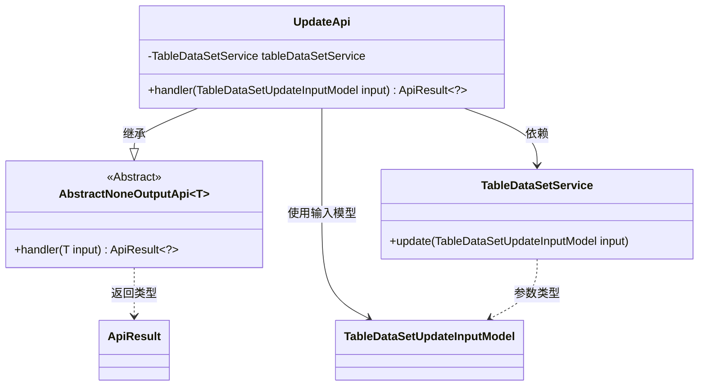
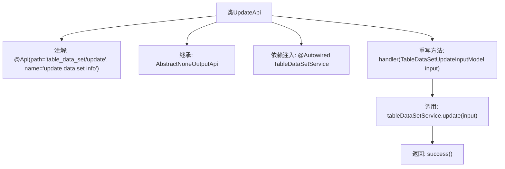

# 基础信息

|      |      |
|------|------|
| 名称 | UpdateApi |
| 编码语言 | .java |
| 代码路径 | WeFe/board/board-service/src/main/java/com/welab/wefe/board/service/api/data_resource/table_data_set/UpdateApi.java |
| 包名 | com.welab.wefe.board.service.api.data_resource.table_data_set |
| 依赖项 | ['com.welab.wefe.board.service.dto.vo.data_resource.TableDataSetUpdateInputModel', 'com.welab.wefe.board.service.service.data_resource.table_data_set.TableDataSetService', 'com.welab.wefe.common.exception.StatusCodeWithException', 'com.welab.wefe.common.web.api.base.AbstractNoneOutputApi', 'com.welab.wefe.common.web.api.base.Api', 'com.welab.wefe.common.web.dto.ApiResult', 'org.springframework.beans.factory.annotation.Autowired'] |
| 概述说明 | 更新数据集信息的API类，继承自无输出抽象类，调用服务层方法处理输入模型，成功返回空结果。 |

# 说明

这是一个名为UpdateApi的Java类，用于更新数据集信息。该类继承自AbstractNoneOutputApi，泛型参数为TableDataSetUpdateInputModel。通过@Api注解定义了API路径为"table_data_set/update"，名称为"update data set info"。类中注入了TableDataSetService服务，并重写了handler方法，该方法接收TableDataSetUpdateInputModel输入参数，调用tableDataSetService.update方法进行数据更新，最后返回成功的ApiResult。整个类实现了无输出更新的API功能。

# 类列表 Class Summary

| 名称   | 类型  | 说明 |
|-------|------|-------------|
| UpdateApi | class | 这是一个Java API类，用于更新数据集信息。它接收TableDataSetUpdateInputModel输入，调用tableDataSetService的update方法处理，成功后返回空结果。 |

## 类 UpdateApi

|      |      |
|------|------|
| 访问范围 | @Api(path = "table_data_set/update", name = "update data set info");public |
| 类型 | class |
| 名称 | UpdateApi |
| 说明 | 这是一个Java API类，用于更新数据集信息。它接收TableDataSetUpdateInputModel输入，调用tableDataSetService的update方法处理，成功后返回空结果。 |

### UML类图

这段代码展示了一个基于Spring框架的API更新实现类UpdateApi，它继承自泛型抽象类AbstractNoneOutputApi，专门处理TableDataSetUpdateInputModel类型的数据更新请求。类中通过依赖注入TableDataSetService服务来执行实际的数据更新操作，handler方法接收输入模型并返回封装好的ApiResult结果。整个设计体现了清晰的层次结构和单一职责原则，UpdateApi专注于处理更新请求的流程控制。

### 内部方法调用关系图

该流程图描述了UpdateApi类的结构和工作流程。该类是一个带有特定路径和名称注解的API接口，继承自抽象父类，并通过自动注入的服务类完成数据更新操作。主要流程包括：接收输入模型参数，调用服务层更新方法，最后返回成功结果。整个流程简洁清晰地展现了从请求处理到结果返回的完整链路。

### 字段列表 Field List

| 名称  | 类型  | 说明 |
|-------|-------|------|
| tableDataSetService | TableDataSetService | 使用@Autowired自动注入TableDataSetService实例。 |

### 方法列表

| 名称  | 类型  | 说明 |
|-------|-------|------|
| handler | ApiResult<?> | Java方法重写，调用服务更新表数据，成功返回结果。 |

