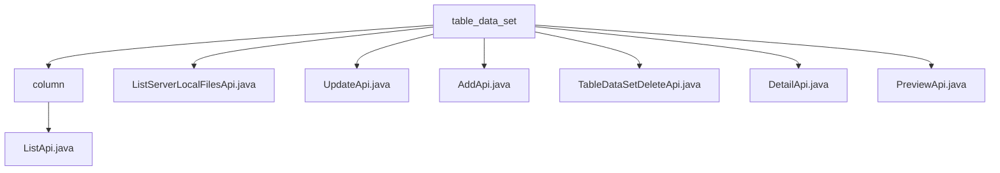

# 基础信息

|      |      |
|------|------|
| 名称 | table_data_set |
| 编码语言 | .java |
| 代码路径 | WeFe/board/board-service/src/main/java/com/welab/wefe/board/service/api/data_resource/table_data_set |
| 包名 | docs.board.board-service.src.main.java.com.welab.wefe.board.service.api.data_resource.table_data_set |
| 概述说明 | ListApi类用于获取数据集字段列表，路径为table_data_set/column/list。ListServerLocalFilesApi类查询服务器文件，仅显示xls、xlsx和csv文件。UpdateApi类更新数据集信息，路径为table_data_set/update。AddApi类添加数据集，路径为table_data_set/add。DeleteApi类删除数据集，路径为table_data_set/delete。DetailApi类获取数据集详情，路径为table_data_set/detail。PreviewApi类预览数据集行，支持数据库和文件数据源。 |

# 说明

## 概述  
该模块核心职责是管理数据集(TableDataSet)的完整生命周期，包括字段列表查询、本地文件检索、增删改查及数据预览功能，类似CRUD模式的数据管家。接口规范统一继承AbstractApi基类，路径均以"table_data_set"为前缀，例如"table_data_set/add"实现添加操作。关键数据结构包含TableDataSetUpdateInputModel(更新输入)、DataResourceAddOutputModel(添加输出)等。外部依赖包括DataSetColumnService(字段服务)、TableDataSetRepository(存储库)等。例如ListApi通过DataSetColumnService.query实现分页查询。

## 主要业务场景  
典型应用包含数据集全流程管理：通过AddApi/UpdateApi/DeleteApi实现数据增删改，DetailApi获取详情，ListApi查询字段列表，类似数据库管理系统的元数据操作。交互模式均为RESTful风格，例如PreviewApi支持从数据库或文件(CSV/Excel)两种数据源预览原始数据。完整功能覆盖数据集上传(通过ListServerLocalFilesApi筛选xls/csv文件)、结构化存储、元数据维护及样本查看。例如文件上传场景会先调用ListServerLocalFilesApi获取可用文件列表，再通过AddApi导入数据。

### 包内部结构视图

该流程图展示了table_data_set目录下的文件结构关系。table_data_set作为根节点，包含column子目录和6个API文件。column目录下又包含ListApi.java文件。整体结构清晰地反映了数据资源表相关API的层级组织方式，共包含8个节点，准确对应输入路径数量。

# 文件列表

| 名称   | 类型  | 说明 |
|-------|------|-------------|
| [ListServerLocalFilesApi.java](ListServerLocalFilesApi.md) | file | 查询服务器指定目录下的文件，仅返回xls、xlsx和csv格式的文件列表。 |
| [UpdateApi.java](UpdateApi.md) | file | 更新数据集信息的API类，继承自无输出抽象类，调用服务层方法处理输入模型，成功返回空结果。 |
| [AddApi.java](AddApi.md) | file | 这是一个Java类，定义了一个名为AddApi的API接口，路径为"table_data_set/add"，用于添加数据集。它继承自AbstractApi，处理TableDataSetAddInputModel输入和DataResourceAddOutputModel输出。通过tableDataSetAddService的add方法实现功能，成功时返回包含输出的ApiResult。 |
| [TableDataSetDeleteApi.java](TableDataSetDeleteApi.md) | file | 这是一个删除数据集的API类，路径为"table_data_set/delete"，通过传入数据集ID调用服务删除数据。 |
| [DetailApi.java](DetailApi.md) | file | DetailApi类通过id查询数据集详情，返回TableDataSetOutputModel。若数据不存在返回空结果。使用Autowired注入TableDataSetRepository进行数据库操作。 |
| [PreviewApi.java](PreviewApi.md) | file | PreviewApi类用于预览数据集行，支持从数据库或文件读取数据。数据库方式验证SQL并获取数据，文件方式解析CSV或Excel文件。输出包含字段列表、原始数据和元数据信息。 |
| [column](column/_module.md) | package | 这是一个用于获取数据集字段列表的API类，路径为"table_data_set/column/list"。它继承自AbstractApi，接受包含数据集ID的输入，返回分页的DataSetColumnOutputModel结果。通过DataSetColumnService处理查询请求。 |

