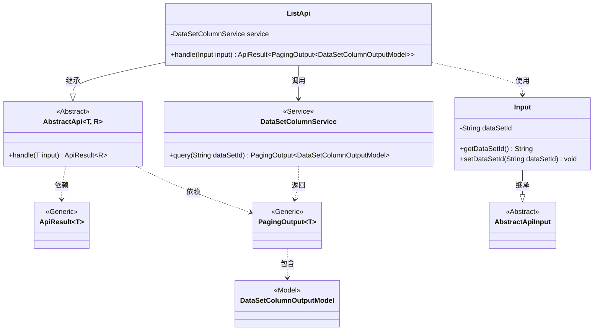

# 基础信息

|      |      |
|------|------|
| 名称 | ListApi |
| 编码语言 | .java |
| 代码路径 | WeFe/board/board-service/src/main/java/com/welab/wefe/board/service/api/data_resource/table_data_set/column/ListApi.java |
| 包名 | com.welab.wefe.board.service.api.data_resource.table_data_set.column |
| 依赖项 | ['com.welab.wefe.board.service.dto.base.PagingOutput', 'com.welab.wefe.board.service.dto.entity.data_set.DataSetColumnOutputModel', 'com.welab.wefe.board.service.service.DataSetColumnService', 'com.welab.wefe.common.exception.StatusCodeWithException', 'com.welab.wefe.common.fieldvalidate.annotation.Check', 'com.welab.wefe.common.web.api.base.AbstractApi', 'com.welab.wefe.common.web.api.base.Api', 'com.welab.wefe.common.web.dto.AbstractApiInput', 'com.welab.wefe.common.web.dto.ApiResult', 'org.springframework.beans.factory.annotation.Autowired'] |
| 概述说明 | 这是一个用于获取数据集字段列表的API类，路径为"table_data_set/column/list"。它继承自AbstractApi，接受包含数据集ID的输入，返回分页的DataSetColumnOutputModel结果。通过DataSetColumnService处理查询请求。 |

# 说明

这是一个名为ListApi的Java类，用于获取数据集字段列表。它继承自AbstractApi，接受Input参数并返回分页的DataSetColumnOutputModel结果。类注解指定了API路径为"table_data_set/column/list"，名称为"list of data set fields"。内部类Input包含一个必填字段dataSetId，并有对应的getter和setter方法。handle方法调用DataSetColumnService的query方法处理请求，返回分页查询结果。整个类实现了数据集字段列表查询功能。

# 类列表 Class Summary

| 名称   | 类型  | 说明 |
|-------|------|-------------|
| ListApi | class | 这是一个API类，路径为"table_data_set/column/list"，用于获取数据集字段列表。输入参数为数据集ID，返回分页的字段数据。通过DataSetColumnService查询数据。 |

## 类 ListApi

|      |      |
|------|------|
| 访问范围 | @Api(path = "table_data_set/column/list", name = "list of data set fields");public |
| 类型 | class |
| 名称 | ListApi |
| 说明 | 这是一个API类，路径为"table_data_set/column/list"，用于获取数据集字段列表。输入参数为数据集ID，返回分页的字段数据。通过DataSetColumnService查询数据。 |

### UML类图

该类图展示了基于Spring框架的API实现结构。ListApi继承AbstractApi并依赖DataSetColumnService进行数据查询，使用Input作为参数封装类。核心流程为：ListApi.handle()调用service.query()获取分页数据，其中PagingOutput泛型类包装DataSetColumnOutputModel模型数据。输入参数Input继承自AbstractApiInput，包含必要的数据集ID校验逻辑。整体设计体现了分层架构和依赖注入思想。

### 内部方法调用关系图

```mermaid
graph TD
    A["类ListApi"]
    B["注解: @Api"]
    C["继承: AbstractApi<Input, PagingOutput<DataSetColumnOutputModel>>"]
    D["依赖注入: @Autowired DataSetColumnService"]
    E["重写方法: handle(Input input)"]
    F["内部类: Input"]
    G["属性: String dataSetId"]
    H["校验注解: @Check"]
    I["getter/setter方法"]
    J["方法调用: service.query(input.getDataSetId())"]
    K["返回包装: success()"]

    A --> B
    A --> C
    A --> D
    A --> E
    E --> J
    J --> K
    A --> F
    F --> G
    F --> H
    F --> I
```

该流程图展示了ListApi类的核心结构，包含API注解、父类继承、服务注入和请求处理流程。内部类Input定义了数据集ID字段及其校验规则，handle方法通过调用service.query获取分页数据后，用success方法包装返回结果。整体呈现了从请求参数校验到业务处理的完整链路。

### 字段列表 Field List

| 名称  | 类型  | 说明 |
|-------|-------|------|
| service | DataSetColumnService | 自动注入DataSetColumnService服务实例。 |

### 方法列表

| 名称  | 类型  | 说明 |
|-------|-------|------|
| handle | ApiResult<PagingOutput<DataSetColumnOutputModel>> | 重写handle方法，调用service.query查询数据集列，返回分页结果。 |

