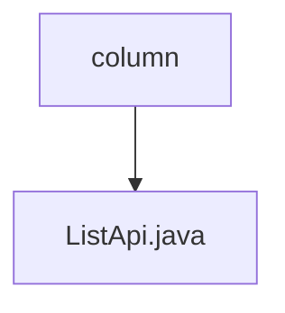

# 基础信息

|      |      |
|------|------|
| 名称 | column |
| 编码语言 | .java |
| 代码路径 | WeFe/board/board-service/src/main/java/com/welab/wefe/board/service/api/data_resource/table_data_set/column |
| 包名 | docs.board.board-service.src.main.java.com.welab.wefe.board.service.api.data_resource.table_data_set.column |
| 概述说明 | 这是一个用于获取数据集字段列表的API类，路径为"table_data_set/column/list"。它继承自AbstractApi，接受包含数据集ID的输入，返回分页的DataSetColumnOutputModel结果。通过DataSetColumnService处理查询请求。 |

# 说明

这是一个名为ListApi的Java类，用于获取数据集字段列表。它继承自AbstractApi，接受Input参数并返回分页的DataSetColumnOutputModel结果。类注解指定了API路径为"table_data_set/column/list"，名称为"list of data set fields"。内部类Input包含一个必填字段dataSetId，并有对应的getter和setter方法。handle方法调用DataSetColumnService的query方法处理请求，返回分页查询结果。整个类实现了数据集字段列表查询功能。

### 包内部结构视图

该流程图展示了WeFe项目中数据资源表数据集列相关的API文件结构。根节点为"column"目录，其下包含一个具体的API实现文件"ListApi.java"。这种简洁的层级关系体现了模块化设计思想，便于开发者快速定位到列数据操作相关的接口代码。

# 文件列表

| 名称   | 类型  | 说明 |
|-------|------|-------------|
| [ListApi.java](ListApi.md) | file | 这是一个用于获取数据集字段列表的API类，路径为"table_data_set/column/list"。它继承自AbstractApi，接受包含数据集ID的输入，返回分页的DataSetColumnOutputModel结果。通过DataSetColumnService处理查询请求。 |

