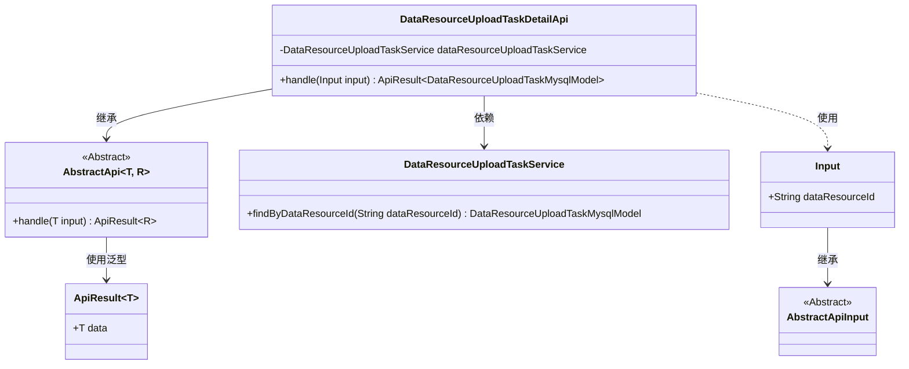

# 基础信息

|      |      |
|------|------|
| 名称 | DataResourceUploadTaskDetailApi |
| 编码语言 | .java |
| 代码路径 | WeFe/board/board-service/src/main/java/com/welab/wefe/board/service/api/data_resource/upload_task/DataResourceUploadTaskDetailApi.java |
| 包名 | com.welab.wefe.board.service.api.data_resource.upload_task |
| 依赖项 | ['com.welab.wefe.board.service.database.entity.data_resource.DataResourceUploadTaskMysqlModel', 'com.welab.wefe.board.service.service.data_resource.DataResourceUploadTaskService', 'com.welab.wefe.common.exception.StatusCodeWithException', 'com.welab.wefe.common.fieldvalidate.annotation.Check', 'com.welab.wefe.common.web.api.base.AbstractApi', 'com.welab.wefe.common.web.api.base.Api', 'com.welab.wefe.common.web.dto.AbstractApiInput', 'com.welab.wefe.common.web.dto.ApiResult', 'org.springframework.beans.factory.annotation.Autowired'] |
| 概述说明 | 获取数据集上传任务详情的API类，通过dataResourceId查询任务信息并返回结果。 |

# 说明

该代码定义了一个名为DataResourceUploadTaskDetailApi的API类，用于获取数据集上传任务信息。它继承自AbstractApi，接受Input参数并返回DataResourceUploadTaskMysqlModel结果。Input类包含一个必填字段dataResourceId。API路径为data_resource/upload_task/detail，通过自动注入的DataResourceUploadTaskService调用findByDataResourceId方法查询数据。处理逻辑封装在handle方法中，成功时返回查询结果。

# 类列表 Class Summary

| 名称   | 类型  | 说明 |
|-------|------|-------------|
| DataResourceUploadTaskDetailApi | class | 获取数据集上传任务详情的API类，通过dataResourceId查询并返回任务信息。 |

## 类 DataResourceUploadTaskDetailApi

|      |      |
|------|------|
| 访问范围 | @Api(path = "data_resource/upload_task/detail", name = "get a data set upload task info");public |
| 类型 | class |
| 名称 | DataResourceUploadTaskDetailApi |
| 说明 | 获取数据集上传任务详情的API类，通过dataResourceId查询并返回任务信息。 |

### UML类图

这段代码描述了一个数据资源上传任务详情API的实现结构。DataResourceUploadTaskDetailApi继承自泛型抽象类AbstractApi，处理Input参数并返回包含DataResourceUploadTaskMysqlModel的ApiResult。核心依赖DataResourceUploadTaskService进行数据查询，Input类继承自AbstractApiInput并包含必须的dataResourceId字段。整体采用分层设计，通过泛型实现类型安全，体现了Spring依赖注入和参数校验的典型用法。

### 内部方法调用关系图

```mermaid
graph TD
    A["类DataResourceUploadTaskDetailApi"]
    B["注解: @Api"]
    C["继承: AbstractApi<Input, DataResourceUploadTaskMysqlModel>"]
    D["依赖注入: DataResourceUploadTaskService"]
    E["重写方法: handle(Input input)"]
    F["内部类: Input"]
    G["校验注解: @Check(require = true)"]
    H["字段: String dataResourceId"]
    I["方法调用: dataResourceUploadTaskService.findByDataResourceId"]
    J["返回: ApiResult.success()"]

    A --> B
    A --> C
    A --> D
    A --> E
    E --> I
    I --> J
    A --> F
    F --> G
    F --> H
```

该流程图展示了DataResourceUploadTaskDetailApi类的结构及其关键组件。类通过@Api注解定义API路径，继承AbstractApi并注入DataResourceUploadTaskService服务。核心方法handle调用服务层的findByDataResourceId查询方法，返回封装结果。内部类Input包含必填字段dataResourceId，通过@Check注解实现参数校验。整体流程清晰展现了从API入口到数据查询的完整调用链。

### 字段列表 Field List

| 名称  | 类型  | 说明 |
|-------|-------|------|
| dataResourceUploadTaskService | DataResourceUploadTaskService | 使用@Autowired自动注入DataResourceUploadTaskService服务实例。 |

### 方法列表

| 名称  | 类型  | 说明 |
|-------|-------|------|
| handle | ApiResult<DataResourceUploadTaskMysqlModel> | 该方法重写父类逻辑，调用服务层根据输入的数据资源ID查询上传任务，并返回封装成功的API结果。 |

