# 基础信息

|      |      |
|------|------|
| 名称 | DataResourceUploadTaskQueryApi |
| 编码语言 | .java |
| 代码路径 | WeFe/board/board-service/src/main/java/com/welab/wefe/board/service/api/data_resource/upload_task/DataResourceUploadTaskQueryApi.java |
| 包名 | com.welab.wefe.board.service.api.data_resource.upload_task |
| 依赖项 | ['com.welab.wefe.board.service.dto.base.PagingInput', 'com.welab.wefe.board.service.dto.base.PagingOutput', 'com.welab.wefe.board.service.dto.entity.data_resource.output.DataResourceUploadTaskOutputModel', 'com.welab.wefe.board.service.service.data_resource.DataResourceUploadTaskService', 'com.welab.wefe.common.exception.StatusCodeWithException', 'com.welab.wefe.common.web.api.base.AbstractApi', 'com.welab.wefe.common.web.api.base.Api', 'com.welab.wefe.common.web.dto.ApiResult', 'org.springframework.beans.factory.annotation.Autowired'] |
| 概述说明 | 这是一个查询数据集上传任务列表的API类，继承自AbstractApi，使用分页输入和输出，调用DataResourceUploadTaskService处理查询请求。 |

# 说明

这是一个名为DataResourceUploadTaskQueryApi的Java类，用于查询数据集上传任务列表。它继承自AbstractApi基类，泛型参数指定了输入类型为内部类Input，输出类型为分页的DataResourceUploadTaskOutputModel。类上标注了API路径和名称。通过自动注入的DataResourceUploadTaskService服务处理查询请求，返回分页结果。内部类Input继承自PagingInput，用于接收分页查询参数。handle方法调用服务层查询功能并返回成功结果。

# 类列表 Class Summary

| 名称   | 类型  | 说明 |
|-------|------|-------------|
| DataResourceUploadTaskQueryApi | class | 这是一个查询数据集上传任务列表的API类，继承自AbstractApi，使用DataResourceUploadTaskService处理查询请求，返回分页结果。输入为分页参数，输出为任务列表。 |


## 类 DataResourceUploadTaskQueryApi

|      |      |
|------|------|
| 访问范围 | @Api(path = "data_resource/upload_task/query", name = "query data set upload task list");public |
| 类型 | class |
| 名称 | DataResourceUploadTaskQueryApi |
| 说明 | 这是一个查询数据集上传任务列表的API类，继承自AbstractApi，使用DataResourceUploadTaskService处理查询请求，返回分页结果。输入为分页参数，输出为任务列表。 |


### UML类图

```mermaid
classDiagram
    class DataResourceUploadTaskQueryApi {
        -DataResourceUploadTaskService dataResourceUploadTaskService
        +handle(Input input) ApiResult~PagingOutput~DataResourceUploadTaskOutputModel~~
    }
    class AbstractApi~T, R~ {
        <<Abstract>>
    }
    class PagingInput {
    }
    class Input {
    }
    class DataResourceUploadTaskService {
        <<Interface>>
        +query(Input input) PagingOutput~DataResourceUploadTaskOutputModel~
    }
    class PagingOutput~T~ {
    }
    class DataResourceUploadTaskOutputModel {
    }
    class ApiResult~T~ {
    }

    DataResourceUploadTaskQueryApi --> AbstractApi~Input, PagingOutput~DataResourceUploadTaskOutputModel~~ : 继承
    DataResourceUploadTaskQueryApi --> DataResourceUploadTaskService : 依赖
    Input --> PagingInput : 继承
    DataResourceUploadTaskService ..> PagingOutput~DataResourceUploadTaskOutputModel~ : 返回
    DataResourceUploadTaskService ..> Input : 参数
```

这段类图描述了一个数据资源上传任务查询API的结构。DataResourceUploadTaskQueryApi继承自泛型抽象类AbstractApi，依赖DataResourceUploadTaskService接口进行业务处理。内部类Input继承自PagingInput用于分页参数，服务接口返回包含DataResourceUploadTaskOutputModel的分页结果。整体设计体现了分层架构，通过泛型实现了输入输出类型的灵活扩展，同时保持了核心分页查询功能的统一性。


### 内部方法调用关系图

```mermaid
graph TD
    A["类DataResourceUploadTaskQueryApi"]
    B["注解: @Api"]
    C["继承: AbstractApi<Input, PagingOutput<DataResourceUploadTaskOutputModel>>"]
    D["依赖注入: @Autowired DataResourceUploadTaskService"]
    E["重写方法: handle(Input input)"]
    F["内部类: Input extends PagingInput"]
    G["服务调用: dataResourceUploadTaskService.query(input)"]
    H["返回结果: success(...)"]

    A --> B
    A --> C
    A --> D
    A --> E
    E --> G
    G --> H
    A --> F
```



该流程图展示了DataResourceUploadTaskQueryApi类的核心结构和工作流程。类通过@Api注解定义API路径，继承AbstractApi抽象类并指定输入/输出泛型类型。主要处理逻辑在重写的handle方法中，通过自动注入的Service组件执行查询操作，最终返回分页结果。内部类Input扩展了基础分页参数类，体现了清晰的层级关系和职责划分。整个流程展示了从请求处理到服务调用的完整链路。

### 字段列表 Field List

| 名称  | 类型  | 说明 |
|-------|-------|------|
| dataResourceUploadTaskService | DataResourceUploadTaskService | 使用@Autowired自动注入DataResourceUploadTaskService服务实例。 |

### 方法列表

| 名称  | 类型  | 说明 |
|-------|-------|------|
| handle | ApiResult<PagingOutput<DataResourceUploadTaskOutputModel>> | 该方法重写父类逻辑，调用服务查询数据资源上传任务，返回分页结果。输入参数为Input，输出封装为ApiResult。异常时抛出StatusCodeWithException。 |


