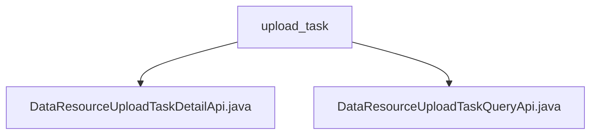

# 基础信息

|      |      |
|------|------|
| 名称 | upload_task |
| 编码语言 | .java |
| 代码路径 | WeFe/board/board-service/src/main/java/com/welab/wefe/board/service/api/data_resource/upload_task |
| 包名 | docs.board.board-service.src.main.java.com.welab.wefe.board.service.api.data_resource.upload_task |
| 概述说明 | DataResourceUploadTaskDetailApi类用于获取数据集上传任务详情，继承AbstractApi，通过dataResourceId查询。DataResourceUploadTaskQueryApi类用于分页查询任务列表，继承AbstractApi，使用PagingInput参数返回分页结果。两者均通过DataResourceUploadTaskService处理查询。 |

# 说明

## 概述  
该模块核心职责是提供数据集上传任务的管理接口，包括任务详情查询和分页列表获取。接口规范遵循RESTful风格，通过继承AbstractApi实现统一处理逻辑，路径前缀为data_resource/upload_task。关键数据结构包含DataResourceUploadTaskMysqlModel（详情模型）和DataResourceUploadTaskOutputModel（分页输出模型）。外部依赖仅涉及DataResourceUploadTaskService服务层。例如详情接口通过dataResourceId精确查询，列表接口支持分页参数。

## 主要业务场景  
模块支持两种典型交互模式：精确查询（类似数据库主键查询）和条件分页（类似表格数据筛选）。业务流程均通过Service层代理，例如详情查询调用findByDataResourceId，列表查询返回分页包装结果。完整功能覆盖数据集上传任务的读取场景，API类型包含GET类查询接口。典型应用如任务监控面板需同时调用详情和列表接口实现数据联动展示。

### 包内部结构视图

该流程图展示了数据资源上传任务模块的API文件结构，包含两个主要接口文件：DataResourceUploadTaskDetailApi和DataResourceUploadTaskQueryApi，它们都位于upload_task目录下。这种结构清晰地反映了任务查询和详情查看的功能划分。

# 文件列表

| 名称   | 类型  | 说明 |
|-------|------|-------------|
| [DataResourceUploadTaskDetailApi.java](DataResourceUploadTaskDetailApi.md) | file | 获取数据集上传任务详情的API类，通过dataResourceId查询任务信息并返回结果。 |
| [DataResourceUploadTaskQueryApi.java](DataResourceUploadTaskQueryApi.md) | file | 这是一个查询数据集上传任务列表的API类，继承自AbstractApi，使用分页输入和输出，调用DataResourceUploadTaskService处理查询请求。 |

