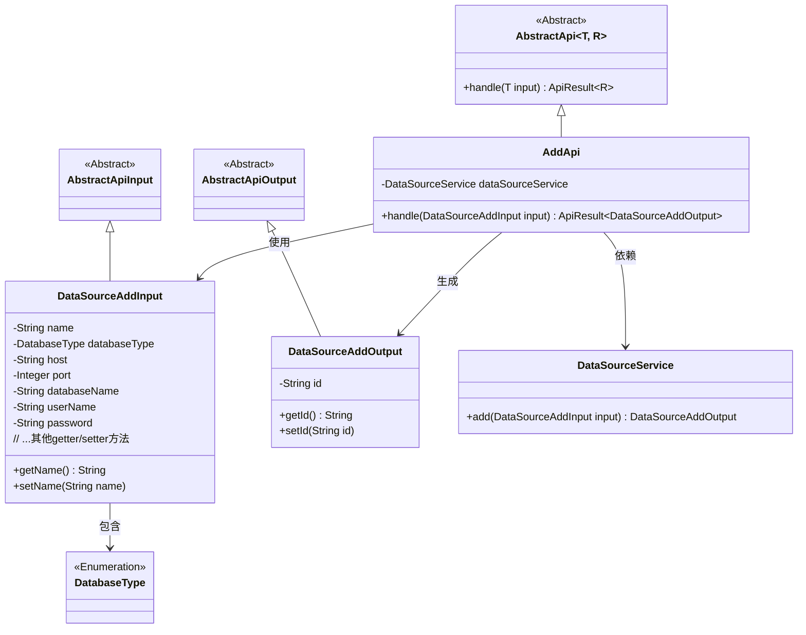
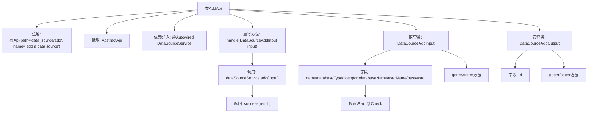

# 基础信息

|      |      |
|------|------|
| 名称 | AddApi |
| 编码语言 | .java |
| 代码路径 | WeFe/board/board-service/src/main/java/com/welab/wefe/board/service/api/datasource/AddApi.java |
| 包名 | com.welab.wefe.board.service.api.datasource |
| 依赖项 | ['com.welab.wefe.board.service.service.DataSourceService', 'com.welab.wefe.common.exception.StatusCodeWithException', 'com.welab.wefe.common.fieldvalidate.annotation.Check', 'com.welab.wefe.common.jdbc.base.DatabaseType', 'com.welab.wefe.common.web.api.base.AbstractApi', 'com.welab.wefe.common.web.api.base.Api', 'com.welab.wefe.common.web.dto.AbstractApiInput', 'com.welab.wefe.common.web.dto.AbstractApiOutput', 'com.welab.wefe.common.web.dto.ApiResult', 'org.springframework.beans.factory.annotation.Autowired'] |
| 概述说明 | AddApi类用于添加数据源，包含输入参数验证和输出结果。输入包括名称、类型、主机、端口等必填字段，输出返回数据源ID。 |

# 说明

该代码定义了一个名为AddApi的类，用于添加数据源。类继承自AbstractApi，处理DataSourceAddInput输入并返回DataSourceAddOutput输出。输入包含数据源名称、数据库类型、主机、端口、数据库名称、用户名和密码等字段，均进行非空校验，名称长度限制为4到30字符。输出包含生成的ID字段。通过DataSourceService的add方法处理输入并返回结果。

# 类列表 Class Summary

| 名称   | 类型  | 说明 |
|-------|------|-------------|
| AddApi | class | AddApi类用于添加数据源，包含输入参数如名称、类型、主机、端口等，输出返回数据源ID。输入参数有校验规则，如名称长度4-30，必填项等。 |

## 类 AddApi

|      |      |
|------|------|
| 访问范围 | @Api(path = "data_source/add", name = "add a data source");public |
| 类型 | class |
| 名称 | AddApi |
| 说明 | AddApi类用于添加数据源，包含输入参数如名称、类型、主机、端口等，输出返回数据源ID。输入参数有校验规则，如名称长度4-30，必填项等。 |

### UML类图

该类图展示了一个数据源添加API的结构。AddApi继承自泛型抽象类AbstractApi，处理DataSourceAddInput输入并生成DataSourceAddOutput输出。输入类包含多个带校验注解的字段，输出类包含生成的ID字段。AddApi通过依赖DataSourceService完成核心业务逻辑，整体采用分层设计模式，输入输出均继承自抽象基类。

### 内部方法调用关系图

这段代码展示了一个数据源添加API的实现，采用分层架构设计。AddApi类继承抽象模板类并实现核心处理逻辑，包含输入输出参数的内嵌类定义。流程图清晰呈现了类继承关系、依赖注入、方法调用链路以及嵌套类的结构，特别是展示了输入参数的校验注解配置和输出结果的封装方式。整个设计体现了标准的API开发模式，包括参数验证、服务调用和结果封装等关键环节。

### 字段列表 Field List

| 名称  | 类型  | 说明 |
|-------|-------|------|
| dataSourceService | DataSourceService | 使用@Autowired自动注入DataSourceService实例。 |

### 方法列表

| 名称  | 类型  | 说明 |
|-------|-------|------|
| handle | ApiResult<DataSourceAddOutput> | 该方法重写父类逻辑，接收DataSourceAddInput参数，调用dataSourceService.add处理并返回结果，成功时封装为ApiResult。 |

