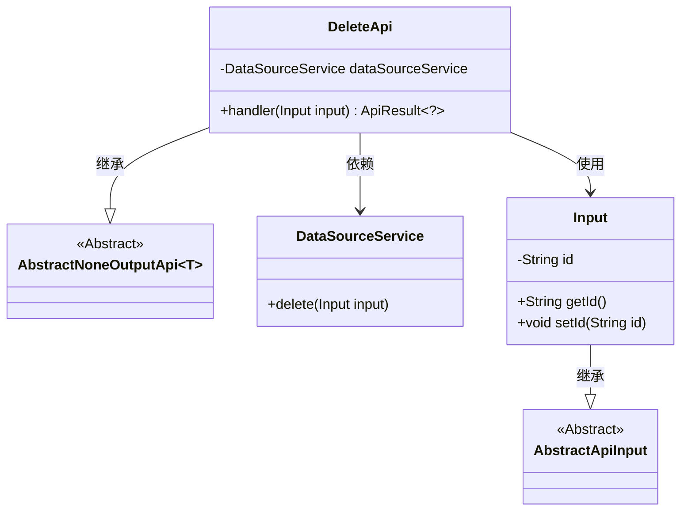

# 基础信息

|      |      |
|------|------|
| 名称 | DeleteApi |
| 编码语言 | .java |
| 代码路径 | WeFe/board/board-service/src/main/java/com/welab/wefe/board/service/api/datasource/DeleteApi.java |
| 包名 | com.welab.wefe.board.service.api.datasource |
| 依赖项 | ['com.welab.wefe.board.service.service.DataSourceService', 'com.welab.wefe.common.exception.StatusCodeWithException', 'com.welab.wefe.common.fieldvalidate.annotation.Check', 'com.welab.wefe.common.web.api.base.AbstractNoneOutputApi', 'com.welab.wefe.common.web.api.base.Api', 'com.welab.wefe.common.web.dto.AbstractApiInput', 'com.welab.wefe.common.web.dto.ApiResult', 'org.springframework.beans.factory.annotation.Autowired'] |
| 概述说明 | 这是一个删除数据源的API类，接收数据源ID作为输入，调用服务层删除数据并返回成功结果。 |

# 说明

这是一个名为DeleteApi的Java类，用于删除数据源。该类继承自AbstractNoneOutputApi，泛型参数为内部类Input。通过Autowired注解注入DataSourceService服务。handler方法处理输入参数，调用dataSourceService的delete方法执行删除操作，成功后返回ApiResult。Input内部类继承AbstractApiInput，包含一个必填字段id，用于标识要删除的数据源，并通过Check注解进行校验。整个类通过Api注解定义了路径为"data_source/delete"和名称为"delete a data source"。

# 类列表 Class Summary

| 名称   | 类型  | 说明 |
|-------|------|-------------|
| DeleteApi | class | 删除数据源的API类，接收数据源ID作为必填参数，调用DataSourceService执行删除操作，成功后返回空结果。 |

## 类 DeleteApi

|      |      |
|------|------|
| 访问范围 | @Api(path = "data_source/delete", name = "delete a data source");public |
| 类型 | class |
| 名称 | DeleteApi |
| 说明 | 删除数据源的API类，接收数据源ID作为必填参数，调用DataSourceService执行删除操作，成功后返回空结果。 |

### UML类图

这段代码展示了一个删除数据源的API实现，核心类DeleteApi继承自泛型抽象类AbstractNoneOutputApi，并依赖DataSourceService执行删除操作。输入参数封装在静态嵌套类Input中，该类继承自AbstractApiInput并包含数据源ID字段。类图清晰地呈现了继承关系和依赖关系，体现了分层设计和职责分离的原则。

### 内部方法调用关系图

```mermaid
graph TD
    A["类DeleteApi"]
    B["父类: AbstractNoneOutputApi<Input>"]
    C["依赖注入: DataSourceService"]
    D["重写方法: handler(Input input)"]
    E["内部类: Input"]
    F["属性: String id"]
    G["方法: String getId()"]
    H["方法: void setId(String id)"]
    I["注解校验: @Check(name='数据源id', require=true)"]
    J["业务调用: dataSourceService.delete(input)"]
    K["返回结果: success()"]

    A --> B
    A --> C
    A --> D
    A --> E
    E --> F
    E --> G
    E --> H
    E --> I
    D --> J
    D --> K
```

这段代码展示了一个基于Spring框架的API删除功能实现。DeleteApi继承抽象父类并重写handler方法，通过DataSourceService执行删除操作。内部类Input定义了带校验注解的请求参数id字段，并提供了标准getter/setter方法。流程图清晰呈现了类继承关系、依赖注入、方法调用链和参数校验逻辑，体现了典型的API层处理流程。

### 字段列表 Field List

| 名称  | 类型  | 说明 |
|-------|-------|------|
| dataSourceService | DataSourceService | 自动注入DataSourceService实例。 |

### 方法列表

| 名称  | 类型  | 说明 |
|-------|-------|------|
| handler | ApiResult<?> | 这是一个Java方法，重写父类handler方法，调用dataSourceService删除输入数据，成功时返回空结果，可能抛出StatusCodeWithException异常。 |

