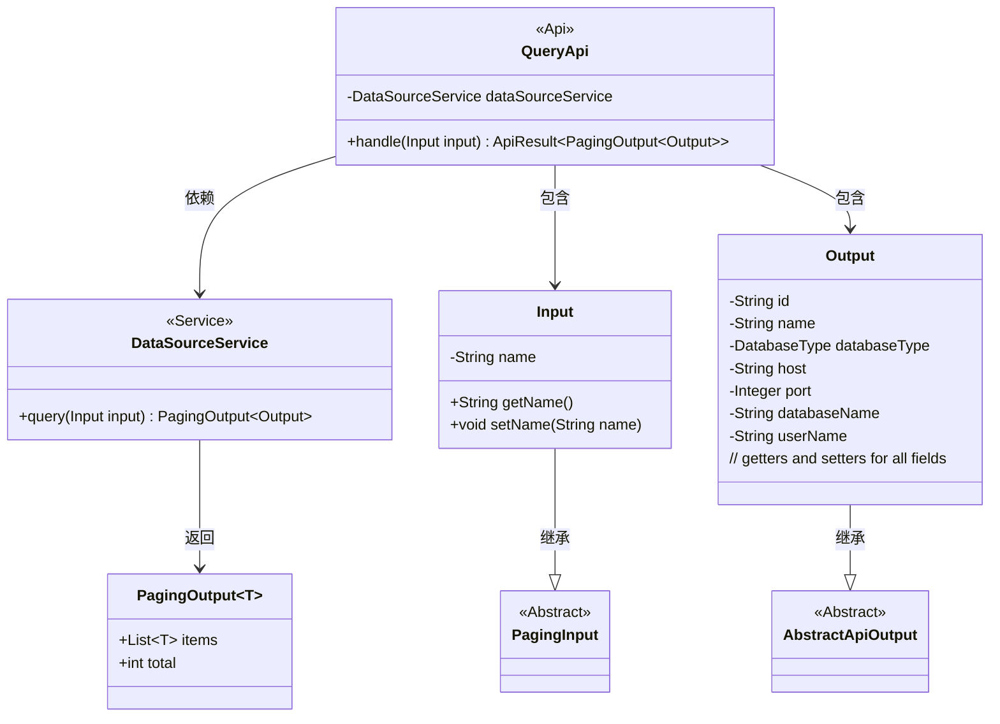

# 基础信息

|      |      |
|------|------|
| 名称 | QueryApi |
| 编码语言 | .java |
| 代码路径 | WeFe/board/board-service/src/main/java/com/welab/wefe/board/service/api/datasource/QueryApi.java |
| 包名 | com.welab.wefe.board.service.api.datasource |
| 依赖项 | ['com.welab.wefe.board.service.dto.base.PagingInput', 'com.welab.wefe.board.service.dto.base.PagingOutput', 'com.welab.wefe.board.service.service.DataSourceService', 'com.welab.wefe.common.exception.StatusCodeWithException', 'com.welab.wefe.common.fieldvalidate.annotation.Check', 'com.welab.wefe.common.jdbc.base.DatabaseType', 'com.welab.wefe.common.web.api.base.AbstractApi', 'com.welab.wefe.common.web.api.base.Api', 'com.welab.wefe.common.web.dto.AbstractApiOutput', 'com.welab.wefe.common.web.dto.ApiResult', 'org.springframework.beans.factory.annotation.Autowired'] |
| 概述说明 | 分页查询数据源的API类，包含输入参数（名称）和输出结果（ID、名称、数据库类型、主机、端口、数据库名、用户名）。调用DataSourceService处理查询请求。 |

# 说明

这是一个名为QueryApi的API类，用于分页查询数据源。它继承自AbstractApi，输入类型为Input，输出类型为PagingOutput<Output>。输入参数Input包含一个可校验的数据源名称字段name，继承自PagingInput实现分页功能。输出参数Output包含数据源详细信息，如id、name、databaseType、host、port、databaseName和userName。API通过注入的DataSourceService处理查询请求，并返回分页结果。

# 类列表 Class Summary

| 名称   | 类型  | 说明 |
|-------|------|-------------|
| QueryApi | class | 分页查询数据源的API类，包含输入参数（名称）和输出结果（ID、名称、数据库类型、主机、端口、数据库名、用户名）。通过DataSourceService处理查询请求。 |

## 类 QueryApi

|      |      |
|------|------|
| 访问范围 | @Api(path = "data_source/query", name = "query data source by pagination");public |
| 类型 | class |
| 名称 | QueryApi |
| 说明 | 分页查询数据源的API类，包含输入参数（名称）和输出结果（ID、名称、数据库类型、主机、端口、数据库名、用户名）。通过DataSourceService处理查询请求。 |

### UML类图

这段代码展示了一个分页查询数据源的API实现。QueryApi继承自AbstractApi，使用Input作为请求参数类型，PagingOutput<Output>作为响应类型。Input继承PagingInput包含分页参数和名称过滤条件，Output继承AbstractApiOutput包含数据源详细信息。DataSourceService提供查询功能，返回分页结果。类图清晰地展示了这些类之间的继承、包含和依赖关系。

### 内部方法调用关系图

```mermaid
graph TD
    A["类QueryApi"]
    B["注解: @Api"]
    C["继承: AbstractApi<Input, PagingOutput<Output>>"]
    D["依赖注入: DataSourceService"]
    E["重写方法: handle(Input input)"]
    F["内部类: Input"]
    G["内部类: Output"]
    H["Input属性: String name"]
    I["Input方法: getName/setName"]
    J["Output属性: id,name,databaseType等"]
    K["Output方法: getter/setter"]

    A --> B
    A --> C
    A --> D
    A --> E
    A --> F
    A --> G
    F --> H
    F --> I
    G --> J
    G --> K
    E --> D
```

流程图描述了QueryApi类的结构和关系。该类是一个带有@Api注解的API实现，继承自AbstractApi泛型类，包含DataSourceService依赖注入。核心是handle方法重写，调用dataSourceService.query处理分页查询。内部类Input扩展了PagingInput，包含name属性和访问方法；Output继承AbstractApiOutput，包含数据库连接相关属性和对应的getter/setter方法。整体展现了API请求处理的数据流转结构。

### 字段列表 Field List

| 名称  | 类型  | 说明 |
|-------|-------|------|
| dataSourceService | DataSourceService | 使用@Autowired自动注入DataSourceService实例。 |

### 方法列表

| 名称  | 类型  | 说明 |
|-------|-------|------|
| handle | ApiResult<PagingOutput<Output>> | 重写方法，调用数据源服务查询输入并返回分页结果，成功时返回封装数据，异常时抛出状态码异常。 |

