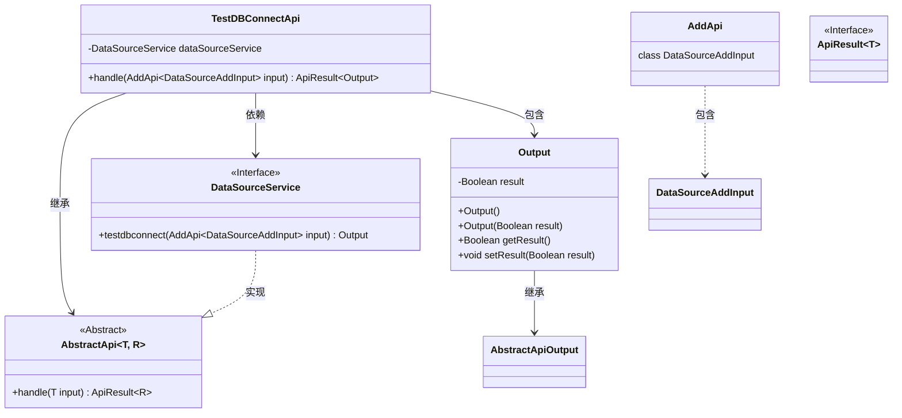
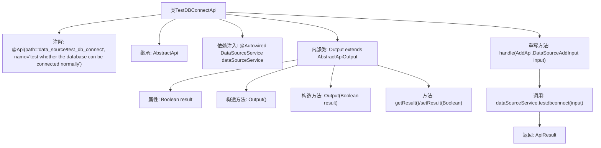

# 基础信息

|      |      |
|------|------|
| 名称 | TestDBConnectApi |
| 编码语言 | .java |
| 代码路径 | WeFe/board/board-service/src/main/java/com/welab/wefe/board/service/api/datasource/TestDBConnectApi.java |
| 包名 | com.welab.wefe.board.service.api.datasource |
| 依赖项 | ['com.welab.wefe.board.service.service.DataSourceService', 'com.welab.wefe.common.exception.StatusCodeWithException', 'com.welab.wefe.common.web.api.base.AbstractApi', 'com.welab.wefe.common.web.api.base.Api', 'com.welab.wefe.common.web.dto.AbstractApiOutput', 'com.welab.wefe.common.web.dto.ApiResult', 'org.springframework.beans.factory.annotation.Autowired'] |
| 概述说明 | 这是一个测试数据库连接的API类，接收数据源输入并返回连接测试结果。 |

# 说明

该代码定义了一个名为TestDBConnectApi的API类，用于测试数据库连接是否正常。它继承自AbstractApi类，泛型参数指定输入类型为AddApi.DataSourceAddInput，输出类型为内部类Output。API路径为"data_source/test_db_connect"。通过注入的DataSourceService调用testdbconnect方法进行连接测试，返回包含布尔值结果的ApiResult。Output内部类继承AbstractApiOutput，封装了表示连接结果的result属性及其getter/setter方法。整个API处理流程简洁，专注于数据库连接测试功能。

# 类列表 Class Summary

| 名称   | 类型  | 说明 |
|-------|------|-------------|
| TestDBConnectApi | class | 该API用于测试数据库连接，接收数据源输入，返回连接测试结果。 |

## 类 TestDBConnectApi

|      |      |
|------|------|
| 访问范围 | @Api(path = "data_source/test_db_connect", name = "test whether the database can be connected normally");public |
| 类型 | class |
| 名称 | TestDBConnectApi |
| 说明 | 该API用于测试数据库连接，接收数据源输入，返回连接测试结果。 |

### UML类图

这段代码展示了一个测试数据库连接API的实现，其中TestDBConnectApi继承自泛型抽象类AbstractApi，并依赖DataSourceService进行数据库连接测试。Output作为内部类封装测试结果，继承自AbstractApiOutput。类图清晰地呈现了继承、依赖和包含关系，以及接口与实现的关系，体现了模块化设计和清晰的职责划分。

### 内部方法调用关系图

这段代码是一个用于测试数据库连接是否正常的API类。它继承了AbstractApi基类，通过@Autowired注入DataSourceService服务，并重写了handle方法来调用dataSourceService.testdbconnect方法进行数据库连接测试。内部类Output用于封装测试结果，包含一个Boolean类型的result属性和对应的getter/setter方法。整个流程从API请求开始，经过服务层调用，最终返回包含测试结果的ApiResult对象。

### 字段列表 Field List

| 名称  | 类型  | 说明 |
|-------|-------|------|
| dataSourceService | DataSourceService | 使用@Autowired自动注入DataSourceService实例。 |

### 方法列表

| 名称  | 类型  | 说明 |
|-------|-------|------|
| handle | ApiResult<Output> | 该方法重写父类逻辑，调用数据源服务测试数据库连接，返回包含测试结果的ApiResult对象。 |

