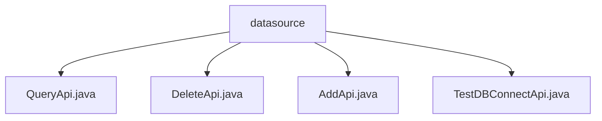

# 基础信息

|      |      |
|------|------|
| 名称 | datasource |
| 编码语言 | .java |
| 代码路径 | WeFe/board/board-service/src/main/java/com/welab/wefe/board/service/api/datasource |
| 包名 | docs.board.board-service.src.main.java.com.welab.wefe.board.service.api.datasource |
| 概述说明 | QueryApi用于分页查询数据源，输入包含名称和分页参数，输出为数据源详情。DeleteApi通过ID删除数据源。AddApi添加数据源，校验输入字段。TestDBConnectApi测试数据库连接，返回布尔结果。均继承基础API类，通过DataSourceService处理请求。 |

# 说明

## 概述  
该模块核心职责是提供数据源的CRUD操作及连接测试功能，类似资源管理系统的后端服务。接口规范统一继承AbstractApi基类，输入输出均采用强类型参数，例如分页查询返回PagingOutput<Output>结构。关键数据结构包括DataSourceAddInput（含主机/端口等连接信息）和PagingInput（分页参数）。外部依赖仅为DataSourceService，通过依赖注入实现业务逻辑。例如AddApi严格校验名称长度（4-30字符），TestDBConnectApi返回布尔值连接结果。

## 主要业务场景  
完整业务流程涵盖数据源生命周期管理：通过AddApi创建（例如MySQL连接信息入库）、QueryApi分页查询（支持databaseType过滤）、DeleteApi按ID删除。交互模式均为同步HTTP调用，类似RESTful风格。典型应用包括数据源配置界面集成，例如前端先调用TestDBConnectApi验证连接，再提交AddApi。API类型包含写操作（Add/Delete）和读操作（Query/Test），集成案例如管理后台通过PagingOutput实现分页表格渲染。

### 包内部结构视图

该流程图展示了WeFe项目中数据源API的层级结构。根节点"datasource"包含四个子节点，分别对应查询、删除、添加和测试数据库连接的API接口文件。所有Java文件都直接隶属于datasource目录下，没有更深层的嵌套关系，形成了清晰的平级结构。每个API文件都代表一个独立的功能模块。

# 文件列表

| 名称   | 类型  | 说明 |
|-------|------|-------------|
| [QueryApi.java](QueryApi.md) | file | 分页查询数据源的API类，包含输入参数（名称）和输出结果（ID、名称、数据库类型、主机、端口、数据库名、用户名）。调用DataSourceService处理查询请求。 |
| [DeleteApi.java](DeleteApi.md) | file | 这是一个删除数据源的API类，接收数据源ID作为输入，调用服务层删除数据并返回成功结果。 |
| [AddApi.java](AddApi.md) | file | AddApi类用于添加数据源，包含输入参数验证和输出结果。输入包括名称、类型、主机、端口等必填字段，输出返回数据源ID。 |
| [TestDBConnectApi.java](TestDBConnectApi.md) | file | 这是一个测试数据库连接的API类，接收数据源输入并返回连接测试结果。 |

