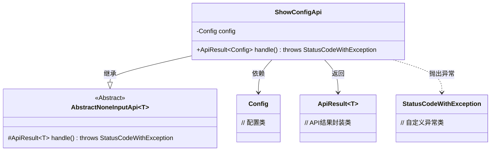
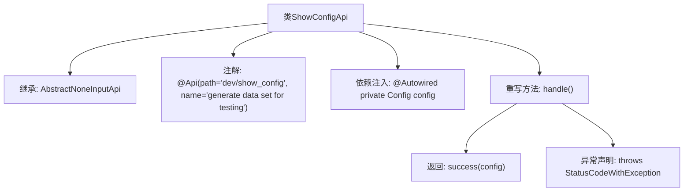

# 基础信息

|      |      |
|------|------|
| 名称 | ShowConfigApi |
| 编码语言 | .java |
| 代码路径 | WeFe/board/board-service/src/main/java/com/welab/wefe/board/service/api/dev/ShowConfigApi.java |
| 包名 | com.welab.wefe.board.service.api.dev |
| 依赖项 | ['com.welab.wefe.board.service.constant.Config', 'com.welab.wefe.common.exception.StatusCodeWithException', 'com.welab.wefe.common.web.api.base.AbstractNoneInputApi', 'com.welab.wefe.common.web.api.base.Api', 'com.welab.wefe.common.web.dto.ApiResult', 'org.springframework.beans.factory.annotation.Autowired'] |
| 概述说明 | 这是一个名为ShowConfigApi的API类，路径为dev/show_config，用于生成测试数据集。它继承自AbstractNoneInputApi，返回Config对象。通过handle方法获取配置并返回成功结果。 |

# 说明

这是一个名为ShowConfigApi的Java类，用于生成测试数据集。它继承自AbstractNoneInputApi类，泛型类型为Config。类上标注了Api注解，路径为"dev/show_config"，名称为"generate data set for testing"。类中通过Autowired自动注入了Config对象。重写了handle方法，直接返回包含config对象的成功结果。该类不接收输入参数，可能抛出StatusCodeWithException异常。

# 类列表 Class Summary

| 名称   | 类型  | 说明 |
|-------|------|-------------|
| ShowConfigApi | class | 这是一个名为ShowConfigApi的API类，路径为dev/show_config，用于生成测试数据集。它继承自AbstractNoneInputApi，返回Config配置信息。 |

## 类 ShowConfigApi

|      |      |
|------|------|
| 访问范围 | @Api(path = "dev/show_config", name = "generate data set for testing");public |
| 类型 | class |
| 名称 | ShowConfigApi |
| 说明 | 这是一个名为ShowConfigApi的API类，路径为dev/show_config，用于生成测试数据集。它继承自AbstractNoneInputApi，返回Config配置信息。 |

### UML类图

这段代码展示了一个基于Spring框架的API实现类ShowConfigApi，它继承自泛型抽象类AbstractNoneInputApi，用于返回系统配置信息。类图中清晰地体现了继承关系（ShowConfigApi→AbstractNoneInputApi）、依赖注入（Config成员变量）、返回类型（ApiResult）和异常处理（StatusCodeWithException）。该API通过handle()方法处理请求，返回包含Config对象的成功结果，典型应用于测试数据生成的场景。

### 内部方法调用关系图

这段代码展示了一个Spring风格的API类ShowConfigApi，继承自AbstractNoneInputApi泛型基类，通过@Api注解定义接口路径和描述。核心功能是通过@Autowired自动注入Config配置对象，并在重写的handle()方法中直接返回该配置。流程图清晰呈现了类继承关系、注解声明、依赖注入和方法实现的逻辑链路，体现了典型的Spring Boot控制器实现模式。

### 字段列表 Field List

| 名称  | 类型  | 说明 |
|-------|-------|------|
| config | Config | 使用@Autowired自动注入Config配置类的实例。 |

### 方法列表

| 名称  | 类型  | 说明 |
|-------|-------|------|
| handle | ApiResult<Config> | 重写方法返回配置结果，成功时返回配置对象。 |

