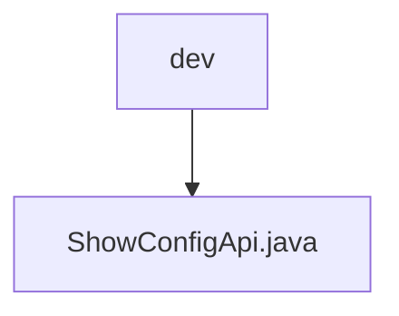

# 基础信息

|      |      |
|------|------|
| 名称 | dev |
| 编码语言 | .java |
| 代码路径 | WeFe/board/board-service/src/main/java/com/welab/wefe/board/service/api/dev |
| 包名 | docs.board.board-service.src.main.java.com.welab.wefe.board.service.api.dev |
| 概述说明 | 这是一个名为ShowConfigApi的API类，路径为dev/show_config，用于生成测试数据集。它继承自AbstractNoneInputApi，返回Config对象。通过handle方法获取配置并返回成功结果。 |

# 说明

这是一个名为ShowConfigApi的Java类，用于生成测试数据集。它继承自AbstractNoneInputApi类，泛型类型为Config。类上标注了Api注解，路径为"dev/show_config"，名称为"generate data set for testing"。类中通过Autowired自动注入了Config对象。重写了handle方法，直接返回包含config对象的成功结果。该类不接收输入参数，可能抛出StatusCodeWithException异常。

### 包内部结构视图

该流程图展示了WeFe项目中board-service模块的API开发目录结构。根节点"dev"表示开发环境下的API目录，其下级节点"ShowConfigApi.java"是该目录下的具体API实现文件。这个简洁的层级关系清晰地呈现了开发API的单一文件结构，符合微服务架构中API文件通常按功能或环境分类存放的惯例。

# 文件列表

| 名称   | 类型  | 说明 |
|-------|------|-------------|
| [ShowConfigApi.java](ShowConfigApi.md) | file | 这是一个名为ShowConfigApi的API类，路径为dev/show_config，用于生成测试数据集。它继承自AbstractNoneInputApi，返回Config对象。通过handle方法获取配置并返回成功结果。 |

