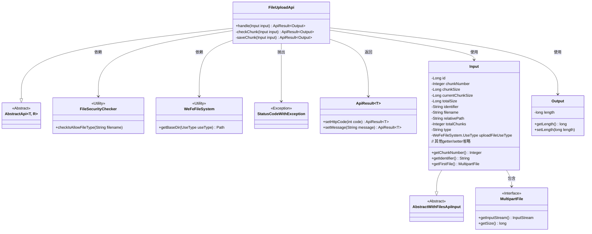

# 基础信息

|      |      |
|------|------|
| 名称 | FileUploadApi |
| 编码语言 | .java |
| 代码路径 | WeFe/board/board-service/src/main/java/com/welab/wefe/board/service/api/file/FileUploadApi.java |
| 包名 | com.welab.wefe.board.service.api.file |
| 依赖项 | ['com.welab.wefe.board.service.api.file.security.FileSecurityChecker', 'com.welab.wefe.board.service.base.file_system.WeFeFileSystem', 'com.welab.wefe.common.StatusCode', 'com.welab.wefe.common.exception.StatusCodeWithException', 'com.welab.wefe.common.fieldvalidate.annotation.Check', 'com.welab.wefe.common.util.FileUtil', 'com.welab.wefe.common.web.api.base.AbstractApi', 'com.welab.wefe.common.web.api.base.Api', 'com.welab.wefe.common.web.dto.AbstractWithFilesApiInput', 'com.welab.wefe.common.web.dto.ApiResult', 'org.apache.commons.io.FileUtils', 'org.springframework.web.multipart.MultipartFile', 'java.io.File', 'java.io.IOException', 'java.io.InputStream', 'java.nio.file.Path'] |
| 概述说明 | 文件上传API，支持分片检查与保存，校验文件类型，处理POST和GET请求，返回分片状态或保存结果。 |

# 说明

FileUploadApi是一个处理文件上传的API类，继承自AbstractApi。它支持POST和GET两种方法：POST用于保存文件分片，GET用于检查分片是否存在。输入参数包括文件标识、分块信息、文件类型等。处理流程中会先检查文件类型是否合法，然后根据请求方法执行相应操作。保存分片时会创建目录并将分片写入文件，检查分片则验证分片文件是否存在。输出包含文件长度信息。异常处理包括返回错误状态码和消息。

# 类列表 Class Summary

| 名称   | 类型  | 说明 |
|-------|------|-------------|
| FileUploadApi | class | 文件上传API类，支持分片检查与保存。检查文件类型，GET验证分片存在性，POST保存分片。输入含分片信息、文件标识等，输出文件长度。 |

## 类 FileUploadApi

|      |      |
|------|------|
| 访问范围 | @Api(path = "file/upload", name = "upload file");public |
| 类型 | class |
| 名称 | FileUploadApi |
| 说明 | 文件上传API类，支持分片检查与保存。检查文件类型，GET验证分片存在性，POST保存分片。输入含分片信息、文件标识等，输出文件长度。 |

### UML类图

这段代码展示了一个文件上传API的实现，核心类FileUploadApi继承自AbstractApi，处理文件上传的分片检查和保存。Input类封装了上传参数，Output类返回文件长度。流程包括文件类型检查、分片存在性验证和分片保存，依赖文件系统工具和安全性检查工具。异常处理和结果封装通过StatusCodeWithException和ApiResult实现，体现了完整的分片上传处理流程。

### 内部方法调用关系图

```mermaid
graph TD
    A["FileUploadApi类"]
    B["继承: AbstractApi<Input, Output>"]
    C["方法: handle(Input input)"]
    D["方法: checkChunk(Input input)"]
    E["方法: saveChunk(Input input)"]
    F["嵌套类: Output"]
    G["嵌套类: Input"]
    H["文件类型检查: FileSecurityChecker.checkIsAllowFileType"]
    I["分支判断: input.method"]
    J["POST请求处理: saveChunk"]
    K["GET请求处理: checkChunk"]
    L["异常处理: StatusCodeWithException"]
    M["分片检查逻辑"]
    N["分片保存逻辑"]

    A --> B
    A --> C
    A --> D
    A --> E
    A --> F
    A --> G
    C --> H
    C --> I
    I -->|"POST"| J
    I -->|"GET"| K
    I -->|default| L
    D --> M
    E --> N
```

该流程图描述了文件上传API的核心处理流程。首先检查文件类型合法性，然后根据HTTP方法(POST/GET)分发到分片保存或检查逻辑。POST方法会创建目录并保存文件分片，GET方法会检查分片是否存在。包含完整的异常处理路径和嵌套类关系，展示了从请求处理到结果返回的全过程控制流。

### 字段列表 Field List

| 名称  | 类型  | 说明 |
|-------|-------|------|

### 方法列表

| 名称  | 类型  | 说明 |
|-------|-------|------|
| checkChunk | ApiResult<Output> | 检查文件分片是否存在。若分片号为空则设为0，生成文件路径后检查是否存在。存在返回成功消息，不存在返回299状态码及提示。 |
| handle | ApiResult<Output> | 处理文件上传请求，检查文件类型，支持POST保存分片和GET检查分片，异常返回599状态码。 |
| saveChunk | ApiResult<Output> | 方法saveChunk接收Input参数，处理分块文件上传。检查分块序号，创建目标目录，将输入流写入分块文件。成功返回文件大小，异常时记录日志并抛出系统错误。 |

