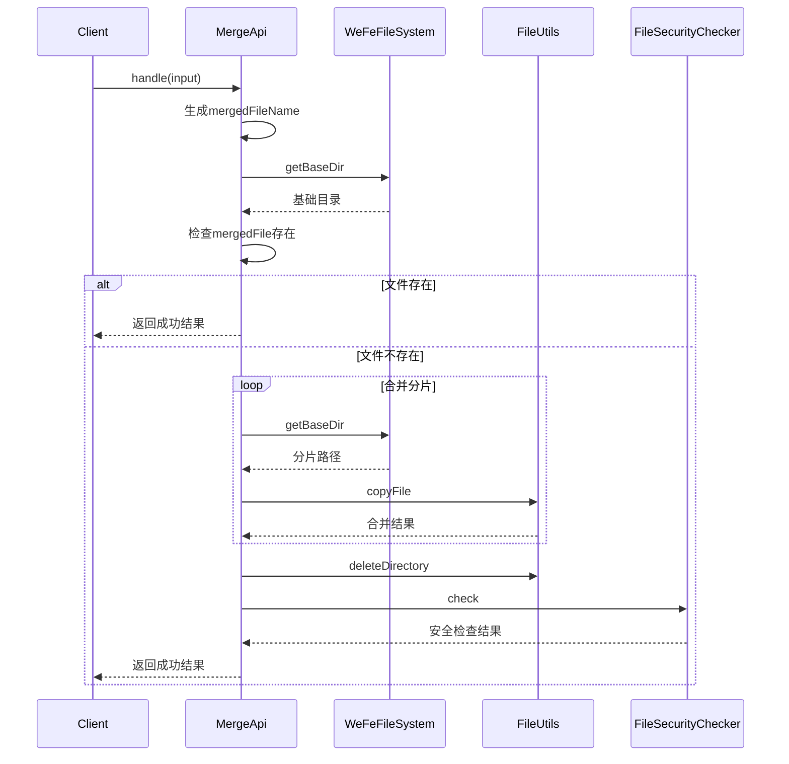

# 基础信息

|      |      |
|------|------|
| 名称 | MergeApi |
| 编码语言 | .java |
| 代码路径 | WeFe/board/board-service/src/main/java/com/welab/wefe/board/service/api/file/MergeApi.java |
| 包名 | com.welab.wefe.board.service.api.file |
| 依赖项 | ['com.welab.wefe.board.service.api.file.security.FileSecurityChecker', 'com.welab.wefe.board.service.base.file_system.WeFeFileSystem', 'com.welab.wefe.common.StatusCode', 'com.welab.wefe.common.exception.StatusCodeWithException', 'com.welab.wefe.common.fieldvalidate.annotation.Check', 'com.welab.wefe.common.web.api.base.AbstractApi', 'com.welab.wefe.common.web.api.base.Api', 'com.welab.wefe.common.web.dto.AbstractApiInput', 'com.welab.wefe.common.web.dto.ApiResult', 'org.apache.commons.io.FileUtils', 'java.io.File', 'java.io.FileOutputStream', 'java.io.IOException', 'java.util.UUID'] |
| 概述说明 | 该API用于合并上传的文件分块，生成唯一文件名，合并后删除分块并检查文件安全性。输入包括文件名、唯一标识和用途，输出为合并后的文件名。 |

# 说明

该代码定义了一个文件合并API类MergeApi，继承自AbstractApi，用于处理上传文件的分块合并。输入类Input包含文件名、唯一标识符和文件用途类型；输出类Output包含合并后的文件名。主要逻辑是：根据输入参数定位分块文件目录，生成随机合并文件名，按顺序将分块文件合并到目标文件，完成后删除分块目录并进行文件安全检查。若合并文件已存在则直接返回成功。异常时抛出系统错误状态码。

# 类列表 Class Summary

| 名称   | 类型  | 说明 |
|-------|------|-------------|
| MergeApi | class | 该API用于合并上传的文件分块，生成唯一文件名，合并分块后检查安全性并返回结果。 |


## 类 MergeApi

|      |      |
|------|------|
| 访问范围 | @Api(path = "file/merge", name = "Merge the chunks after the file is uploaded");public |
| 类型 | class |
| 名称 | MergeApi |
| 说明 | 该API用于合并上传的文件分块，生成唯一文件名，合并分块后检查安全性并返回结果。 |


### UML类图

```mermaid
classDiagram
    class MergeApi {
        <<Api>> 
        +handle(Input input) ApiResult~Output~
    }
    
    class AbstractApi~T, R~ {
        <<Abstract>> 
        #handle(T input) ApiResult~R~
    }
    
    class ApiResult~T~ {
        <<Generic>> 
    }
    
    class WeFeFileSystem {
        <<Utility>> 
        +getBaseDir(UseType useType) Path
    }
    
    class UseType {
        <<Enum>> 
    }
    
    class FileSecurityChecker {
        <<Utility>> 
        +check(File file) void
    }
    
    class StatusCodeWithException {
        <<Exception>> 
    }
    
    class MergeApi$Output {
        -String filename
        +Output(String filename)
        +getFilename() String
        +setFilename(String filename) void
    }
    
    class MergeApi$Input {
        -String filename
        -String uniqueIdentifier
        -WeFeFileSystem.UseType uploadFileUseType
        +getFilename() String
        +setFilename(String filename) void
        +getUniqueIdentifier() String
        +setUniqueIdentifier(String uniqueIdentifier) void
        +getUploadFileUseType() WeFeFileSystem.UseType
        +setUploadFileUseType(WeFeFileSystem.UseType uploadFileUseType) void
    }
    
    class AbstractApiInput {
        <<Abstract>> 
    }
    
    MergeApi --|> AbstractApi : 继承
    MergeApi$Input --|> AbstractApiInput : 继承
    MergeApi --> MergeApi$Input : 使用
    MergeApi --> MergeApi$Output : 使用
    MergeApi --> WeFeFileSystem : 依赖
    MergeApi --> FileSecurityChecker : 依赖
    MergeApi ..> StatusCodeWithException : 抛出
    MergeApi$Input --> WeFeFileSystem.UseType : 包含
```

该代码实现了一个文件分片合并的API服务。MergeApi继承自AbstractApi，处理文件分片合并请求，包含Input和Output两个静态内部类。通过WeFeFileSystem获取文件存储路径，合并分片文件后进行安全检查，使用FileUtils进行文件操作。类图展示了核心类关系，包括继承、依赖和包含关系，体现了文件合并的业务流程和异常处理机制。


### 内部方法调用关系图

```mermaid
graph TD
    A["MergeApi类"]
    B["继承: AbstractApi<Input, Output>"]
    C["内部类: Output"]
    D["内部类: Input"]
    E["方法: handle(Input input)"]
    F["生成mergedFileName"]
    G["获取分片目录dir"]
    H["获取分片文件列表parts"]
    I["创建目标文件mergedFile"]
    J["检查mergedFile存在性"]
    K["循环合并分片"]
    L["删除分片目录"]
    M["文件安全检查"]
    N["返回成功结果"]

    A --> B
    A --> C
    A --> D
    A --> E
    E --> F
    E --> G
    E --> H
    E --> I
    E --> J
    J -->|存在| N
    J -->|不存在| K
    K --> L
    L --> M
    M --> N
```





这段代码实现了一个文件分片合并的API，主要功能包括：生成唯一合并文件名、获取分片目录、检查目标文件是否存在、循环合并分片文件、删除临时分片目录、进行文件安全检查等。流程图展示了类结构和主要处理逻辑，时序图详细描述了客户端调用到最终返回的完整交互过程。该代码处理了文件存在性检查、分片合并异常等边缘情况，并通过安全检查确保文件安全性。

### 字段列表 Field List

| 名称  | 类型  | 说明 |
|-------|-------|------|

### 方法列表

| 名称  | 类型  | 说明 |
|-------|-------|------|
| handle | ApiResult<Output> | 该方法处理文件合并，生成唯一文件名，合并分片文件后检查安全性，返回结果或异常。 |


