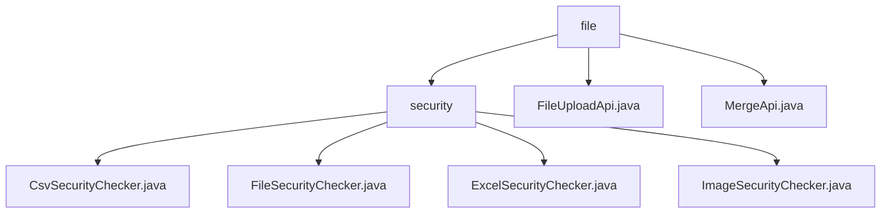

# 基础信息

|      |      |
|------|------|
| 名称 | file |
| 编码语言 | .java |
| 代码路径 | WeFe/board/board-service/src/main/java/com/welab/wefe/board/service/api/file |
| 包名 | docs.board.board-service.src.main.java.com.welab.wefe.board.service.api.file |
| 概述说明 | 该模块提供多格式文件安全检查，支持CSV/Excel/图片等10种类型，采用先格式校验后内容扫描流程。包含文件上传分片处理和合并功能，涉及安全检查、异常处理和目录操作。关键类包括FileUploadApi和MergeApi。 |

# 说明

## 概述  
该模块核心职责是实现文件上传、分片合并及多格式安全检查的一体化处理，类似文件处理流水线。接口规范包含FileUploadApi的POST/GET分片操作、MergeApi的合并逻辑，以及FileSecurityChecker的doCheck检查方法。关键数据结构涉及分块目录管理、随机合并文件名生成器及各类文件解析器（如CsvParser）。外部依赖包括Apache POI、OpenCSV和Java图像IO库。例如Excel文件合并后会触发工作表遍历检查，图片分片需通过重绘缓冲区验证。

## 主要业务场景  
模块支持分片上传、合并及10种文件类型安全检查的完整流程，采用"分片处理-合并-格式校验-内容扫描"链式逻辑。交互模式类似分布式文件网关，失败时自动清理分片并阻断流程。典型应用包括用户上传大文件时的分片传输与安全扫描，例如Excel分片合并后逐行检测关键词，图片分片需完成重绘净化。API集成涵盖文件类型校验、分片状态查询及合并操作，异常处理统一返回标准化错误码。

### 包内部结构视图

该流程图展示了文件服务API的层级结构。根节点"file"下包含两个直接子节点：安全检测目录"security"和两个API文件。安全检测目录下又包含四个具体的安全检查器实现类，分别用于处理CSV、通用文件、Excel和图片的安全检查。这种结构清晰地反映了文件上传和安全检查功能的模块化设计。

# 文件列表

| 名称   | 类型  | 说明 |
|-------|------|-------------|
| [FileUploadApi.java](FileUploadApi.md) | file | 文件上传API，支持分片检查与保存，校验文件类型，处理POST和GET请求，返回分片状态或保存结果。 |
| [MergeApi.java](MergeApi.md) | file | 该API用于合并上传的文件分块，生成唯一文件名，合并后删除分块并检查文件安全性。输入包括文件名、唯一标识和用途，输出为合并后的文件名。 |
| [security](security/_module.md) | package | CsvSecurityChecker检查CSV文件内容安全性，逐行扫描关键词。FileSecurityChecker是抽象基类，定义允许的文件类型和检查流程。ExcelSecurityChecker检查Excel文件内容，验证工作表数据。ImageSecurityChecker验证图片格式并清除潜在恶意内容。 |

