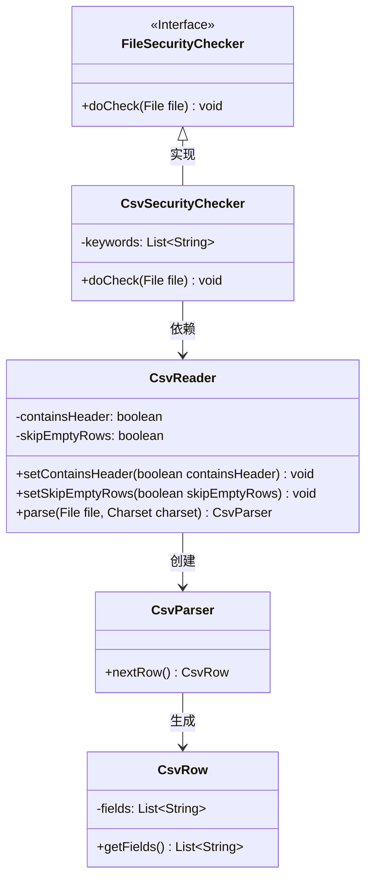
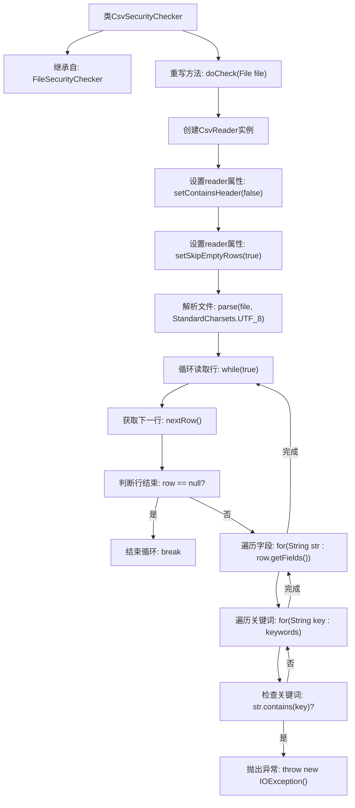

# 基础信息

|      |      |
|------|------|
| 名称 | CsvSecurityChecker |
| 编码语言 | .java |
| 代码路径 | WeFe/board/board-service/src/main/java/com/welab/wefe/board/service/api/file/security/CsvSecurityChecker.java |
| 包名 | com.welab.wefe.board.service.api.file.security |
| 依赖项 | ['de.siegmar.fastcsv.reader.CsvParser', 'de.siegmar.fastcsv.reader.CsvReader', 'de.siegmar.fastcsv.reader.CsvRow', 'java.io.File', 'java.io.IOException', 'java.nio.charset.StandardCharsets'] |
| 概述说明 | CsvSecurityChecker类检查CSV文件内容，若发现keywords中的关键字则抛出异常。 |

# 说明

CsvSecurityChecker类继承自FileSecurityChecker，用于检查CSV文件安全性。它重写doCheck方法，接收文件参数并可能抛出IOException。方法内创建CsvReader实例，设置不包含表头且跳过空行。使用UTF-8编码解析文件为CsvParser对象。通过循环逐行读取CSV数据，对每行的每个字段检查是否包含预定义关键词。若发现关键词则抛出异常，提示文件包含不安全字符。处理完所有行后方法结束。

# 类列表 Class Summary

| 名称   | 类型  | 说明 |
|-------|------|-------------|
| CsvSecurityChecker | class | CsvSecurityChecker检查CSV文件内容，若发现关键字则报错。 |

## 类 CsvSecurityChecker

|      |      |
|------|------|
| 访问范围 | public |
| 类型 | class |
| 名称 | CsvSecurityChecker |
| 说明 | CsvSecurityChecker检查CSV文件内容，若发现关键字则报错。 |

### UML类图

这段类图展示了CSV文件安全检查器的结构。CsvSecurityChecker继承自FileSecurityChecker接口，通过CsvReader解析文件并生成CsvParser，逐行读取CsvRow对象并检查每个字段是否包含敏感关键词。整个流程涉及5个核心类，实现了从文件读取到安全验证的完整处理链，其中CsvReader负责解析配置，CsvParser逐行处理，CsvRow提供字段级访问。

### 内部方法调用关系图

这段代码展示了一个CSV文件安全检查器的实现流程。该检查器继承自基础文件检查器，通过读取CSV文件内容并逐行扫描每个字段，检查是否包含预定义的关键词。当发现敏感词时会立即抛出异常终止检查，否则持续扫描直至文件结束。流程完整展现了从文件解析、行遍历到关键词匹配的安全检查全过程。

### 字段列表 Field List

| 名称  | 类型  | 说明 |
|-------|-------|------|

### 方法列表

| 名称  | 类型  | 说明 |
|-------|-------|------|
| doCheck | void | 该方法检查CSV文件是否包含不安全字符。读取文件时不处理表头和空行，逐行检查每个字段，若发现关键词则抛出异常。 |

